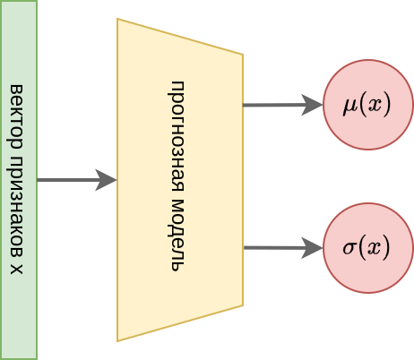
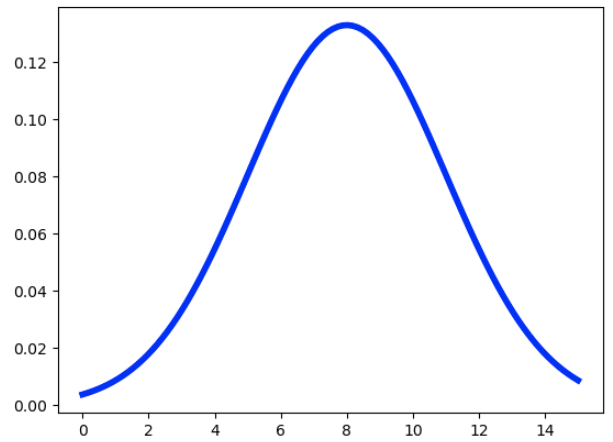
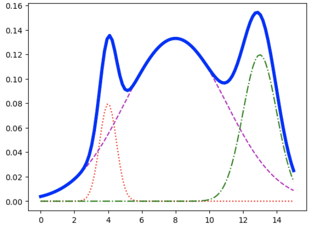
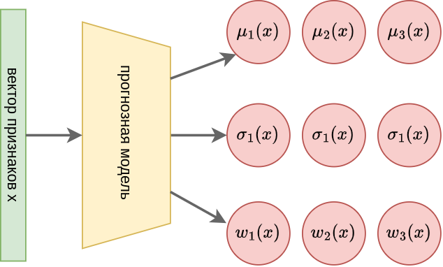

# Прогноз вероятностных распределений

Часто в прикладных задачах требуется предсказать не число, а вероятностное распределение отклика. Например, при прогнозировании будущей цены квартиры, мы можем отдавать отчёт, что точный прогноз вряд ли возможен, зато можем предсказывать распределение будущей цены.

В простейшем случае можно предполагать, что целевая величина принадлежит некоторому параметрическому распределению, например нормальному 

$$
y \sim \mathcal{N}(\mu(x),\sigma^2(x))
$$

, где среднее $\mu$ и стандартное отклонение $\sigma$ зависят от известных признаков $x$, таких как текущая стоимость, её изменение в истории, ставки по кредитам, объём строительства новых квартир в рассматриваемом районе и т.д.

Реализовать такой прогноз очень легко - достаточно прогнозировать не одно число, а два, которые будем интерпретировать как $\mu(x)$ и $\sigma(x)$:

Поскольку стандартное отклонение не может быть отрицательным и, учитывая вероятностную природу прогноза, равным нулю тоже, на выходном слое при прогнозе $\sigma(x)$ необходимо применить [функцию активации](../MLP/Activation-functions), дающую значения на интервале $(0,+\infty)$.

  
Что это будет за активация?

Из представленных активаций подходит только SoftPlus.

Однако нормальное распределение **унимодально**, т.е. имеет всего один максимум, как показано ниже:

В то же время реальное распределение часто **мультимодально**, т.е. обладает сразу несколькими локальными максимумами. В случае прогноза стоимости квартиры это может соответствовать трём случаям:

- реализуется экономический спад, цены упадут

- существенных макроэкономических изменений не произойдёт

- реализуется экономический бум, цены вырастут

Моделировать подобные сценарии можно **смесью нормальных распределений** (mixture of Gaussians):

$$
y \sim w_1(x) \mathcal{N}(\mu_1(x),\sigma_1(x))+w_2(x) \mathcal{N}(\mu_2(x),\sigma_2(x))+w_3(x) \mathcal{N}(\mu_3(x),\sigma_3(x))
$$

где веса $w_1(x),w_2(x),w_3(x)$ неотрицательны и суммируются в единицу. Ниже показан пример реализации такой смеси, состоящих из суммы 3-х компонент отдельно показанных красным, фиолетовым и зелёным цветом:

:::note Задача

Посчитайте среднее и дисперсию для смеси нормальных величин.

:::

Для прогноза распределения такой смеси распределений нейросеть должна выдавать уже 9 прогнозных значений, отвечающих 3м весам, 3м средним и 3м стандартным отклонениям.

После прогноза весов должен следовать слой, нормализующий эти веса, чтобы они суммировались в единицу.

## Настройка модели

Поскольку модель выдаёт вероятности, то оценивать её параметры нужно [методом максимального правдоподобия](../../docs_ml/Base-concepts/MaxLikelihood-Connection), т.е. максимизировать сумму логарифмов вероятностей реализовавшихся целевых значений.

## Обобщения

Смешивать можно не только нормальные распределения, но и любые другие. Число компонент смеси может быть любым. 

:::note Задача

Предложите нейросетевую архитектуру, которая бы предсказывала распределение целевой величины смесью распределений с переменным числом компонент смеси, предсказываемым нейросетью.

:::

## Множественный прогноз

Используя прогноз смесью распределений можно выдавать множественный прогноз, состоящий не из одного числа, а из набора подходящих чисел. Этими числами могут служить локальные максимумы распределения. Это полезно, если в задаче может быть несколько вариантов решения. Например, 

- в автоматической диагностике болезни одним и тем же симптомам может соответствовать несколько видов болезней;

- в задаче управления роботом может быть несколько положений рук и ног, чтобы робот не падал.
