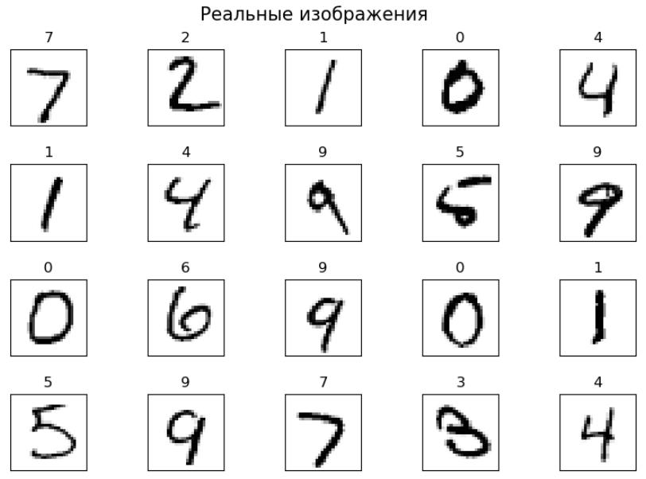
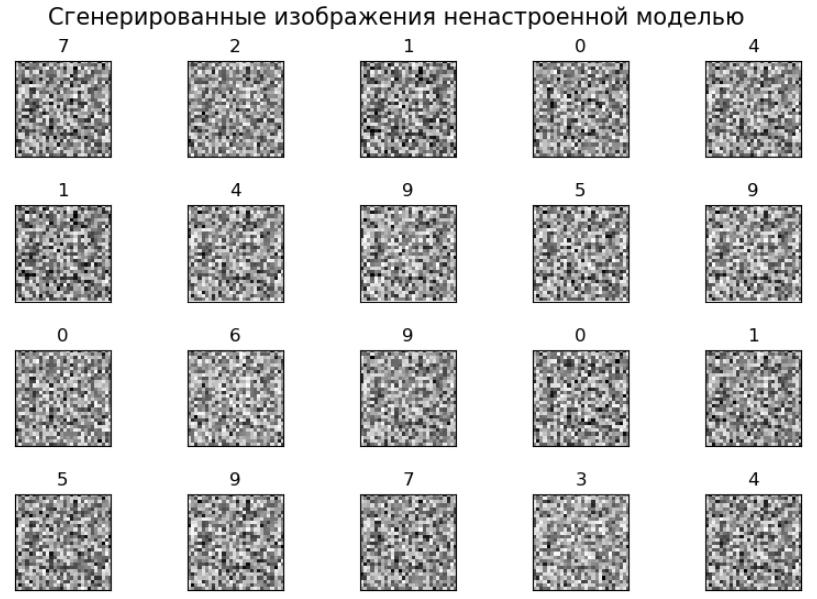
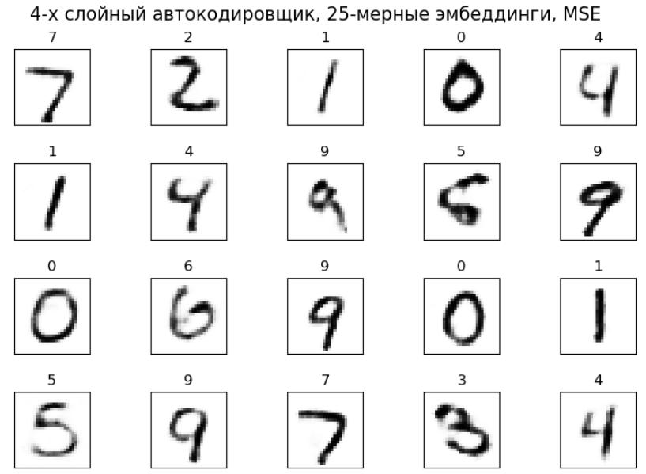
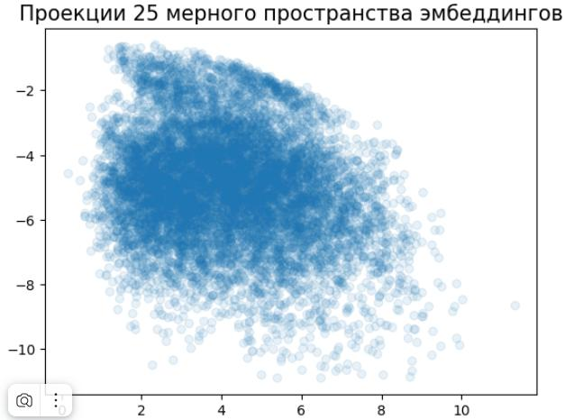
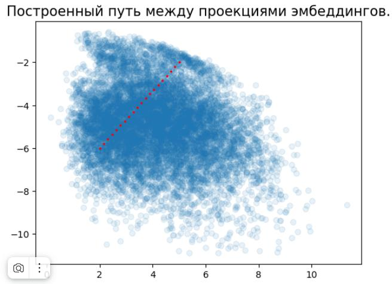
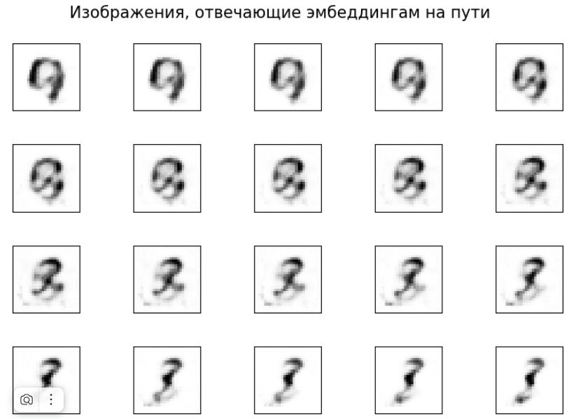
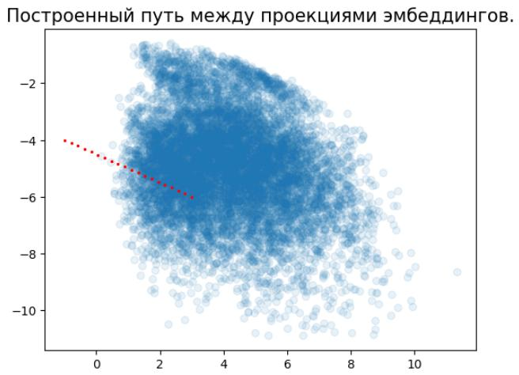
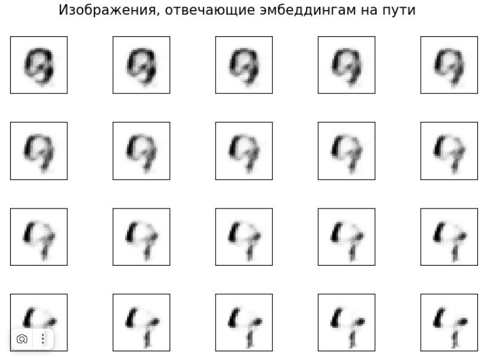

# Пример работы автокодировщика

Рассмотрим применение недоопределённого автокодировщика (undercomplete autoencoder) на датасете Digits, представляющего собой чёрно-белые сканы рукописных цифр в разрешении $28 \times 28$. Таким образом, пространство признаков будет $28^2=784$. Обучать модель будем на обучающей выборке, а визуализировать качество - на тестовой.

В качестве модели возьмём 4-х слойный персептрон с числом нейронов:

$$
784 \to 100 \to 25 \to 100 \to 784.
$$

В качестве функций активации везде будем использовать LeakyReLU кроме выходного слоя, на котором применим сигмоидную активацию, чтобы получить интенсивности пикселей выходного изображения в интервале $(0,1)$. 

Примеры изображений (тестовая выборка):

Ненастроенная модель будет выдавать случайные результаты:

После настройки (5 эпох по обучающей выборке с 60.000 изображений) получим реалистичные генерации:

:::tip Сжатие данных

Обратите внимание, что нам удалось получить реалистичное воспроизведение цифр из 784-мерного пространства, используя всего лишь 25-мерные эмбеддинги!

:::

Визуализируем полученные эмбеддинги. Для этого настроим 2-х слойный автокодировщик с тождественными активациями и числом нейронов:

$$
25 \to 2 \to 25,
$$

т.е. по сути отобразим 25-мерные эмбеддинги в двумерное пространство, используя метод главных компонент (он эквивалентен такому автокодировщику).

Получим следующую визуализацию эмбеддингов:

Прочертим в этом пространстве путь:

По каждой точке пути восстановим 25-мерный эмбеддинг, по которому, в свою очередь, восстановим изображение. Получим следующую последовательность сгенерированных цифр:

Как видим, все цифры реалистичны, хотя местами и написаны неряшливо, что объясняется ошибкой реконструкции 25-мерных эмбеддингов по их 2-мерным проекциям.

Теперь прочертим путь в 25-мерном пространстве эмбеддингов, выходящий за пределы распределения эмбеддингов:

Восстановим изображения, отвечающие точкам на этом пути:

Как видим, типовым эмбеддингам соответствует реалистичная цифра, а нетипичным - нереалистичная.
