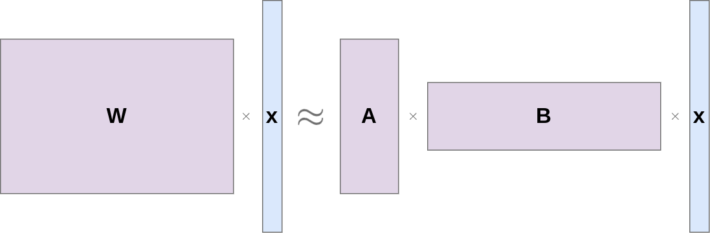
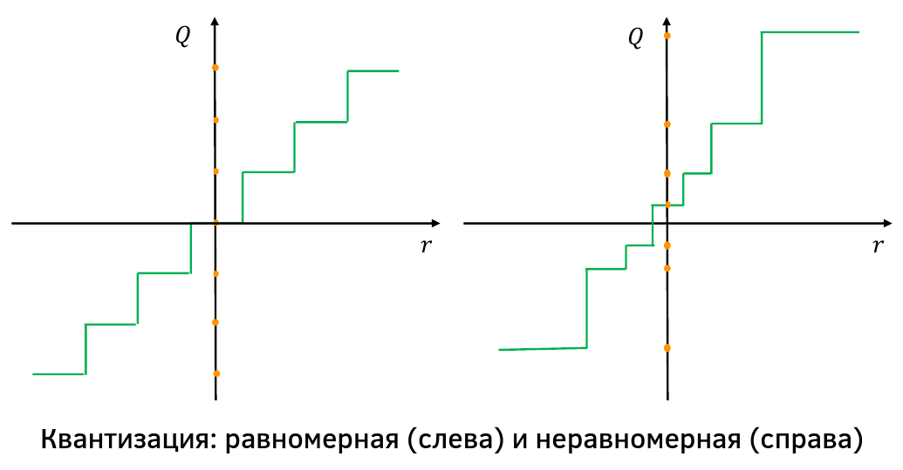
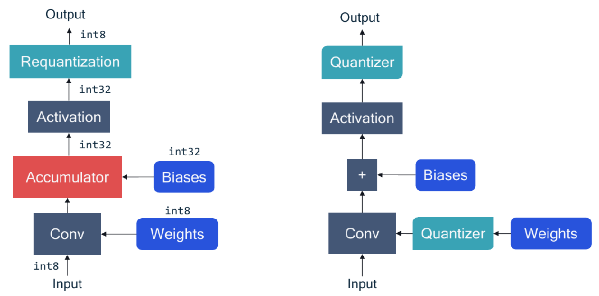
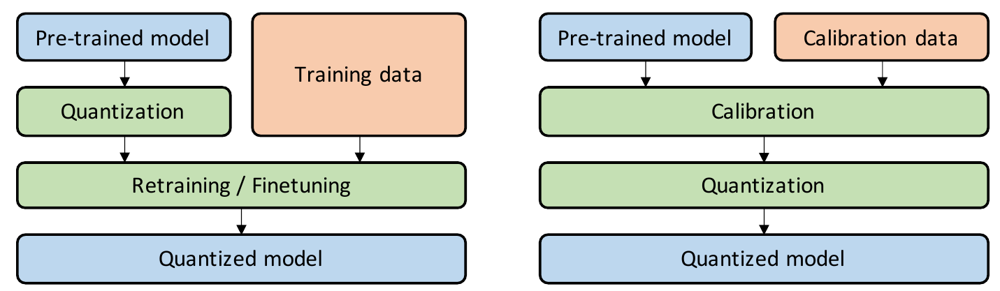
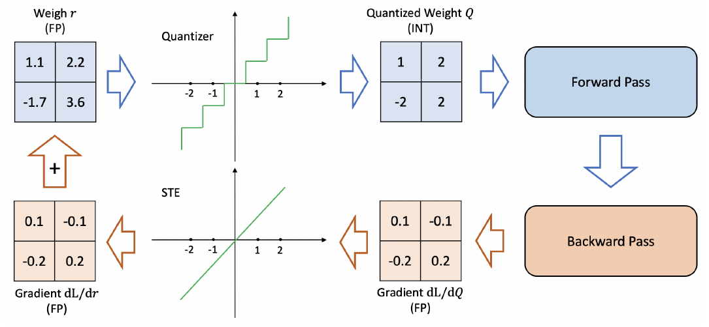

# Методы упрощения моделей

Помимо ручного упрощения архитектуры и автоматического, за счёт методов прореживания нейросети (network pruning), существуют два других популярных метода упрощения нейросетей.

## Декомпозиция тензоров

**Декомпозиция тензоров** (tensor decomposition) Применение линейного слоя эквивалентно [домножению на матрицу весов](../MLP/Multilayer-perceptron). Чтобы сократить объём связанных с этим вычислений, можно приблизить матрицу весов произведением 2-х вытянутых матриц:

 

Такая декомпозиция приводит к низкоранговой матричной аппроксимации, поскольку матрицы $A,B$ в произведении имеют низкий ранг. В более сложных нейросетях используются операции над тензорами, которые также допускают низкоранговые разложения для упрощения вычислений.

  
Если $W\in\mathbb{R}^{N \times D}, x \in \mathbb{R}^D, A\in\mathbb{R}^{N\times K}, B\in\mathbb{R}^{K\times D}$, то насколько уменьшится число вычислений при представлении $W$ в виде произведения $AB$?

Число операций при перемножении $Wx$ равна $O(ND)$.
Число операций при перемножении $Bx$ равна $O(KD)$, получим $K$-мерный вектор, умножив который на $A$ получим еще $O(NK)$.

Получили сокращение количество вычислений от $O(ND)$ до $O(K(D+N))$, что существенно, если $N,D$ - большие числа, а $K$ - малое.

## Квантизация нейросети

### Идея подхода

Простой подход сокращения объема сети и числа вычислений в ней заключается в переводе всех вычислений из float64 представления в float32.

**Квантизация сети** (network quantization), заменяет точное вещественное представление весов сети (например float64) менее точным низкобитным целочисленным (например int8). Это не уменьшает число связей, но ускоряет вычисления и сокращает размер модели. Например при переходе от 32-битного представления чисел к 8-битному стоимость хранения матриц уменьшается в 4 раза, а стоимость перемножения матриц уменьшается в 16 раз! 

:::tip Более сильная квантизация

Существуют методы квантизации чисел вплоть до бинарных операций (представление чисел - 1 бит) и тернарных (2-х битное представление)!

:::

### Квантизатор вещественных чисел

Пусть мы хотим представить вещественные числа $b$-битными целыми числами, принимающими значения $0,1,2,...2^{b}-1$. Для аппроксимации этого поведения используется специальная функция - квантизатор $q(x)$.

Определим $\lceil x \rfloor$ - оператор округления числа к ближайшему целому и пусть

$$
\text{clamp}(x,a,c)=
\begin{cases} 
a,\quad x<a \\ 
x,\quad a \le x \le c \\ 
c,\quad x>c \\ 
\end{cases}
$$

Функция-квантизатор $\hat{x}=q(x)$, состоит из 2х шагов:

$$
x_{int}=\text{clamp}\left( \lceil x/s \rfloor +z; 0, 2^b-1\right)
$$

$$
\hat{x} = s \left( x_{int}-z\right)
$$

Как несложно видеть, $\hat{x}\in[q_{min},q_{max}]$, где

$$
\begin{align*}
q_{min} &= -sz \\
q_{max} &= s(2^b-1-z) \\
\end{align*}
$$

Мы можем увеличить покрываемый регион, увеличивая $s$ (уменьшая **ошибку переполнения**), однако это приведёт к большей **ошибке округления**, принадлежащей $[-0.5s, 0.5s]$. 

Параметры квантизации обычно выбираются едиными для всего обрабатываемого тензора (слоя), но могут подбираться и индивидуально для каждого канала (нейрона), что увеличит точность аппроксимации ценой внесения дополнительных операций перемасштабирования.

:::tip Неравномерная квантизация

Выше был приведён пример равномерной квантизации. Существуют методы, подбирающие неравномерные операции квантизации (и соответственно деквантизации) для неравномерно распределённых данных, как показано на рисунке ([источник](https://arxiv.org/abs/2106.08295)):

:::

При квантизации нейросетей мы работаем с тремя нейросетями:

1. исходная нейросеть в вещественных числах

2. её квантизованная аппроксимация в вещественных числах

3. итоговая целочисленная модель для конечного маломощного устройства

Вторая модель аппроксимирует третью, с ней удобно работать на мощном вычислителе, настраивать и подбирать параметры.

Далее показана реализация свёртки для итоговой целочисленной модели (слева) и её вещественной аппроксимации (справа), используя квантизатор $q(x)$ ([3]):

Квантизуются веса и результат действия функции активации. Смещения не квантизуется, поскольку их обычно хранят, используя повышенную разрядность, поскольку они прибавляются, а не умножаются, поэтому почти не приводят к переполнению целого числа.

### Выбор параметров квантизации

Пусть $V$ - квантизуемый тензор. Параметры $s,z$ можно выбрать, чтобы минимально достаточным образом покрыть диапазон квантизуемых значений:

$$
q_{min}=\min V;\quad q_{max}=\max V.
$$

Тогда не будет ошибок обрезки диапазона, но метод неустойчив к наличию выбросов, из-за которых придётся покрывать слишком широкий диапазон значений и будет высокая погрешность квантизации.

Поэтому, как альтернатива, перебором по сетке можно подобрать такие значения $s,z$, чтобы минимизировать ошибку аппроксимации исходного тензора его квантизованной версией по норме Фробениуса ($L_2$ норма для тензоров):

$$
||V-\hat{V}(q_{min},q_{max})||^2_F\to\min_{q_{min},{q_max}}
$$

### Настройка модели и квантизация

Существует два типа квантизации: Quantization-Aware Training (QAT, слева) and Post-Training Quantization (PTQ, справа) [2]:

В **Post-Training Quantization** к исходной модели применяются квантизаторы $q(x)$ к весам и активациям, а параметры этих квантизаторов подбираются, используя небольшой калибровочный датасет, так, чтобы после каждой операции равномернее покрывать диапазон целых чисел. Этот способ прост в реализации, поскольку перенастройка модели не требуется, но может привести к существенному ухудшению качества модели в связи с ошибками квантизации, которые не учитывались, когда настраивалась исходная модель (в вещественных числах).

Это ограничение позволяет исправить более системный подход - **Quantization-Aware Training**. В нём 

1. исходная вещественная модель используется как начальное приближение;

2. далее эта модель дополняется квантизаторами $q(x)$, чтобы эмулировать работу целочисленной модели;

3. квантизованная аппроксимация донастраивается в вещественных числах.

Поскольку квантизованная аппроксимация донастраивается, это позволяет  видоизменить веса модели, чтобы они учитывали особенности последующей квантизации.

Тонкий момент при оптимизации заключается в **проходе назад** (backward pass), при котором необходимо пропускать градиент через операцию квантизации. Как видно по рисунку выше, зависимость Q(r) кусочно-постоянна, а поэтому её градиент будет почти всюду ноль и сеть не сможет обучиться! 

Чтобы устранить эту проблему, при проходе вперёд квантизатор работает штатно, но при проходе назад и расчёте градиента используется эвристическая замена кусочно-постоянного округления тождественной операцией, для которой градиент равен единице, т.е. мы считаем, что

$$
\frac{\partial \lceil y \rfloor}{\partial y} = 1
$$

Эта аппроксимация известна как Straight Through Estimator, STE [[1]](https://arxiv.org/abs/1308.3432)).

Схематично проход вперёд и назад при настройке модели показан ниже  ([источник](https://arxiv.org/abs/2106.08295)):

Детальнее о методах квантизации можно прочитать в обзорах [[2]](https://arxiv.org/abs/2106.08295) и [[3]](https://arxiv.org/abs/2106.08295).

## Литература

1. Bengio Y., Léonard N., Courville A. Estimating or propagating gradients through stochastic neurons for conditional computation //arXiv preprint arXiv:1308.3432. – 2013.

2. Gholami A. et al. A survey of quantization methods for efficient neural network inference //Low-Power Computer Vision. – Chapman and Hall/CRC, 2022. – С. 291-326.

3. Nagel M. et al. A white paper on neural network quantization //arXiv preprint arXiv:2106.08295. – 2021.
