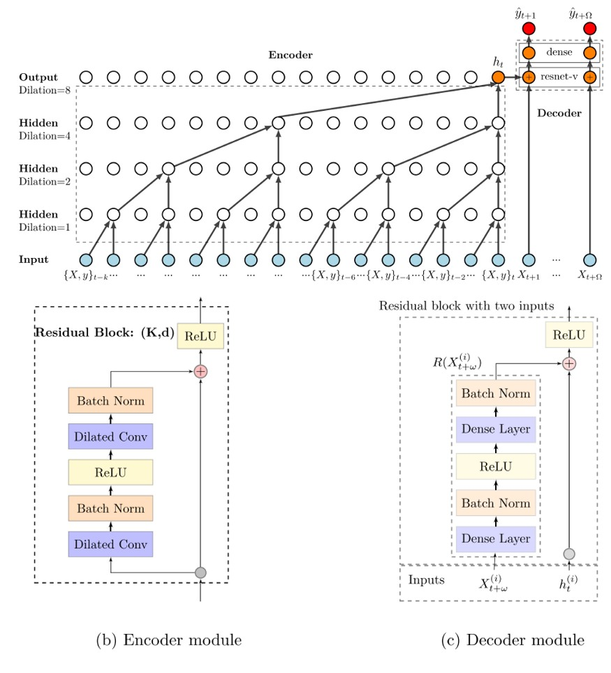

# Введение в языковые модели

**Языковая модель** (Language Model, LM [[1]](https://en.wikipedia.org/wiki/Language_model)) — это фундаментальная концепция в обработке естественного языка (NLP). Её задача состоит в том, чтобы моделировать последовательности слов, оценивая, насколько вероятна та или иная фраза в заданном языке. 

Формально, языковая модель задаёт распределение вероятностей над последовательностями слов:

$$
P_{\theta}(w_{1},\dots,w_{n})
$$

где $\theta$ — обучаемые параметры языковой модели, которые обычно находятся методом **максимального правдоподобия** (Maximum Likelihood Estimation, MLE) на больших массивах текстовых данных (корпусах текстов).

Знание вероятности всей последовательности позволяет нам решать две основные задачи моделирования:

1. **Прогнозирование следующего слова (autoregressive LM):** Оценка того, какое слово с наибольшей вероятностью продолжит начатый текст:
   
   $$
   p(w_{n}|w_{1}w_{2}...w_{n-1}) - ?
   $$

2. **Прогнозирование промежуточных слов (masked LM):** Восстановление пропущенных (замаскированных) токенов внутри контекста:
   
   $$
   w_{1}....w_{i-1}\mathbf{X}_iw_{i+1}w_{i+2}...w_{j}\mathbf{X}_{j+1}\mathbf{X}_{j+2}\mathbf{X}_{j+3}w_{j+4}w_{j+5}...w_{n},\;\mathbf{X} - ?
   $$
   
   >  Эта задача эффективно решается архитектурой BERT и её улучшениями.

## Применение языковых моделей

Языковые модели лежат в основе подавляющего большинства современных интеллектуальных систем, работающих с текстом и речью:

* **Автодополнение (аutocompletion):** подсказка следующего слова на клавиатурах смартфонов или автоматическое завершение запросов в поисковых системах.
* **Исправление опечаток при вводе:** выбор наиболее вероятных слов в контексте, если текст введён с ошибками и опечатками.
* **Машинный перевод:** Выбор наиболее естественного варианта перевода среди нескольких допустимых вариантов.
* **Распознавание речи (speech recognition):** Устранение акустической неоднозначности при распознавании речи. 
  
  > Например, звуковые последовательности «с верой» и «сферой» звучат почти идентично, но языковая модель позволяет выбрать правильный вариант, опираясь на окружающий контекст предложения.
* **Генерация текста:** создание креативных текстов, продолжение историй по их началу, ответы на вопросы в диалоговых системах.

## Статистический подход: марковские цепи

По правилам вероятностей вероятность любой последовательности слов можно представить в виде следующего произведения:

$$
P(w_{1},\dots,w_{n})=\prod_{i=1}^{n}P(w_{i}|w_{1},\dots,w_{i-1})
$$

Однако при таком подходе для вычисления вероятности $i$-го слова нам нужно помнить весь предыдущий контекст $w_1, \dots, w_{i-1}$. Число всевозможных контекстов растёт экспоненциально, поэтому мы никогда не соберём достаточно статистики, чтобы точно оценить вероятности длинных уникальных фраз.

Для решения этой проблемы в классическом NLP применяется **марковское предположение**, в котором мы предполагаем, что текущее слово зависит только от $k$ предыдущих слов, а не от всей предистории от начала текста: 

$$
P(w_{n}|w_{1},\dots,w_{n-1})\approx P(w_{n}|w_{n-k},\dots,w_{n-1})
$$

Такая статистическая модель называется **N-граммной моделью**, где $N=k+1$, поскольку в ней моделируются вероятности цепочек не произвольной длины, а лишь **N-грамм** - последовательностей из $N$ подряд идующих слов $w_{1},\dots,w_{n-1}w_{n}$.

Эти вероятности оцениваются по количествам встречаемости соответствующих цепочек в обучающем корпусе текстов, которые далее будем обозначать как $C(\cdot)$.

### Униграмная модель

В этой модели $k=0, N=1$ и слова вообще <u>не зависят от контекста</u>, мы просто генерируем слова пропорционально их частоте встречаемости в языке:

$$
w\sim P(w_{n})
$$

> *Пример сгенерированного текста:* 
> «температура дождь облачно и солнце температура ветер градусы ожидается»

### Биграмная модель ($k=1, N=2$)

В этой модели $k=0, N=1$. Каждое следующее слово зависит только от одного предыдущего:

$$
w\sim P(w_{n}|w_{n-1})=\frac{C\left(w_{n-1}w_{n}\right)}{C\left(w_{n-1}\right)}
$$

> *Пример сгенерированного текста:* 
> «температура воздуха ожидается завтра будет облачно сильный ветер»

### Триграмная модель

В триграмной модели $k=2, N=3$, и слово зависит уже от двух предыдущих:

$$
w\sim P(w_{n}|w_{n-1},w_{n-2})=\frac{C\left(w_{n-2}w_{n-1}w_{n}\right)}{C\left(w_{n-2}w_{n-1}\right)}
$$

> *Пример сгенерированного текста:* 
> «температура воздуха завтра днем составит плюс двадцать градусов»

### Анализ окна контекста

**Окно контекста ($k$)** — это основной гиперпараметр статистических языковых моделей, который управляет их [сложностью и степенью переобучения](../../Machine-learning/Base-concepts/Generalization-ability).

- При малом $k$ оценка вероятностей получается надёжной, так как удаётся накопить большие статистики встречаемости коротких фраз. Однако в результате мы получаем плохую связность текста. Модель теряет нить повествования, как в примерах выше.
- При большом $k$  (таких как 5-граммы и выше) достигается высокая точность контекста, модель генериует грамматически безупречные длинные фразы. Однако из-за недостаточной статистики встречаемости длинных фраз в обучающем тексте мы сталкиваемся с проблемой <u>разреженной оценки параметров</u> такой модели. В итоге при генерации нового текста модель просто запоминает и копирует обучающую выборку кусками, не проявляя разнообразия.

## Проблема разреженности

Допустим, мы применяем статистическую языковую модель для оценки правдоподобия новых текстов 

> Это полезно, например, при классификации писем на спам и не спам, для чего в генеративных моделях требуются оценки $p(\text{text}|\text{спам})$ и $p(\text{text}|\text{не спам})$.

В этом случае даже для небольших $k$ мы столкнёмся с проблемой при встрече новых сочетаний слов в тестовой выборке. 

> Допустим, что при применении модели нам встретилась биграмма $w_{i+1}w_i$, которой не было в обучающей выборке. В этом случае счётчик $C(w_{i+1}w_i) = 0$. А поскольку вероятность всей цепочки считается как произведение
> 
> $$
> \prod_{i=1}^{n}P(w_{i}|w_{1},\dots,w_{i-1}),
> $$
> 
> то правдоподобие всего предложения сразу превращается в ноль!

Также при генерации новых текстов будут невозможны переходы в новые слова, и генератор всегда будет повторять заученные фрагменты текстов из обучающей выборки.

### Сглаживание Лапласа

Простейшее решение проблемы разреженности — добавить небольшую константу $\alpha>0$ к счётчику каждого возможного события, чтобы ни одна вероятность не обращалась в ноль. 

Модифицированная формула, например, для триграммной модели будет:

$$
P(w_{n}|w_{n-2},w_{n-1})=\frac{C\left(w_{n-2},w_{n-1},w_{n}\right){\color{red}+\alpha}}{C\left(w_{n-2},w_{n-1}\right){\color{red}+\alpha V}}
$$

где $V$ — размер словаря (число уникальных слов).

:::note Влияние гиперпараметра $\alpha$

- При малом $\alpha$ мы максимально сохраняем оригинальное эмпирическое распределение. Точность возрастает, но разнообразие генерации падает (модель избегает новых сочетаний).
- При увеличении $\alpha$ распределение стремится к равномерному, что приводит к увеличению разнообразия текста ценой снижения его связности.

> *Пример перерегулирования:* При слишком большом $\alpha$ модель решит, что $p(\text{раму}|\text{мама мыла}) \approx p(\text{синхрофазатрон}|\text{мама мыла})$, полностью игнорируя здравый смысл языка.

:::

### Продвинутые методы сглаживания

Сглаживание Лапласа считает все не встречавшиеся ранее переходы одинаково вероятными. Такое поведение можно улучшить, если для не встречавшейся ранее $N$-граммы опираться на $(N-1)$-грамму. 

Например, для триграммы распределение можно брать из биграммной модели:

$$
P(w_{n}|w_{n-2},w_{n-1})=\frac{C\left(w_{n-2},w_{n-1},w_{n}\right){\color{red}+\alpha C\left(w_{n-1},w_{n}\right)}}{C\left(w_{n-2},w_{n-1}\right){\color{red}+\alpha C\left(w_{n-1}\right)}}
$$

Другой популярный подход — интерполяция. Мы смешиваем предсказания моделей разных уровней с весом $\lambda$:

$$
\widehat{P}(w_{n}|w_{n-2},w_{n-1})=\lambda P(w_{n}|w_{n-2},w_{n-1}){\color{red}+(1-\lambda)P(w_{n}|w_{n-1})}
$$

> Второй подход проще в реализации, если у нас <u>уже есть</u> готовая биграммная и триграммная модель. Первый же способ статистически правильнее, поскольку при часто встречающейся триграмме он будет использовать в основном её,  подмешивая сглаживающую биграмму в меньшей степени.

Если биграмной модели не хватает данных, можно продолжить рекурсию и сглаживать её с униграмной моделью и равномерным распределением.

> Для достижения наилучших результатов в статистическом NLP используется более сложный метод сглаживания Кнесера-Нея (Kneser-Ney Smoothing [[2]](https://web.stanford.edu/~jurafsky/slp3/C.pdf)) и его модификации.

## Проблема неизвестных слов (Out-of-Vocabulary)

Ещё одна проблема, тесно связанная со сглаживанием — это появление слов, которых вообще не было в обучающей выборке (Out-of-Vocabulary, OOV).

В классическом подходе эта проблема решается введением специального токена `<UNK>` (от "unknown"). При подготовке данных все редкие слова (например, встречающиеся реже 3 раз) заменяются на `<UNK>`. Модель учится предсказывать появление "неизвестного слова" в определённых контекстах. Во время тестирования любое новое слово также расценивается как токен `<UNK>`.

## Модели машинного обучения

Классические N-граммы опираются на строгие совпадения слов. Но слова "собака" и "пёс" для такой модели — совершенно разные сущности. Если в обучении было "собака лает", N-граммная модель не поймёт, что "пёс лает" тоже вероятно.

Поскольку задача предсказания следующего слова представляет собой классическую задачу классификации (с числом классов равным числу уникальных слов языка), более продвинутые языковые модели, использующиеся на практике, строятся с помощью классификаторов машинного и глубокого обучения:

1. Известный контекст $w_{n-1}w_{n-2},...$ кодируется нейронной сетью в вектор признаков (эмбеддинг) $\mathbf{x}$.

2. Для каждого слова из словаря предсказываются их «рейтинги» (сырые значения, называемые **логитами**, *logits*):
   
   $$
   g_{1}(\mathbf{x}),g_{2}(\mathbf{x}),...g_{V}(\mathbf{x})
   $$

3. Логиты не являются вероятностями  - они могут быть отрицательными и не обязательно суммируются в 1. Чтобы получить корректное распределение вероятностей следующего слова, логиты пропускают через [SoftMax-преобразование](../MLP/Outputs-loss-functions#softmax-преобразование):

$$
\begin{aligned}p(w_{n}=1|\mathbf{x}) & =\frac{e^{g_{1}(\mathbf{x})}}{\sum_{i=1}^{V}e^{g_{i}(\mathbf{x})}}\\
\cdots & \cdots\\
p(w_{n}=V|\mathbf{x}) & =\frac{e^{g_{V}(\mathbf{x})}}{\sum_{i=1}^{V}e^{g_{i}(\mathbf{x})}}
\end{aligned}

$$

Параметры модели оцениваются **методом максимального правдоподобия**, который в контексте нейросетей эквивалентен минимизации [кросс-энтропийной функции потерь](../MLP/Outputs-loss-functions#кросс-энтропийные-потери-многоклассовые).

Если на этапе применения модели необходимо управлять противоречием между разнообразием генерации и связностью текста, то для получения вероятности следующего слова применяют [SoftMax-преобразование с температурой](../../Machine-learning/General-classifiers/Probability-prediction-SoftMax):

$$
\begin{aligned}p(w_{n}=1|\mathbf{x}) & =\frac{e^{g_{1}(\mathbf{x}){\color{red}/\tau}}}{\sum_{i=1}^{V}e^{g_{i}(\mathbf{x}){\color{red}/\tau}}}\\
\cdots & \cdots\\
p(w_{n}=V|\mathbf{x}) & =\frac{e^{g_{V}(\mathbf{x}){\color{red}/\tau}}}{\sum_{i=1}^{V}e^{g_{i}(\mathbf{x}){\color{red}/\tau}}}
\end{aligned}

$$

Тогда гиперпараметр температуры $\tau>0$ как раз позволит управлять данным противоречием аналогично тому, как это делалось гиперпараметром $k$ в статистической модели.

> Такой подход элегантно решает проблему нулевых вероятностей новых словочетаний, которые ранее не встречались в обучающей выборке, поскольку SoftMax-преобразование любому сочетанию слов присвоит положительную вероятность. Величина этой вероятности будет управляться гиперпараметром температуры.

В качестве модели $g_{1}(\mathbf{x}),...g_{V}(\mathbf{x})$ эффективнее показывают себя нейросети. Поскольку текст - это последовательность слов, то, заменив слова соответствующими эмбеддингами, его можно обрабатывать временными свёрточными сетями (temporal convolutional nets [[3]](https://habr.com/ru/companies/otus/articles/519838/)), основанными на использовании каузальных свёрток (causal convolutions), которым разрешено обрабатывать лишь предшествующие, но не будущие данные временного ряда, как показано ниже [[3]](https://habr.com/ru/companies/otus/articles/519838/):

Каузальные свёртки похожи на статистические языковые модели тем, что учитывают исторический контекст лишь <u>ограниченной</u> длины. Для учёта <u>всего</u> исторического контекста можно использовать [рекуррентные сети](../Recurrent-neural-nets/RNN). Однако история в таких сетях хранится в векторе скрытого состояния, которое обновляется домножением на одну и ту же матрицу много раз. За счёт подобного домножения настройка таких сетей происходит нестабильно, а при успешном обучении историческая информация быстро забывается. Лучше помнить историю за счёт использования вентилей (gates) позволяют продвинутые рекуррентные сети [LSTM и GRU](../Recurrent-neural-nets/LSTM-GRU). Однако эмпирически даже они забывают информацию, которая была несколько сотен шагов назад. Сохранять всю входную информацию в нетронутом виде позволяет [механизм внимания](../Recurrent-neural-nets/Attention-RNN), причём для ускорения обработки он используется не в контексте рекуррентных сетей, а в контексте [модели трансформера](../Transformer/Transformer).

## Литература

1. [Wikipedia: Language model.](https://en.wikipedia.org/wiki/Language_model)
2. [Jurafsky, D., & Martin, J. H. (2023). *Speech and Language Processing* (3rd ed. draft). Chapter 3: N-gram Language Models.](https://web.stanford.edu/~jurafsky/slp3/C.pdf)
3. [habr.ru: Временные сверточные сети – революция в мире временных рядов.](https://habr.com/ru/companies/otus/articles/519838/)
