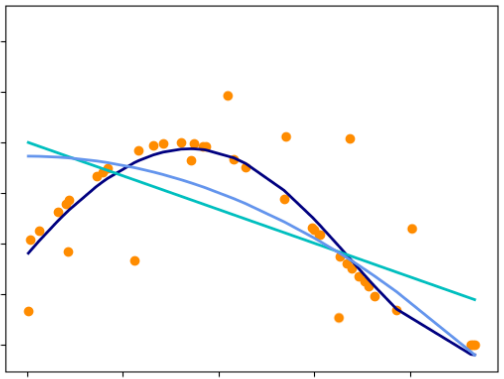
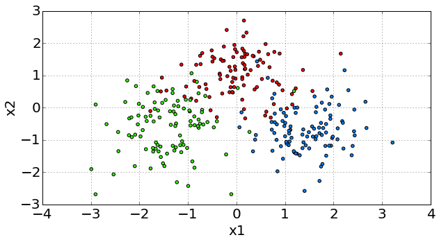

# Обучение с учителем

## Признаки, отклики и обучающая выборка

Машинное обучение работает с так называемыми **объектами** (objects). В задаче классификации спама объектами являются письма, а в задаче предсказания времени пути - начальная и конечная точка маршрута и информация об окружающей среде, которая влияет на длительность маршрута.

Каждый объект описывается парой $(\mathbf{x},y)$, где

- $\mathbf{x}$ - входная информация, которую мы знаем об объекте;

- $y$ - выходная информация, которую мы хотим предсказать для объекта по $\mathbf{x}$.

При этом для удобства обработки входную информацию в большинстве случаев кодируют некоторым вектором фиксированной длины $\mathbf{x}\in\mathbb{R}^D$, где каждый элемент этого вектора называют **признаком** (feature), а весь вектор $\mathbf{x}$ - **вектором признаков** (feature vector). Номер признака далее будем обозначать верхним индексом: $\mathbf{x}=[x^1,x^2,...x^D]$.

Выходную информацию $y$ называют **откликом** или **целевой переменной** (target). 

В наиболее типичной ситуации нам известна размеченная выборка из N объектов:

$$
(\mathbf{x}_1,y_1), (\mathbf{x}_2,y_2), ... (\mathbf{x}_N,y_N)
$$

Такая задача называется **задачей обучения с учителем** (supervised learning), поскольку модель может использовать правильную "учительскую" разметку для набора из $N$ объектов для настройки своих параметров. Учительская разметка получается либо в результате ручной разметки экспертами предметной области, либо в результате логирования входных и выходных данных (которые мы хотим предсказать по входным в будущем) заранее - например, можно логировать, какие письма пользователь самостоятельно разметил как спам, чтобы в будущем научиться заранее предугадывать его предпочтения.

## Типы задач обучения с учителем

В зависимости от типа отклика, задачи обучения с учителем разделяются на следующие категории:

- **Регрессия** (regression): отклик представляет собой число $y\in\mathbb{R}$. С различными регрессионными моделями такого типа вы познакомитесь в дальнейших главах учебника.
  
  - <u>Примеры</u>: предсказываем время пути по маршруту; фокусное расстояние в фотоаппарате для чёткости лиц или стоимость акции на следующий день.

- **Векторная регрессия**: отклик представляет собой сразу вектор вещественных ответов $y\in \mathbb{R}^M$.  Задачу векторную регрессию можно решать с помощью $M$ отдельных регрессионных алгоритмов. Но эффективнее строить прогноз для всех $M$ прогнозов сразу, чего можно добиться, например, с помощью нейросетей, которым посвящён вторая часть книги - "[глубокое обучение](../../Neural-networks/intro)".
  
  - <u>Примеры</u>: прогнозируем будущую стоимость не одной акции, а сразу нескольких акций одновременно; при прогнозе погоды предсказываем сразу температуру, влажность, давление и скорость ветра.

- **Ранжирование** (ranking): отклик принимает вещественные значения релевантности $y\in\mathbb{R}$, однако при фактическом использовании важны <u>не абсолютные значения отклика, а относительные</u>, потому что итоговым результатом является упорядочивание объектов по степени релевантности. 
  
  - <u>Примеры</u>: в информационном поиске по поисковому запросу пользователя  отранжировать релевантные документы или товары в магазине. 

- **Классификация** (classification): отклик принимает одно из C дискретных значений - $y\in\{1,2,...C\}$. Частным случаем классификации является **бинарная классификация** (binary classification), когда классов всего два. В этом случае один из них называют положительным, а другой - отрицательным, и $y\in\{+1,-1\}$. Классификаторы в общем виде описаны в [отдельной главе учебника](../General-classifiers/Discriminant-functions). Также в последующих главах вы познакомитесь с основными классификационными моделями.
  
  - <u>Примеры бинарной классификации</u>: определить, болен ли человек или здоров по результатам анализов; определить, является ли письмо спамом или полезным сообщением; предсказать, вернёт ли клиент с определёнными характеристиками кредит банку или нет.
  
  - <u>Примеры многоклассовой классификации</u>: определить человека по фото, поставить диагноз болезни по симптомам; классифицировать новость по тематике (спорт / политика / экономика / технологии / культура).

- **Разметка** (labeling): аналогично классификации, но объект может принадлежать сразу нескольким классам или ни одному. 
  
  - <u>Примеры</u>: автоматическая простановка хэштегов к изображению; отнесение текста к тематическим рубрикам, которые могут одновременно в нём присутствовать.

:::tip Другие виды откликов.
Выше описаны наиболее типичные виды откликов, но в общем случае откликом может выступать объект произвольного типа. В частности, модели машинного обучения можно научить генерировать: 

- тексты (при переводе с одного языка на другой, при ответе на вопросы), 

- графы (при подборе химических соединений, обладающих требуемыми химическими свойствами), 

- звук (при озвучивании текста), 

- изображения (в задачах перерисовки фотографий пользователей в стиле известных художников или по текстовому запросу). 

Сложно-структурированные отклики реализуются нейронными сетями, что мы изучим во второй части книги про [глубокое обучение](../../Neural-networks/book-title).

:::

### Пример задачи регрессии

Ниже приведён пример задачи регрессии, в которой по одномерному признаку по оси X необходимо предсказать вещественный отклик по оси Y. Обучающая выборка обозначена оранжевыми точками, по которым требуется восстановить зависимость $\hat{y}=f(\mathbf{x})$, чтобы уметь прогнозировать целевую величину $y$ для любых новых объектов $\mathbf{x}$. Как видим, это можно делать различными способами с разными ошибками прогнозов.

### Пример задачи классификации

Далее приведен пример задачи классификации, в которой каждый объект описывается двумя признаками $x^1$ и $x^2$, обозначенными по осям X и Y. Каждый объект обучающей выборки изображён точкой на графике. Целевая величина для прогнозирования представляет собой один из трех классов, каждый из которых показан своим цветом. По этим точкам требуется восстановить общую закономерность соотнесения любой точки $(x^1,x^2)$ одному из классов.

Детальнее задачи обучения с учителем описаны в [[1]](https://www.amazon.com/Statistical-Pattern-Recognition-Andrew-Webb/dp/0470682280#detailBullets_feature_div) и [[2]](https://link.springer.com/book/10.1007/978-3-319-14142-8?fbclid=IwAR3xjOn8wUqvGIA3LquUuib_LuNcehk7scJQFmsyA3ShPjDJhDvyuYaZyRw).

## Специальные постановки задачи обучения с учителем

Если, помимо обучающих объектов, заранее известны признаковые описания $\mathbf{x}_{N+1},...\mathbf{x}_{N+M}$ для тестовых объектов, для которых требуется построить прогноз в будущем, то такая задача называется **трансдуктивным обучением** (transductive learning). Дополнительное знание о тестовых объектах позволяет более точно настроить модель именно для этих объектов.

Существуют ситуации, когда для объектов обучающей выборки известны не только целевые переменные $y$, но и пояснения $z$ (**привилегированная информация**, priveledged information), почему отклик именно такой. Рассмотрим в качестве примера задачу медицинской классификации, в которой для пациентов с заданными признаками (такими как пол, возраст, история визитов к врачу, общее состояние, текущие жалобы) требуется поставить диагноз болезни. В этой задаче разметка (итоговый диагноз врача), может содержать дополнительные пояснения $\mathbf{z}$, характеризующие комментарии врача, почему он поставил тот или иной диагноз. В этом случае обучающая выборка состоит уже из троек (входные признаки, отклик, пояснения):

$$
(\mathbf{x}_1,y_1,\mathbf{z}_1), (\mathbf{x}_2,y_2,\mathbf{z}_2), ... (\mathbf{x}_N,y_N,\mathbf{z}_N)
$$

Требуется построить модель, которая как и раньше, по входным признакам будет предсказывать отклик $\hat{y}=f(\mathbf{x})$ уже для новых объектов, но для более точной настройки модель может использовать ещё и пояснения $\mathbf{z}$, доступные в обучающей выборке. Настройка модели в таком случае называется **learning using priviledged information** (LUPI, [[3]](https://www.sciencedirect.com/science/article/abs/pii/S0893608009001130)).

## Литература

1. [Webb A. R., Copsey K.D. Statistical pattern recognition. 3rd Edition. – John Wiley & Sons, 2011.](https://www.amazon.com/Statistical-Pattern-Recognition-Andrew-Webb/dp/0470682280#detailBullets_feature_div)

2. [Aggarwal C. C. et al. Data mining: the textbook. – New York : springer, 2015.](https://link.springer.com/book/10.1007/978-3-319-14142-8?fbclid=IwAR3xjOn8wUqvGIA3LquUuib_LuNcehk7scJQFmsyA3ShPjDJhDvyuYaZyRw)

3. [Vapnik V., Vashist A. A new learning paradigm: Learning using privileged information //Neural networks. – 2009. – Т. 22. – №. 5-6. – С. 544-557.](https://www.sciencedirect.com/science/article/abs/pii/S0893608009001130)
