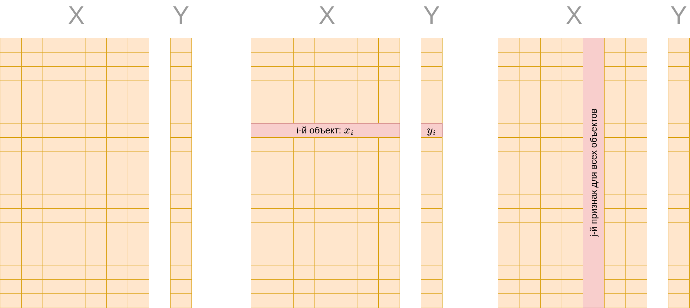

# Настройка параметров модели

Можно вручную задать функцию соответствия $\hat{y}=f(\mathbf{x})$ (которую называют **прогностической** или **прогнозной** функцией), которая бы выдавала прогнозы отклика $\hat{y}$ по известным признакам, однако зачастую это сложно сделать из-за многообразия объектов и сложных зависимостей между признаками и откликом. Поэтому в машинном обучении с учителем соответствие между признаками и откликом ищется в некотором классе функций $f_{\mathbf{w}}(\mathbf{x})$, параметризованном **вектором параметров** $\mathbf{w}$, которые подбираются по обучающей выборке, состоящей из $N$ объектов:

$$
(\mathbf{x}_1,y_1), (\mathbf{x}_2,y_2), ... (\mathbf{x}_N,y_N). 
$$

> Параметры модели также будем называть **весами модели** (model weights).

Например, класс функций может быть множеством всех константных прогнозов:

$$
f_w(\mathbf{x})=w,\quad w\in\mathbb{R},
$$

или состоять из всех линейных функций от признаков:

$$
f_{\mathbf{w}}(\mathbf{x})=w_0+w_1 x^1+w_2 x^2+...+w_D x^D, \quad \mathbf{w}=[w_0,w_1,...w_D]\in \mathbb{R}^{D+1}
$$

Существуют и более сложные семейства функций, о которых будет рассказано в следующих главах.

Чтобы из семейства функций выбрать наилучшую (что эквивалентно выбору определённого вектора параметров $\hat{\mathbf{w}}$) необходимо численно формализовать, какие прогнозы мы будем считать хорошими, а какие - плохими. Для этого задаётся **функция потерь** (loss function) $\mathcal{L}(\hat{y},y)$, зависящая от истинного значения отклика $y$ и предсказанного $\hat{y}$. Чем выше значение функции потерь, тем хуже считается прогноз. 

## Основные функции потерь в задаче регрессии

Рассмотрим основные функции потерь в задаче регрессии:

| название                                | формула                            |
|:---------------------------------------:| ---------------------------------- |
| квадрат ошибки (squared error, L2 loss) | $(\hat{y}-y)^2$                    |
| модуль ошибки (absolute error, L1 loss) | $\left\lvert\hat{y}-y\right\rvert$ |

Также широко используется гладкая комбинация обоих функций потерь, называемая **функцией Хубера** (smooth L1 loss):

$$
\begin{cases} 
0.5 \cdot x^2, & \text{если } |x| < \beta, \\
\beta \cdot (|x| - 0.5 \cdot \beta), & \text{если } |x| \geq \beta,
\end{cases}
$$

В последнем случае $\beta>0$ - гиперпараметр, задающий область квадратичной зависимости, которая продлевается линейно за пределами этой области, сохраняя непрерывность самой функции и непрерывность её производной.

> Будучи гладкой, эта функция удобна для оптимизации, но в то же время так же устойчива к нетипичным наблюдениям, как и модуль ошибки.

## Пример потерь для классификации

Для задачи классификации простейшей функцией потерь является индикатор ошибки, вычисляемый по формуле $\mathbb{I}\{\hat{y}\ne y\}$, где функция индикатора $\mathbb{I}\{\text{условие}\}$ возвращает 1, если условие выполнено, и 0 иначе. Забегая вперёд, скажем, что на практике для настройки моделей эту функцию применить нельзя, поскольку она не является дифференцируемой. Поэтому в классификации используются другие функции потерь, о которых будет рассказано [далее](../Linear-classification/Linear-classifier-methods#основные-функции-потерь).

:::tip Функция выигрыша

Функцию потерь не нужно путать с **функцией выигрыша** (score function) $S(\hat{y},y)$, которая также часто встречается в машинном обучении. Для более плохих прогнозов функция потерь должна принимать <u>более высокие</u> значения, а функция выигрыша - наоборот, <u>более низкие</u>. 

Например, для классификации функцией выигрыша является индикатор верного угадывания класса $\mathbb{I}\{\hat{y}=y\}$.

:::

## Теоретический и эмпирический риск

Для настройки параметров модели $\mathbf{w}$ традиционно желают минимизировать ожидаемые потери на новых объектах, поступающих из некоторого вероятностного распределения, называемые теоретическим риском:

$$
\mathbb{E}_{(\mathbf{x},y)}\{\mathcal{L}(f_{\mathbf{w}}(\mathbf{x}),y)\}=\mathit{\int}\int\mathit{\mathcal{L}(f_{\mathbf{w}}(\mathbf{x}),y)p(\mathbf{x},y)d\mathbf{x}dy\to\min_{\mathbf{w}}}
$$

Практически эта величина невычислима из-за того, что мы не обладаем информацией о теоретическом распределении объектов $p(\mathbf{x},y)$, а знаем лишь ограниченную обучающую выборку ${(\mathbf{x}_1,y_1),(\mathbf{x}_2,y_2),...(\mathbf{x}_N,y_N)}$. Поэтому на практике параметры $\mathbf{w}$ находятся минимизацией **эмпирического риска** $L(\mathbf{w})$, представляющего собой выборочную оценку теоретического риска по обучающей выборке:

$$
L(\mathbf{w}|X,Y)=\overline{\mathcal{L}(f_{\mathbf{w}}(\mathbf{x}),\,y)}=\frac{1}{N}\sum_{n=1}^{N}\mathcal{L}(f_{\mathbf{w}}(\mathbf{x}_{n}),\,y_{n}) \to \min_\mathbf{w} 
$$

Оценка параметров $\hat{\mathbf{w}}$ определяется как минимизатор эмпирического риска:

$$
\widehat{\mathbf{w}}=\arg\min_{\mathbf{w}}L(\mathbf{w}|X,Y),
$$

где $X\in \mathbb{R}^{N\times D}$ - **матрица "объекты-признаки"**, также называемая **матрицей признаков** (feature matrix). Строки этой матрицы соответствуют $D$-мерным векторам признаков для каждого из $N$ объектов обучающей выборки, а $Y\in \mathbb{R}^N$ - вектор откликов, которые мы хотим научиться предсказывать по признакам.

Модель с настроенными параметрами также называют **алгоритмом прогнозирования**.

> Параметры модели не стоит путать с **гиперпараметрами** (hyperparameters), которые не настраиваются по обучающей выборке, а задаются пользователем либо подбираются по отдельной выборке, называемой валидационной.

Вы также можете прочитать о принципе минимизации эмпирического риска в [[1]](https://urss.ru/cgi-bin/db.pl?lang=Ru&blang=ru&page=Book&id=241884&srsltid=AfmBOorL6KjhUfo0Y42_NmrUhzKrDo4zOsneZDwK8AP0Sl_U9aD13AbJ).

## Литература

1. [Мерков А. Б. Распознавание образов: введение в методы статистического обучения. //Москва: Едиториал УРСС. – 2019.](https://urss.ru/cgi-bin/db.pl?lang=Ru&blang=ru&page=Book&id=241884&srsltid=AfmBOorL6KjhUfo0Y42_NmrUhzKrDo4zOsneZDwK8AP0Sl_U9aD13AbJ)
