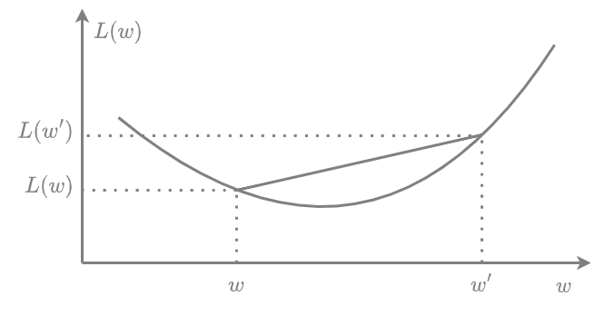

# Выпуклость потерь

В машинном обучении приветствуется выбор **выпуклых** функций потерь (convex loss functions) от параметров (или весов) модели, т.е. таких функций, что

$$
L(a*\mathbf{w}+(1-a)\mathbf{w}')\le aL(\mathbf{w})+(1-a)L(\mathbf{w}')\quad \forall \mathbf{w},\mathbf{w}'\text{ и } a\in[0,1].
$$

> Такие функции также называют **выпуклыми вниз**, чтобы не путать с  **вогнутыми** функциями (**выпуклыми вверх**), для которых выполнено неравенство в обратную сторону.

Неравенство выполнено для любых аргументов $\mathbf{w},\mathbf{w}'$ из области определения функции, которое также должно быть выпуклым (т.е. если две точки принадлежат области определения, то и любая промежуточная точка на отрезке, их соединяющем, тоже принадлежит области определения функции). Геометрически определение выпуклой функции означает, что отрезок, соединяющий любые две точки на функции, нигде не может лежать ниже значений функции. 

Пример выпуклой функции от одной переменной показан ниже:

Стоит отметить, что если потери на отдельном объекте $\mathcal{L}(f_{\mathbf{w}}(\mathbf{x}_{n}),y_{n})$ выпуклы по $\mathbf{w}$, то и потери по всей обучающей выборке (эмпирический риск) будут выпуклыми, т.к. усреднение выпуклых функций всегда будет тоже выпуклой функцией (докажите!).

Выпуклые функции удобны тем, что:

- любой локальный минимум является <u>глобальным</u>;
- равенство нулю производной является не только необходимым, но и <u>достаточным</u> условием минимума. 

Таким образом, найдя значение $\hat{\mathbf{w}}$, в котором $\nabla L(\hat{\mathbf{w}})=0$, мы точно знаем, что это глобальный минимум. 

Основные функции потерь машинного обучения для задач [регрессии](Function-selection#основные-функции-потерь-в-задаче-регрессии) и [классификации](../Linear-classification/Linear-classifier-methods#основные-функции-потерь) выпуклы.

:::note Задача

Попробуйте доказать эти свойства. Для доказательства второго свойства пригодится использование другого критерия выпуклой функции, что она всегда лежит не ниже касательной, проведённой в любой точке.

:::

  
Может ли у выпуклой функции не быть минимума?

  Да, рассмотрите функцию $y=1/x$.

  
Может ли у выпуклой функции быть несколько минимумов?

  Да, рассмотрите функцию $y=\max\{0,\vert x \vert-1\}$.

Более полную информацию о выпуклых функциях вы можете прочитать в [[1]](https://en.wikipedia.org/wiki/Convex_function) и [[2]](https://web.mit.edu/dimitrib/www/Convex_Theory_Entire_Book.pdf).

## Литература

1. [Wikipedia: convex function.](https://en.wikipedia.org/wiki/Convex_function)

2. [Bertsekas D. Convex optimization theory. – Athena Scientific, 2009. ](https://web.mit.edu/dimitrib/www/Convex_Theory_Entire_Book.pdf)
