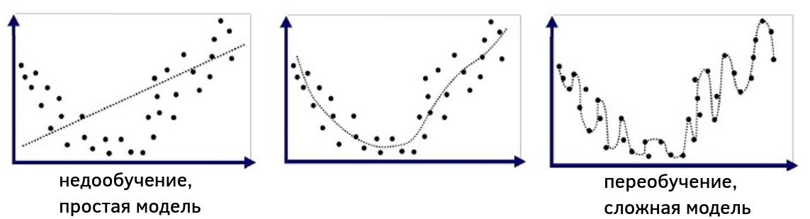

# Обобщающая способность модели

После [настройки параметров модели](Function-selection) на **обучающей выборке** (training set) $[X,Y]$, нам бы хотелось оценить, насколько хорошо она будет работать на новых данных - **тестовой выборке** (test set) $[X',Y']$, т.е. оценить так называемую **обобщающую способность** (generalization ability) - способность модели успешно экстраполировать выученные зависимости при обучении. Ведь именно для этого мы и настраивали модель! 

Тут важно помнить, что эмпирический риск на обучающей выборке не будет репрезентативно отражать эмпирический риск на новых данных, и в общем случае мы будем наблюдать, что $L(\hat{\mathbf{w}}|X,Y)<L(\hat{\mathbf{w}}|X',Y')$, поскольку $\hat{\mathbf{w}}$  выбиралась так, чтобы минимизировать ошибки именно на обучающих данных $(X,Y)$, но не новых. Мы лишь надеемся, что новые данные будут распределены примерно так же, как в обучающей выборке. 

Чем более сложная (гибкая, с б**о**льшим числом параметров) у нас модель, тем легче ей  подстроиться под обучающую выборку и тем меньше будет $L(\hat{\mathbf{w}}|X,Y)$, однако это далеко не всегда будет приводить к снижению $L(\hat{\mathbf{w}}|X',Y')$! Например, мы решаем задачу линейной регрессии по одномерному признаку $x$ и отклику $y$. Управлять сложностью получаемой модели можно за счет поиска линейной зависимости не только от $x$, но и от квадрата признака $(x)^2$, куба признака $(x)^3$ и так далее до определённой степени $(x)^K$. Тогда наша модель будет иметь вид:

$$
\hat{y}=w_0+w_1 x+w_2 (x)^2+...+w_K (x)^K,
$$

и будет моделировать множество всевозможных полиномиальных зависимостей $y$ от $x$. Выбирая различные $K$, мы будем управлять сложностью получаемой модели. На рисунке ниже обучающая выборка в осях $x,y$ показана точками, а прогнозы модели при различных $K$ показаны пунктирной линией. Видно, что малое $K=1$  (слева) будет приводить к линейной зависимости, которая слишком проста для реальной зависимости в данных, что соответствует **недообученной модели** (underfitted model), в то время как при высоком $K$ (справа) зависимость получается сложнее реальной зависимости и приводит к **переобученной модели** (overfitted model). Промежуточное $K$ приводит к модели, сложность которой примерно соответствует сложности реальных данных.

Более формально понятия недообученных и переобученных моделей будут рассмотрены в [отдельном разделе](../Overfitting-and-underfitting) учебника.

## Гиперпараметры моделей

Такой параметр, как $K$ в примере, который не настраивается на обучающей выборке (как вектор весов $\mathbf{w}$), а выбирается пользователем, называется **гиперпараметром** (hyperparameter). 

Подумайте, почему K нельзя настраивать на обучающей выборке?

Такой способ настройки будет всегда поощрять более гибкую модель с б**о**льшим значением K.

В частности, при K>=N-1 модель будет иметь как минимум столько же настраиваемых параметров, сколько объектов в выборке, и сможет обеспечить безошибочные прогнозы на всех объектах обучающей выборки, но не на новых тестовых объектах!

У большинства моделей машинного обучения есть гиперпараметр, отвечающий за сложность модели. Важно тщательно настроить этот гиперпараметр, чтобы *сложность модели соответствовала сложности реальной зависимости в данных*. 

Если модель будет слишком простой, то она будет показывать недостаточную точность из-за того, что у неё не хватает выразительной способности описать реальную зависимость. 

Если же модель будет слишком сложной, то она начнёт *перенастраиваться на особенности реализации обучающей выборки* (которая случайна в силу случайного отбора объектов в неё) вместо подгонки под реальную зависимость, что также негативно повлияет на её обобщающую способность на тестовых данных. Детальнее  недообученные и переобученные модели будут описаны в [отдельном разделе книги](../Bias-variance/Model-complexity).

Вы также можете прочитать недообученных и переобученных моделях в [[1]](https://www.geeksforgeeks.org/underfitting-and-overfitting-in-machine-learning/).

## Литература

1. [Geeksforgeeks: underfitting and overfitting.](https://www.geeksforgeeks.org/underfitting-and-overfitting-in-machine-learning/)
