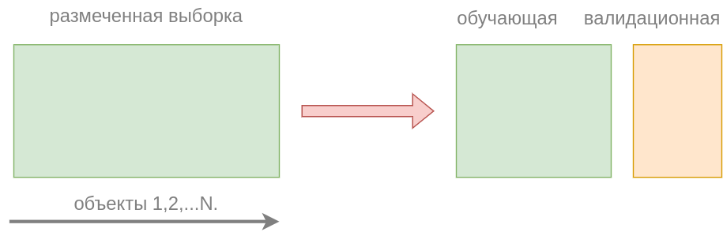
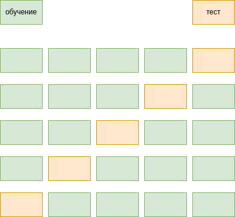
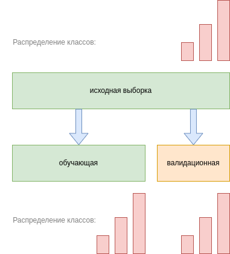
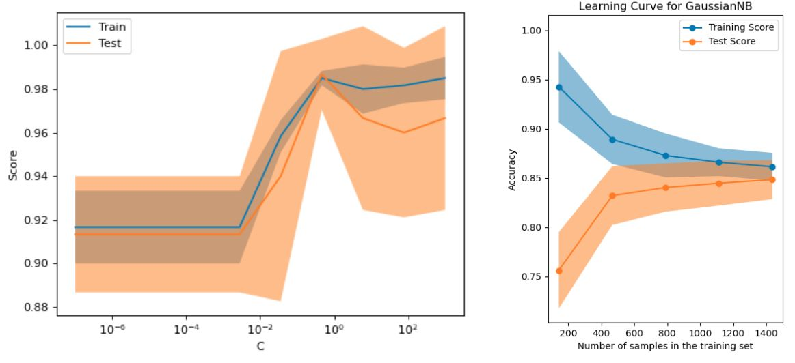
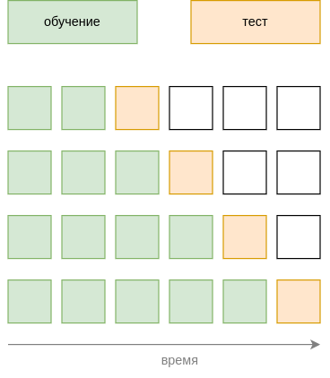

# Оценка качества прогнозов

Мы можем использовать для прогнозирования разные модели или одну и ту же модель, но при разных значениях гиперпараметров. Также для обработки варьируют весь **конвейер обработки данных** (пайплайн, pipeline), включающий как предобработку данных (заполнение пропущенных значений, отсев аномальных наблюдений, отбор и кодирование признаков), так и итоговое построение прогнозов. Важно уметь оценивать качество модели, чтобы подобрать самую точную модель и её наилучшую конфигурацию, а также знать, на какое качество работы мы можем рассчитывать на новых данных.

Как можно было бы оценить качество прогнозов модели? Как мы выяснили раньше, средние потери на обучающих объектах представляют собой необъективную и слишком оптимистическую оценку потерь модели на новых объектах, занижая потери, поскольку её параметры подбираются так, чтобы <u>именно на обучающих объектах</u> модель работала хорошо. Для более объективной оценки модели есть два подхода - использование отложенной **валидационной выборки** и **кросс-валидация**.

## Валидационная выборка

В этом подходе предлагается разбить размеченную выборку случайно на две подвыборки:

- **обучающую** (training set, ~80% объектов), на которой настраивать параметры модели $\mathbf{w}$.

- **валидационную** (validation set, ~20% объектов), на которой оценивать её качество.

Таким образом, множество индексов всех объектов $\{1,2,...N\}$ случайным образом разбивается на два подмножества: 

- $I_{train}$ - индексы объектов обучающей выборки;

- $I_{val}$ - индексы объектов валидационной выборки.

Настройка параметров производится по обучающим объектам ($|I|$ - число элементов в множестве $I$):

$$
L(\mathbf{w}|X_{train},Y_{train})=\frac{1}{|I_{train}|}\sum_{i \in I_{train}}\mathcal{L}(f_{\mathbf{w}}(\mathbf{x}_{i}),\,y_{i}) \to \min_\mathbf{w}
$$

При желании можно также производить [настройку с регуляризацией](Regularization).

Оценка качества прогнозов производится по объектам валидационной выборки:

$$
L(\mathbf{w}|X_{val},Y_{val})=\frac{1}{|I_{val}|}\sum_{i \in I_{val}}\mathcal{L}(f_{\mathbf{w}}(\mathbf{x}_{i}),\,y_{i})
$$

В этом случае регуляризация не используется, т.к. нас интересует <u>только точность</u> итоговых прогнозов.

Данный подход также называется **валидацией на отложенных данных** (hold-out validation).

:::tip Итоговая модель

После того, как мы оценили качество модели на валидационной выборке, итоговая модель обучается <u>на всех</u> размеченных данных (и на обучающей, и на валидационной выборке). Так мы повысим качество итоговой модели, настраивая её, используя всю доступную информацию.

:::

## Кросс-валидация

Недостатком отложенной валидационной выборки является то, что приходится обучать модель на подмножестве данных, а не на всех, поскольку часть данных резервируется на оценку качества (валидационную выборку). Валидационная выборка должна занимать существенную пропорцию от всех данных, чтобы репрезентативно представлять разнообразие новых наблюдений в будущем. Из-за этого тестируемая модель будет в общем получаться хуже, чем итоговая модель, которая обучается на всех данных.

**Кросс-валидация** (перекрёстный контроль, кросс-проверка, cross-validation) - другой подход, который позволяет задействовать больше размеченных объектов для обучения, и все размеченные объекты для тестирования качества прогнозов, что обеспечивает более точное оценивание качества прогнозов.

Для этого размеченная выборка делится на $K$ примерно равных групп объектов, называемых блоками (folds), а подход целиком называется $K$-блоковой кросс-валидацией (K-fold cross-validation).

> $K$ обычно берется равным от 3 до 8. Дальнейшее наращивание $K$ слишком усложняет настройку, но не приводит к существенному улучшению качества оценок.

Далее каждый из этих блоков поочерёдно исключается, а модель настраивается по оставшимся блокам, как показано на рисунке, где строки - это этапы работы алгоритма, а столбцы - блоки объектов, на которые мы разбили обучающую выборку:

После прохода по всем блокам мы получим несмещённые вневыборочные прогнозы для всех объектов, усреднением потерь на которых мы получим итоговую оценку качества. 

### Преимущества

1. Полученная таким образом оценка будет точнее, чем предыдущий подход, поскольку качество прогнозов будет оценено <u>на всех располагаемых объектах</u>, а не только на валидационной выборке. 

2. Также, поскольку каждый раз исключается лишь один из небольших блоков, тестируемая модель обучается на большем объеме данных и получается <u>ближе к итоговой</u>, которую мы обучаем на всей выборке.

3. Поскольку модель в кросс-валидации перенастраивается $K$ раз, можно исследовать стабильность потерь и стабильность настроенных параметров по отдельным блокам, анализируя их стандартные отклонения по блокам. Также можно следить за тем, насколько рассогласованными получаются прогнозы между $K$ моделями, обученными на каждой подвыборке, что позволит оценивать уверенность в прогнозах.

### Недостатки

Недостатком кросс-валидации является то, что приходится $K$ раз перенастраивать модель, в отличие от подхода с отложенной валидационной выборкой, где оцениваемая модель настраивалась лишь один раз.

В частном случае кросс-валидации при $K=N$ модель будет применена к каждому объекту в отдельности. Такой метод называется **скользящим
контролем** (leave-one-out), но применяется только для моделей с очень быстрой настройкой, поскольку требует перенастройки модели $N$ раз.

Mетоды оценки качества прогнозов моделей и их программные реализации в вы также можете прочитать в [[1]](https://scikit-learn.ru/stable/model_selection.html).

## Особенности применения методов

### Альтернативная итоговая модель

Вместо обучения итоговой модели на всех данных можно в качестве итоговой брать усреднение прогнозов по $K$ моделям, обученным на каждом этапе кросс-валидации.

Такая конфигурация может показывать более высокую точность. Сложность обучения у неё ниже (не нужно настраивать модель сразу на всех данных), но сложность прогнозирования выше (поскольку придётся для каждого прогноза усреднять по прогнозам $K$ моделей).

### Случайное перемешивание

Как перед применением подхода с отложенной выборкой, так и перед кросс-валидацией важно объекты перемешать *в случайном порядке*, поскольку исходный порядок объектов мог быть неслучайным. Например, при диагностике заболеваний пациентов поликлиники сначала могли идти здоровые пациенты, а потом больные (во время эпидемии). Для сбалансированного разбиения на подвыборки наблюдения по пациентам необходимо предварительно перемешать.

### Стратифицированное разбиение

Важно помнить, что случайное разбиение на подвыборки меняет распределение признаков и отклика. Например, в случае задачи классификации распределение классов на полной выборке и подвыборках будет различаться в зависимости от характера разбиения. Для сохранения распределения по классам можно производить случайное разбиение **со стратификацией** (stratified split), позволяющее сохранить исходное распределение классов в каждой подвыборке. Такое разбиение проиллюстрировано ниже для случая 3-х классов:

:::note Задача

Предложите алгоритм генерации разбиения со стратификацией по классам.

:::

:::tip Несбалансированная классификация

Сохранить исходное распределение классов <u>особенно важно</u> в задаче **несбалансированной классификации** (umbalanced classification), в которой одни классы встречаются существенно реже остальных. В таком случае высока вероятность, что в подвыборку не попадёт ни одного объекта-представителя редкого класса, и подвыборка получится нерепрезентативной!

Примеры задач несбалансированной классификации: выявление редких заболеваний в медицинской диагностике, обнаружение мошеннических транзакций среди миллионов остальных.

Несбалансированная классификация требует особых подходов, реализованных, например, в библиотеке imbalanced-learn [[2]](https://imbalanced-learn.org/stable/).

:::

В случае, когда классы встречаются часто, стратификация не так критична, поскольку внутри больших подвыборок распределение классов и так будет получаться похожим на априорное распределение по всей выборке. Это следует из закона больших чисел [[3]](https://ru.wikipedia.org/wiki/%D0%97%D0%B0%D0%BA%D0%BE%D0%BD_%D0%B1%D0%BE%D0%BB%D1%8C%D1%88%D0%B8%D1%85_%D1%87%D0%B8%D1%81%D0%B5%D0%BB).

### Учет случайности результатов

Поскольку разбиение на обучающие и валидационные блоки происходит случайно, то результаты <u>будут различаться при перезапусках</u>. Для воспроизводимости экспериментов важно зафиксировать случайный порядок. Это достигается <u>инициализацией генератора случайных чисел фиксированным числом</u> (random state, random seed). 

:::tip Чем его инициализировать?

В обучающих ноутбуках генератор случайности часто инициализируют числом 42. Однако никакой магии именно в таком выборе нет, главное - зафиксировать случайность любым числом, например, нулём.

:::

Если позволяют вычислительные ресурсы, можно перезапустить процедуру несколько раз с разной инициализацией, чтобы оценить влияние вида случайного разбиения на результат.

## Анализ результатов

Полученное качество можно визуализировать в виде сравнительной таблицы качества работы разных моделей или одной и той же модели, но при разных значениях гиперпараметров. 

В случае кросс-валидации полезно добавлять информацию о стандартном отклонении (standard deviation) оценки, полученной по разным блокам кросс-валидации. Эта информация позволит судить о статистической значимости различий.

Информативно строить графики зависимости качества прогнозов от отдельного гиперпараметра (validation curve) и от размера обучающей выборки (learning curve), как показано ниже [[4]](https://scikit-learn.org/stable/modules/learning_curve.html#validation-curve):

## Подбор гиперпараметров

С помощью валидационной выборки или кросс-валидации подбираются наилучшие гиперпараметры модели. Чаще всего гиперпараметры модели настраивают **полным перебором по сетке значений** (grid search), выбирая конфигурацию, обеспечивающую максимальную точность прогнозов. 

Вместо перебора по фиксированной сетке значений варианты гиперпараметров можно **сэмплировать случайно из заданного диапазона** (random search). 

### Когда случайный поиск лучше поиска по сетке?

Случайный перебор лучше поиска по сетке за счёт более полного перебора вариантов, если настраивается набор гиперпараметров, среди которых <u>некоторые гиперпараметры слабо влияют на результат</u>. 

:::tip Простой пример

Рассмотрим два гиперпараметра $A,B\in [0,1]$, среди которых первый влияет, а второй - не влияет на функцию потерь. Если вычислительный бюджет позволяет сделать только 16 оценок, то при поиске по сетке будет использоваться сетка значений $(A,B)\in\{0,0.25,0.5,0.75,1\}\times \{0,0.25,0.5,0.75,1\}$. Заметим, что мы переберём лишь 4 уникальных значения гиперпараметра $A$, а перебор по всевозможным соответствующим значениям незначимого гиперпараметра $B$ будет производиться вхолостую! В случайном же поиске будут оцениваться все 16 различных значений гиперпараметра $A$, что повысит полноту содержательного перебора.

:::

Существуют и более продвинутые способы перебора гиперпараметров, обеспечивающие за минимальное число проверок более быструю сходимость к наилучшей конфигурации (см. hyperparameter optimization, [[5]](https://www.geeksforgeeks.org/hyperparameters-optimization-methods-ml/)).

:::warning Оценка качества при одновременном подборе гиперпараметров

Если по валидационной выборке или кросс-валидации производилась настройка гиперпараметров, то использовать <u>те же данные для итоговой оценки качества работы модели нельзя</u>, так как при многократном переподборе значений гиперпараметров модель могла переобучиться, выбрав ту конфигурацию, которая хорошо работает именно на заданной валидационной выборке. Для несмещённой оценки качества подобранных гиперпараметров необходимо разбивать не на две, а на три выборки:

- обучающую (на которой настраиваем параметры модели),

- валидационную (на которой настраиваем гиперпараметры модели),

- тестовую (на которой уже тестируем качество итогового решения).

Только оценку качества прогнозов на отдельной тестовой выборке можно считать несмещенной в результате подбора гиперпараметров, поскольку только объекты этой выборки модель увидит в первый раз. Существует и кросс-валидационный подход многократного разбиения не на две, а сразу на три подвыборки (nested cross-validation [[6]](https://inria.github.io/scikit-learn-mooc/python_scripts/cross_validation_nested.html)) для одновременного подбора гиперапаметров и оценки качества модели с наилучшими из них. Он обеспечивает более точную оценку качества при более высоких вычислительных ресурсах.

:::

## Оценка качества прогнозов для временных рядов

Для оценки качества прогнозирования временных рядов (последовательности наблюдений, которые поступают динамически по времени) <u>нельзя использовать обычные подходы</u>, поскольку они приведут к случайному перемешиванию объектов во времени, и мы начнём тестировать качество прогнозов более ранних наблюдений по более поздним данным! 

Поэтому для временных рядов используется оценка качества прогнозов с контролем по времени (out-of-time control), при котором усредняется качество прогнозов на один или несколько шагов вперед при всевозможных временных разбиениях на известные прошлые и неизвестные будущие наблюдения, подлежащие прогнозированию, как показано на рисунке:

## Литература

1. [Документация scikit-learn: модели отбора признаков и оценки.](https://scikit-learn.ru/stable/model_selection.html)
2. [Imbalanced-learn documentation.](https://imbalanced-learn.org/stable/)
3. [Wiki: закон больших чисел.](https://ru.wikipedia.org/wiki/%D0%97%D0%B0%D0%BA%D0%BE%D0%BD_%D0%B1%D0%BE%D0%BB%D1%8C%D1%88%D0%B8%D1%85_%D1%87%D0%B8%D1%81%D0%B5%D0%BB)
4. [Документация sklearn: validation curves.](https://scikit-learn.org/stable/modules/learning_curve.html#validation-curve)
5. [Geeksforgeeks: hyperparameter optimization.](https://www.geeksforgeeks.org/hyperparameters-optimization-methods-ml/)
6. [Inria: nested cross-validation.](https://inria.github.io/scikit-learn-mooc/python_scripts/cross_validation_nested.html)
