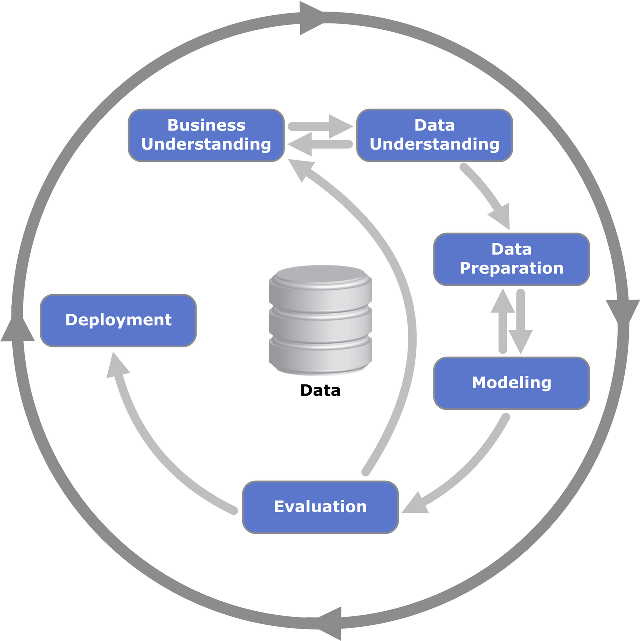

# Этапы решения задачи машинного обучения

Процесс решения практических задач с использованием машинного обучения состоит из следующих этапов:

1. **Понимание бизнес-проблемы.**
   
   На этом этапе мы отвечаем на следующие вопросы: 
   
   - Какую задачу в конечном счете нам нужно решить? 
   
   - Что дано и что необходимо найти? Для чего?

2. **Формализация задачи.**
   
   Решаются вопросы:
   
   - Какими входными признаками мы располагаем для решения? 
   
   - Какая функция потерь будет реалистично оценивать фактические потери (например, в деньгах) от тех или иных ошибок прогнозирования?

3. **Сбор данных.**
   
   Осуществляется сбор разнородных данных из разных источников в единую базу данных.
   
   :::tip Выбор признаков
   
   Полезно спросить экспертов предметной области, какие данные в принципе нужны для построения прогнозов? Это даст ключ к пониманию, какие данные вам необходимо дополнительно собрать.
   
   :::

4. **Предобработка данных.**
   
   На этом этапе решаются следующие проблемы:
   
   - Как заполнять пропущенные значения? 
   
   - Какие объекты считать аномальными и исключать из анализа? 
   
   - Как кодировать сложные неструктурированные данные (тексты, графы, изображения, видеозаписи, аудиофайлы) в виде векторов вещественных чисел? Как представить категориальные переменные в вещественном виде? Этот этап описывается в [следующей части учебника](../Data-preprocessing).

5. **Генерация признаков.**
   
   Модель может неэффективно работать на исходных признаках. Например, линейная модель будет строить только линейные зависимости, а фактическая зависимость может быть нелинейной. Поэтому целесообразно модели помочь на этом этапе, сгенерировав нелинейные трансформации исходных признаков. Очень важно на данном этапе сгенерировать именно те признаки, которые бы действительно информативно помогали выбранной модели предсказывать ожидаемый отклик. 

6. **Отбор информативных признаков.**
   
   На этапе сбора, предобработки и генерации признаков мы, скорее всего, получим избыточный набор информации. Лишние признаки повышают вычислительные расходы и ухудшают обобщающую способность модели, приводя к переобучению: если рассеивать внимание модели на неинформативные признаки, то она может ошибочно выучить ложную закономерность. 

7. **Настройка модели.**
   
   Здесь мы выбираем несколько моделей машинного обучения, по которым настраиваем их параметры, как описано в главе о [настройке параметров модели](02-Function-selection.md).

8. **Оценка качества модели.**
   
   Этот этап описан в разделе, посвященном [оценке качества прогнозов моделей](07-Quality-estimation.md).

9. **Внедрение модели.**
   
   Включает интеграцию модели в существующую инфраструктуру, перенаправление на неё потоков данных и учёт прогнозов модели в последующих бизнес-процессах.

10. **Поддержка модели.**
    
    Данные со временем изменяются, а закономерности в них устаревают. Поэтому важно в динамическом режиме работы отслеживать качество работы модели, чтобы периодически донастраивать её параметры и учитывать новые источники данных.

На каждом этапе возможен откат к одному из предыдущих этапов. Часто при оценке качества модели мы можем получить неудовлетворительное качество и прийти к выводу, что для лучшей точности необходимы дополнительные признаки из существующих (генерация признаков) или из новых источников (сбор данных). Даже после внедрения модели может выясниться, что модель решает немного не ту задачу, которая нужна конечным пользователям, после чего может потребоваться переосмысление бизнес-проблемы. Поэтому указанную последовательность действий правильнее рассматривать не как список, а как циклическую последовательность непрерывных улучшений, как визуализируется в методологии CRISP-DM [[1]](https://ru.wikipedia.org/wiki/CRISP-DM):

## Литература

1. [Wikipedia: CRISP-DM.](https://ru.wikipedia.org/wiki/CRISP-DM) 
