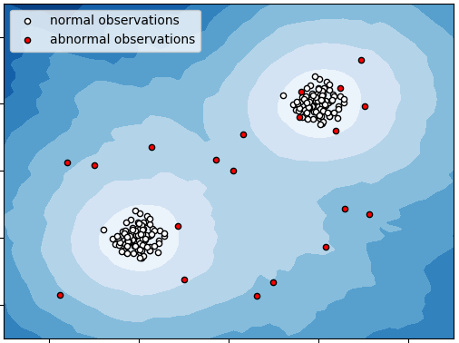
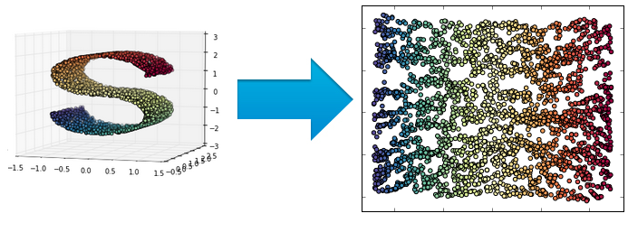

# Обучение без учителя

**Обучение без учителя** (unsupervised learning) в машинном обучении представляет собой задачу, в которой по вектору признаков $\mathbf{x}$ требуется предсказать некоторые отклики $y$, однако обучающая выборка состоит <u>только из признаковых описаний</u> для набора объектов:

$$
\mathbf{x}_1,\mathbf{x}_2,...\mathbf{x}_N.
$$

Поскольку разметка для объектов отсутствует, то в качестве функции потерь выступает не эмпирический риск, а некоторая вручную подобранная эвристика, характеризующая желаемый результат. При этом выбор целевой эвристики формализует свойства прогнозов, которые мы хотим получить и диктуется целевой задачей. Выбор той или иной эвристикой <u>существенно влияет на результат</u>, иногда кардинально. 

Обычно в задачах обучения без учителя прогнозы строятся только для исходной выборки, однако могут возникать задачи, где требуется применение полученной модели и для новых объектов.

Рассмотрим примеры задач обучения без учителя.

## Кластеризация

В **кластеризации** (clustering) необходимо разбить объекты на группы (называемые кластерами) так, чтобы объекты, попавшие в одну группу были метрически похожими (расстояние между ними было небольшим), а объекты, попавшие в разные группы - метрически непохожими (удалёнными друг от друга). Ниже приведён пример кластеризации в двумерном признаковом пространстве $(x^1,x^2)$, где первый признак отложен вдоль оси X, а второй - вдоль оси Y. Объекты обучающей выборки показаны на графике слева. Поскольку выборка не размечена, то все точки обозначены чёрным цветом. В результате применения алгоритма кластеризации (график справа) объекты разбиваются на три кластера (красный, зеленый, синий) так, что объекты из одинакового кластера похожи, а из разных - нет.

Число кластеров может быть как известно заранее, так и определяться автоматически в зависимости от алгоритма. С основными алгоритмами кластеризации и их реализациями в бибилотеке sklearn вы можете ознакомиться в [[1]](https://scikit-learn.org/stable/modules/clustering.html).

Алгоритмы кластеризации используются, например, когда необходимо разбить клиентов компании на отдельные группы с похожими характеристиками. Или  распределить книги электронной библиотеки по категориям на основе сходства их содержания. Также кластеризация применяется для генерации новых признаков объектов для повышения качества решения задач обучения с учителем, например: 

- номер кластера, которому принадлежит объект; 

- расстояние от объекта до центра его кластера, измеряющее степень типичности объекта;

- вектор направления изменения объекта в сторону центра его кластера (что нужно изменить в объекте, чтобы сделать его более типичным);

- расстояние до ближайшего чужого кластера, отношение расстояния до своего и до ближайшего чужого кластера (насколько объект лежит на границе двух кластеров). 

## Обнаружение аномалий

Поступающие на обработку объекты имеют некоторое распределение. Большинство объектов типичны (имеют высокую вероятность, согласно распределению объектов), но некоторые объекты могут оказаться нетипичными (и иметь малую вероятность). Такие объекты лежат далеко от других объектов выборки. Выявление подобных нетипичных объектов называется **обнаружением аномалий** (anomaly detection) или **детекцией выбросов** (outlier detection).

Ниже приведён пример работы алгоритма по детекции выбросов в выборке, регулярные объекты которой помечены белым, а выбросы - красным.

Выбросы обычно получаются в результате <u>ошибок измерения</u>. Например, операционист при вводе информации о клиенте мог вбить лишнюю цифру, либо измеряющий сенсор мог испортиться и записать неверную информацию. В таких случаях детекция выбросов представляет собой важный этап предобработки данных - перед настройкой модели важно обнаружить все выбросы и исключить их из обучающей выборки, чтобы они не привели к смещению прогнозов модели. 

Однако также бывает, что <u>выбросы соответствуют реально существующим объектам</u> в природе, которые требуют специальной обработки. Например, если каждый объект - вектор параметров работы станка (температура, потребление электричества, число оборотов двигателя и т.д.), снимаемых каждую минуту, то наблюдение-выброс может соответствовать ситуации, когда станок выходит на нештатный и опасный режим работы (например, из-за короткого замыкания в сети, пожара, перегрузки), что чреватого поломкой. Своевременное обнаружение подобных аномалий позволит остановить работу станка досрочно, уменьшив размер ущерба, и представляет собой отдельную важную задачу. 

:::tip Обучение без учителя!

Поскольку невозможно заранее описать многообразие всех ошибок измерения и типов нестандартных объектов, то получаем задачу без учителя. Если бы мы размечали объекты на типичные и нетипичные вручную и настраивали бы по этим данным классификатор, то он был бы способен детектировать <u>только ту нетипичность, которая уже наблюдалась в обучающей выборке</u>!

:::

Со всевозможными алгоритмами обнаружения аномалий и их реализациями в sklearn вы можете ознакомиться в [[2]](https://scikit-learn.org/stable/modules/outlier_detection.html).

## Снижение размерности

Задача **снижения размерности** данных (dimensionality reduction, [[3]](https://en.wikipedia.org/wiki/Dimensionality_reduction)) заключается в том, чтобы представить исходные многомерные объекты $\{\mathbf{x}_1,\mathbf{x}_2,...\mathbf{x}_N\}$, лежащие в многомерном пространстве $\mathbb{R}^D$ , в маломерные векторы $\mathbf{y}_1,\mathbf{y}_2,...\mathbf{y}_N$ из пространства $\mathbb{R}^d$, где $d<D$. Это отображение должно сохранять геометрические свойства исходных объектов: 

- если исходные объекты $\mathbf{x},\mathbf{x}'$ были близки, то и их образы $\mathbf{y},\mathbf{y}'$ также должны быть близки 

- если $\mathbf{x},\mathbf{x}'$ были далеки, то и их образы $\mathbf{y},\mathbf{y}'$ тоже должны быть далеки друг от друга. 

По сути, снижение размерности переводит исходные, возможно, избыточные признаковые представления объектов в новые компактные признаковые представления без дублирования информации. Пример снижения размерности из трёхмерного в двумерное пространство приведён ниже, где цвет обозначает множества похожих объектов (изначально не задан):

## Поиск ассоциативных правил

Часто входные данные представляют собой наборы элементов. Например, в магазине покупатели чаще всего покупают не один товар, а  целый набор товаров, пробитых в одном чеке. Примеры совместно купленных товаров показаны в таблице:

| номер чека | набор купленных товаров  |
| ---------- | ------------------------ |
| 1          | хлеб, сыр, масло         |
| 2          | ветчина, масло, хлеб     |
| 3          | кофе, печенье, сливки    |
| 4          | хлеб, бекон, джем        |
| 5          | чай, кофе, сливки, сахар |
| 6          | масло, яйца, хлеб        |
| 7          | кофе, конфеты, сливки    |

Анализируя чеки, можно автоматически искать множества совместно покупаемых товаров и извлекать правила вида:

- если покупатель купил хлеб, то, скорее всего, он купит и молоко;

- если покупатель купил кофе, то, скорее всего, он купит сливки.

Условие срабатывания правила, а также предсказываемый правилом результат могут состоять и из нескольких товаров. 

Автоматическое извлечение подобных правил из наблюдаемых наборов элементов называется **поиском ассоциативных правил** (association rule mining, [[4]](https://en.wikipedia.org/wiki/Association_rule_learning)). Наборы элементов могут быть как неупорядоченными множествами (при анализе чеков в магазине), так и упорядоченными - например, при анализе последовательности посещённых веб-страниц на веб-сайте.

В целом о задачах обучения без учителя можно дополнительно прочитать в [[5]](https://www.geeksforgeeks.org/unsupervised-learning/).

## Литература

1. [Sklearn: clustering](https://scikit-learn.org/stable/modules/clustering.html).
2. [Sklearn: outlier detection.](https://scikit-learn.org/stable/modules/outlier_detection.html)
3. [Wikipedia: dimensionality reduction.](https://en.wikipedia.org/wiki/Dimensionality_reduction)
4. [Wikipedia: association rule learning.](https://en.wikipedia.org/wiki/Association_rule_learning)
5. [Geeksforgeeks: unsupervised learning.](https://www.geeksforgeeks.org/unsupervised-learning/)
