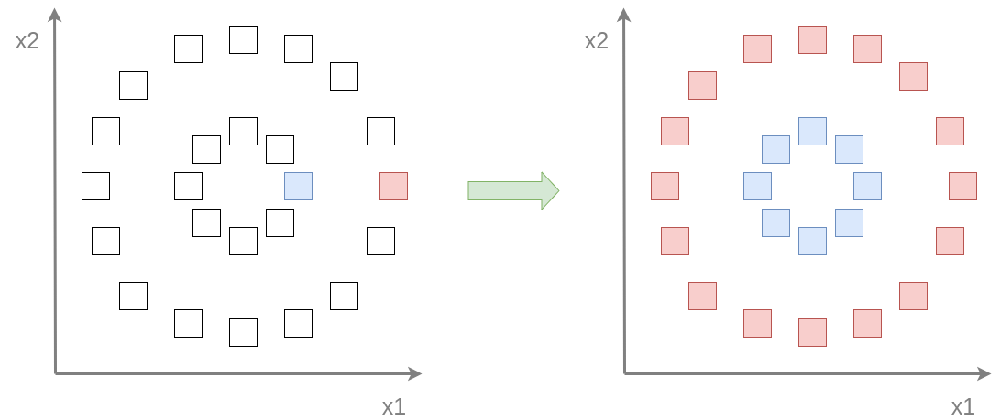

# Частичное обучение

**Частичное обучение** (semi-supervised learning) представляет собой промежуточный случай между [обучением с учителем](Supervised-learning) (в котором все объекты обучающей выборки размечены) и [обучением без учителя](Unsupervised-learning) (в которой ни один объект не размечен). В частичном обучении <u>часть объектов имеют разметку, а часть - нет</u>, поэтому обучающая выборка имеет следующий вид:

$$
(\mathbf{x}_1,y_1),(\mathbf{x}_2,y_2),...(\mathbf{x}_N,y_N),\mathbf{x}_{N+1},\mathbf{x}_{N+2},...\mathbf{x}_{N+M}
$$

Такая постановка задачи весьма типична, поскольку часто не составляет труда собрать большие наборы неразмеченных данных (изображений, текстов, видео в интернете), однако их корректная разметка требует человеческого труда, поэтому разметить мы можем далеко не все собранные объекты.

Упрощенный пример частичного обучения приведён ниже на графике слева для задачи бинарной классификации двумерных объектов, обозначенных квадратами. Изначально в выборке размечено всего два квадрата (в синий и красный класс). Лучшее, что мы можем сделать, <u>используя только размеченные данные</u> - это разделить пространство признаков прямой, равноудалённой от этих двух точек. Однако если мы будем использовать знание о распределении неразмеченных объектов (две концентрических окружности) и предположение о том, что близкие объекты принадлежат одинаковому классу, то мы сможем существенно расширить множество размеченных объектов (график справа), из которого уже естественнее провести границу между классами в форме окружности.

Методы частичного обучения используют предположение о том, что похожие (метрически близкие) объекты должны принадлежать одинаковому классу. Это всего лишь предположение, которое <u>может быть и не выполнено</u>. Тут многое зависит от признаков, которыми мы описываем объекты, а также от функции расстояния, по которой считаем близость. Для верификации предположения необходима проверка на отдельной валидационной выборке!

:::

При правильно подобранном признаковом описании объектов и функции вычисления расстояния методы частичного обучения дают эффект, когда число размеченных объектов мало, а неразмеченных - велико. Если же размеченных объектов и так много, то потенциальный эффект от их использования будет минимальным и лучше использовать классическое обучение с учителем.

:::tip Трансдуктивное обучение

Задача **трансдуктивного обучения** (transductive learning), в которой заранее известны признаковые описания объектов тестовой выборки (на которой мы хотим применить нашу модель), представляет собой частный случай частичного обучения и к ней могут быть применены такие же подходы.

:::

Дополнительно о методах обучения без учителя можно прочитать в [[1]](https://www.geeksforgeeks.org/unsupervised-learning/).

## Литература

1. [Geeksforgeeks: semi-supervised learning in ML.](https://www.geeksforgeeks.org/ml-semi-supervised-learning/)
