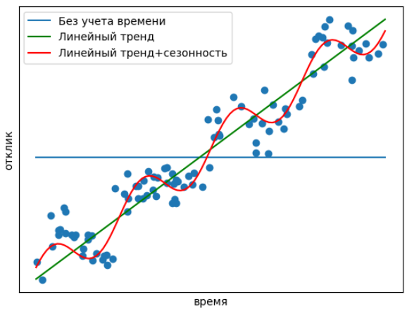

# Обработка временного признака

## Временной признак

Часто одним из признаков является **время наблюдения** для заданного объекта. Например, в задаче прогноза числа арендованных велосипедов для разных дней, вектор признаков будет включать не только погоду, температуру и другие характеристики, но и <u>дату наблюдения</u>. 

Для эффективного использования временного признака рекомендуется его заменить на новый признак, равный *числу дней с начала наблюдений*, т.е. с минимального значения этого признака среди всех объектов. Если известна не только дата, но и время, этот признак можно закодировать как *число секунд с начала измерений*. 

## Тренд

Предложенный признак позволит учесть **временной тренд**. В случае задачи предсказания числа арендованных велосипедов он может состоять в том, что спрос рос со временем за счёт роста популярности недорогих и экологичных видов транспорта.

## Сезонность

Сезонность - это периодическая зависимость целевой величины от времени.

В нашем примере отклик имеет выраженную сезонность, поскольку ожидаемое число арендованных велосипедов зависит от дня недели, а также различается в оразные времена года. Для учёта сезонности полезно извлечь дополнительные категориальные признаки, характеризующие *месяц и день недели*. Также полезно извлечь признаки характеризующие *праздничные дни*. Если известна не только дата, но и время, то можно учитывать и внутридневную сезонность, извлекая такой категориальный признак, как номер часа.

Ниже приведены модели, не учитывающие и учитывающие информацию, извлечённую из временного признака:

Вы можете дополнительно ознакомиться с примером прогнозирования временных рядов с учётом тренда и сезонности в [[1]](https://medium.com/swlh/time-series-analysis-7006ea1c3326).

:::tip Дополнительные признаки

При прогнозировании временных рядов очень информативно использовать ранее наблюдавшиеся (лагированные) значения целевой величины с задержкой во времени. При этом можно использовать несколько значений для задержки, привязанной к сезонности. Например, при прогнозировании спроса на велосипеды можно использовать наблюдавшийся спрос неделю/год назад. Помимо использования лагированных значений непосредственной величины, которую прогнозируем (например, спрос в Зеленограде), полезно также использовать лагированные агрегаты этой величины (спрос по московской области/России в целом).

:::

Детальнее о прогнозировании и аналитике временных рядов вы можете прочитать в учебнике ШАД от Яндекса [[2]](https://education.yandex.ru/handbook/ml/article/vremennye-ryady) и [[3]](https://education.yandex.ru/handbook/ml/article/analitika-vremennyh-ryadov).

## Литература

1. [Medium: time series analysis.](https://medium.com/swlh/time-series-analysis-7006ea1c3326)
2. [Учебник ШАД: временные ряды.](https://education.yandex.ru/handbook/ml/article/vremennye-ryady)
3. [Учебник ШАД: аналитика временных рядов.](https://education.yandex.ru/handbook/ml/article/analitika-vremennyh-ryadov)
