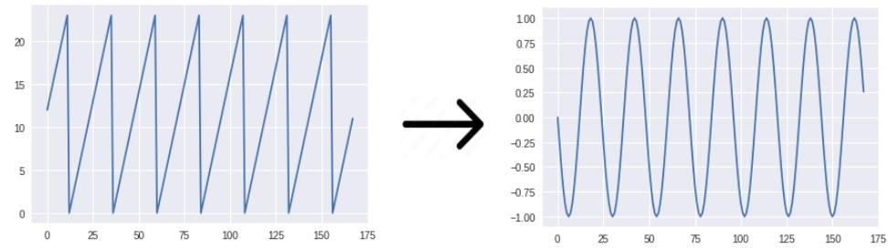

# Обработка категориальных признаков

**Категориальные признаки** (categorical features) - это признаки, принимающие одно из $K$ дискретных значений, такие как профессия человека или город, в котором он родился. Такие признаки очень часто встречаются на практике. Частным случаем категориальных признаков являются **бинарные признаки** (binary features), принимающие всего два значения, такие как семейное положение человека или индикатор, были ли у человека просрочки по кредитам.

Модель машинного обучения ожидает на входе вектор, состоящий только из вещественных признаков. Если бинарный признак мы можем представить в вещественном виде, закодировав категории цифрами 0 и 1, то в случае признака, описывающего несколько категорий, возможны различные варианты кодировок, которые мы рассмотрим далее.

## Порядковое кодирование

В **порядковом кодировании** (ordinal encoding) категория заменяется её номером. Рассмотрим кодировку признака [профессия]. Пусть для простоты она принимает всего 4 возможных значения: программист, художник, дизайнер и системный администратор. В порядковом кодировании мы заменяем профессии их номерами:

| значение                | номер |
| ----------------------- | ----- |
| программист             | 0     |
| художник                | 1     |
| дизайнер                | 2     |
| системный администратор | 3     |

Этот вид кодирования <u>не рекомендуется применять на практике</u>, поскольку метод машинного обучения впоследствии будет считать, что движение в направлении 0,1,2,3 будет соответствовать возрастанию какой-то реально существующей характеристики, которой в действительности нет, поскольку <u>нумерация была произвольной</u>. Также в нашем примере метод на основе близости численных значений будет считать, что программист ближе по смыслу к художнику, чем к системному администратору, что в действительности не так.

## Кодирование частотами

При **частотном кодировании** (frequency encoding) значение каждой категории заменяется на частоту встречаемости этой категории. Пусть, например, у нас 7 человек, среди которых два программиста, три системных администратора, один дизайнер и художник. Для этого случая частотное кодирование будет выглядеть так:

| значение                | кодировка |
| ----------------------- | --------- |
| программист             | 2/7       |
| системный администратор | 3/7       |
| системный администратор | 3/7       |
| дизайнер                | 1/7       |
| художник                | 1/7       |
| системный администратор | 3/7       |
| программист             | 2/7       |

Обратим внимание, что кодирование неоднозначно для дизайнера и художника, которые встретились одинаковое число раз. 

> Полезность кодировки определяется тем, насколько частота встречаемости категорий связана с целевой переменной.

## One-hot кодирование

При **one-hot кодировании** (one-hot encoding, dummy encoding). Вначале все категории нумеруются произвольным образом. Каждый категориальный признак, принимающий значение i-й категории среди $K$ возможных, кодируется $K$-мерным вектором из нулей, где на одной только i-й позиции стоит единица. 

Пример соответствия категорий кодировкам:

| направление | кодировка |
| ----------- | --------- |
| север       | [0,0,0,1] |
| юг          | [0,0,1,0] |
| восток      | [0,1,0,0] |
| запад       | [1,0,0,0] |

Пример применения кодировки к данным:

| направление | кодировка |
| ----------- | --------- |
| север       | [0,0,0,1] |
| север       | [0,0,0,1] |
| запад       | [1,0,0,0] |
| восток      | [0,1,0,0] |
| север       | [0,0,0,1] |

Метод однозначно кодирует категорию и, в отличие от предыдущих методов, производит сопоставление одному категориальному признаку сразу набор бинарных признаков (по числу категорий). Все категории, независимо от порядка кодирования,  получаются равнозначными: попарное расстояние между кодировками любой пары категорий получается одним и тем же. 

One-hot кодирование - самый популярный способ представления категориальных признаков, однако у него есть недостаток, что при слишком большом числе категорий он приводит к сильному разрастанию числа признаков. Например, если категория - это город, то, поскольку городов очень много, число признаков значительно увеличивается, что приводит к сильному увеличению параметров модели машинного обучения, ухудшая её настройку. Одним из способов борьбы с этим является объединение различных родственных категорий в одну. Например, вместо указания города можно указывать область, в которой этот город находится. Если же не хочется  терять детализации, то можно использовать усиленную [регуляризацию](../Base-concepts/Regularization) модели.

:::tip Эмбеддинги

Представление определённой дискретной сущности (например, категории в категориальном признаке) вектором вещественных чисел называется **эмбеддингом** (embedding). One-hot кодирование приводит к слишком длинному вектору, если число категорий велико. Вместе с этим понятно, что если использовать не только значения 0/1, а весь спектр вещественных чисел, то можно даже большое число категорий однозначно закодировать компактным вектором эмбеддинга. Эмбеддинги можно сэмплировать случайно, при этом желательно обеспечивать одинаковое попарное расстояние между эмбеддингами разных категорий. Или генерировать эмбеддинги так, чтобы расстояние между эмбеддингами оказывалось более близким для более близких категорий по смыслу (например, работа программиста более близка к работе системного администратора, а работа художника - к работе дизайнера, поэтому и соответствующие эмбеддинги должны быть ближе). Существуют продвинутые методы автоматической генерации эмбеддингов, о которых можно прочитать, например, в статье [[1]](https://cs.msu.ru/sites/cmc/files/docs/dyakonov.pdf).

:::

## Кодирование средним

**Кодирование средним** (mean encoding, target encoding) - компактный и максимально информативный способ кодирования категориального признака путём замены каждой категории на среднее прогнозируемого отклика <u>при условии этой категории</u>. 

Приведём пример для регрессии, когда по профессии необходимо предсказать зарплату:

| признак (профессия)     | отклик | кодирование признака |
| ----------------------- | ------ | -------------------- |
| программист             | 300    | 350                  |
| системный администратор | 250    | 200                  |
| системный администратор | 200    | 200                  |
| дизайнер                | 220    | 200                  |
| художник                | 150    | 150                  |
| дизайнер                | 180    | 200                  |
| программист             | 400    | 350                  |
| системный администратор | 150    | 200                  |

А ниже показан пример кодирования средним для классификации, когда по профессии предсказываем, вернёт человек кредит или нет:

| признак (профессия)     | отклик | кодирование признака |
| ----------------------- | ------ | -------------------- |
| программист             | 1      | 1                    |
| системный администратор | 1      | 2/3                  |
| системный администратор | 0      | 2/3                  |
| дизайнер                | 1      | 1/2                  |
| художник                | 0      | 0                    |
| дизайнер                | 0      | 1/2                  |
| программист             | 1      | 1                    |
| системный администратор | 1      | 2/3                  |

Как видим, для регрессии и бинарной классификации один столбец исходного признака заменяется на один столбец условных средних. В случае многоклассовой классификации каждая категория будет заменяться на <u>вектор условных частот каждого из классов</u> при условии категории. 

Представленный способ кодирования максимально информативен для решения итоговой задачи предсказания отклика по кодировке, поскольку кодировка в явном виде агрегирует информацию об отклике.

:::warning Переобучение

Кодирование признака агрегацией по отклику <u>приводит к переобучению</u>, поскольку мы через признак явно передаём информацию об ожидаемом ответе, пусть и в усреднённом виде. Для категорий, которые встретились единожды ("художник" в  примере) мы перенесли отклик в признак в явном виде! Получается, мы решаем нечестную задачу, поскольку сообщаем модели информацию об ожидаемом отклике, которую она не должна знать. 

Чтобы избежать переобучения и сделать прогнозы честными, можно выделить отдельную обучающую выборку на кодирование средним только по ней, а потом перенести вычисленное соответствие категорий средним откликам в основную обучающую выборку, по которой уже будем настраивать модель.

Более эффективный способ с точки зрения переиспользования данных - для каждого объекта подставлять вместо категории условное среднее отклика по всем объектам <u>кроме рассматриваемого</u> (**leave one out encoding**).

:::

:::tip Варианты метода

Вместо каждой категории можно подставлять условное среднее по другому вещественному или бинарному признаку. Такое кодирование не приводит к подглядыванию в неизвестный отклик, поэтому для него не нужна отдельная выборка для кодировки. 

Также вместо среднего значения при условии каждой категории можно подставлять условную медиану, максимум, минимум или стандартное отклонение - в зависимости от задачи.

:::

## Кодирование циклических переменных

**Циклическое кодирование** (cyclic encoding) применяется для кодирования категориальных переменных, принимающих циклические значения, такие как час в сутках и день месяца. В этих случаях существует естественный порядок на значениях. 

Например, час в сутках принимает значения 0,1,2,3,...22,23. За счёт вещественного представления часа в сутках удаётся передать модели, что соседние часы близки, а дальние - далеки, что сделает зависимость от часа дня более плавной. При этом необходимо учесть, что, в силу цикличности, час 23 близок к нулевому часу.

Моделировать такие виды близости можно с помощью **циклического кодирования**, при котором признак $u\in [0,\max(u))$ кодируется парой вещественных значений:

$$
u \longrightarrow \left[\sin\left(\frac{2\pi\cdot u}{\max(u)}\right);\cos\left(\frac{2\pi\cdot u}{\max(u)}\right)\right]
$$

Поскольку $\sin() и \cos()$ - непрерывные функции, то такое представление для близких значений $u$ и $u'$ будет выдавать близкие кодировки, а дополнительно удастся сообщить модели, что 23 часа близко к часу ночи, а 31 число близко к первому! Эффект достигается за счёт свойств периодичности синуса и косинуса:

:::tip Какую кодировку использовать?

Конечный вид кодировки подбирается методом проб и ошибок и в конечном счете определяется тем, какой из них будет приводить к более точным прогнозам. Можно кодировать категориальный признак и сразу несколькими способами!

:::

Обзор различных видов кодирования категориальных признаков можно прочитать в [[2]](https://medium.com/aiskunks/categorical-data-encoding-techniques-d6296697a40f), а в [[3]](https://link.springer.com/article/10.1007/s00180-022-01207-6) приводятся сравнительные эксперименты по эффективности кодирования признаков разными способами.

Программные реализации кодирования признаков библиотек sklearn и feature_engine описаны в [[4]](https://scikit-learn.org/stable/modules/preprocessing.html) и [[5]](https://feature-engine.trainindata.com/en/latest/).

## Литература

1. [А.Г. Дьяконов. Методы решения задач классификации с категориальными признаками.](https://cs.msu.ru/sites/cmc/files/docs/dyakonov.pdf)

2. [Medium: categorical data encoding techniques.](https://medium.com/aiskunks/categorical-data-encoding-techniques-d6296697a40f)

3. [Pargent F. et al. Regularized target encoding outperforms traditional methods in supervised machine learning with high cardinality features //Computational Statistics. – 2022. – Т. 37. – №. 5. – С. 2671-2692.](https://link.springer.com/article/10.1007/s00180-022-01207-6)

4. [Документация scikit-learn: preprocessing.](https://scikit-learn.org/stable/modules/preprocessing.html) 

5. [Документация feature-engine: categorical encoding.](https://feature-engine.trainindata.com/en/latest/user_guide/encoding/index.html)
