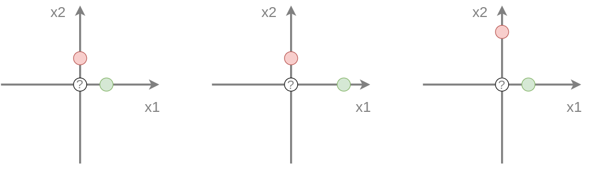
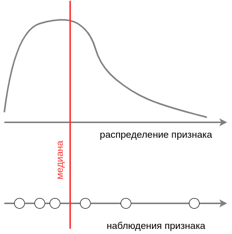

# Нормализация признаков

Входные признаки в большинстве случаев будут иметь разный масштаб (диапазон изменения значений признака): одни признаки могут изменяться в диапазоне $[-0.01,0.01]$, другие - в $[0,100]$ и т.д. Как мы впоследствии увидим из описаний методов машинного обучения, *для большинства из них* масштаб признаков будет оказывать влияние на прогноз. Для таких моделей чем выше разброс значений признака, тем сильнее он будет влиять на прогноз, перекрывая влияние признаков меньшего масштаба. 

Рассмотрим в качестве примера классификацию методом ближайшего соседа (nearest neighbor), который для каждого объекта $\mathbf{x}$ назначает тот класс, к которому принадлежит ближайший к нему объект *из обучающей выборки*. Для простоты рассмотрим классификацию на 2 класса (зелёный и красный) в двумерном пространстве признаков. Обучающая выборка состоит из двух объектов и требуется построить прогноз для точки в начале координат.

Исходная обучающая выборка приведена на рисунке слева: 

Как видим, обучающие объекты равноудалены от точки, для которой требуется сделать прогноз, поэтому оба класса равновероятны. Если мы умножим первый признак на два $x^1\to 2 x^1$, то прогнозом станет красный класс, как более близкий (в центре изображения). А если умножим на два второй признак $x^2\to 2 x^2$, то прогнозом будет уже зелёный класс (справа)!

Чем выше разброс вдоль определённого признака, тем сильнее он влияет на прогноз, поэтому, чтобы влияние всех признаков было одинаковым, их необходимо **нормализовать**, то есть привести к одному масштабу. Наиболее распространены следующие способы:

| **Название**             | **Преобразование**                                  | **Выходные свойства**                   |
| ------------------------ | --------------------------------------------------- | --------------------------------------- |
| Стандартизация           | $\frac{x^{j}-\mu_{j}}{\sigma_{j}}$                  | нулевое среднее и единичная дисперсия   |
| Диапазонное шкалирование | $\frac{x^{j}-\min(x^{j})}{\max(x^{j})-\min(x^{j})}$ | принадлежит интервалу [0,1]             |
| Нормализация средним     | $\frac{x^{j}-\mu_{j}}{\max(x^{j})-\min(x^{j})}$     | нулевое среднее, с единичным диапазоном |

Каждый вид шкалирования применяется к каждому признаку (столбцу в матрице объекты-признаки X) <u>независимо</u>.

Самым популярным методом нормализации признака является **стандартизация признака** (standardization, standard scaler). Вторым по популярности является **диапазонное шкалирование** (min-max scaler). Оно хорошо тем, что значения признака из отрезка [0,MAX] переводятся в отрезок [0,1], причём ноль переходит в ноль, что полезно для **разреженных данных** (sparse data), в которых большинство значений - нули. Такие данные часто возникают на практике и эффективно кодируются разреженными матрицами (sparse matrix, [[1]](https://python-school.ru/blog/python/sparse-matrix/)), которые экономично их хранят и производят операции над ними, оперируя только ненулевыми элементами. Диапазонное шкалирование <u>позволяет сохранить свойство разреженности</u>.

## Влияние выбросов

Наличие выбросов (аномально больших или малых значений) искажает результат нормализации, так наличие даже одного выброса может существенно сместить среднее, дисперсию, минимум или максимум. Поэтому важно <u>предварительно отфильтровать выбросы из выборки</u>. Альтернативно можно заменить неустойчивые к выбросам статистики на устойчивые по схеме ниже:

| неустойчивая статистика                              | робастный аналог                                         | значение              |
| ---------------------------------------------------- | -------------------------------------------------------- | --------------------- |
| $\frac{1}{N}\sum_{n=1}^N x^j$                        | $\text{median}\{x^j\}$                                   | центр распределения   |
| $\sqrt{\frac{1}{N}\sum_{n=1}^N (x^j_n-\bar{x}^j)^2}$ | $\text{median}\{\lvert x^j-\text{median}\{x^j\}\rvert\}$ | разброс распределения |
| $\min$ $x^j$                                         | 1% перцентиль                                            | минимум               |
| $\max x^j$                                           | 99% перцентиль                                           | максимум              |

где $\bar{x}^j=\frac{1}{N}\sum_{n=1}^N x^j_n$. 

### Медиана

**Медиана** (median) - величина, альтернативная **выборочному среднему** (mean) для оценки центра распределения. Для выборки значений признака медиана - это такое значение, что половина наблюдений оказываются меньше, а другая половина - больше этого значения. Для вероятностного распределения медиана - это такое значение, что половина вероятностной массы лежит слева, а другая половина - справа от значения медианы. 

### **p-процентная перцентиль**

$p$-процентная перцентиль (percentile) - это такое значение, что

- для выборки наблюдений $p$ <u>процентов</u> наблюдений лежит слева, а $(1-p)$ процентов - справа от значения.

- для вероятностного распределения признак с вероятностью $p/100$ принимает значение меньше, а с вероятностью $(1-p)/100$ - больше значения перцентили.

Как видно, $p$-квантиль соответствует $(100*p)$-процентной перцентили.

## Литература

1. [Python-school: введение в разреженные матрицы.](https://python-school.ru/blog/python/sparse-matrix/)
