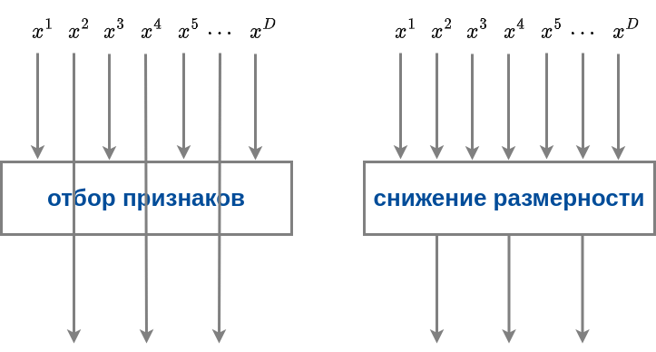
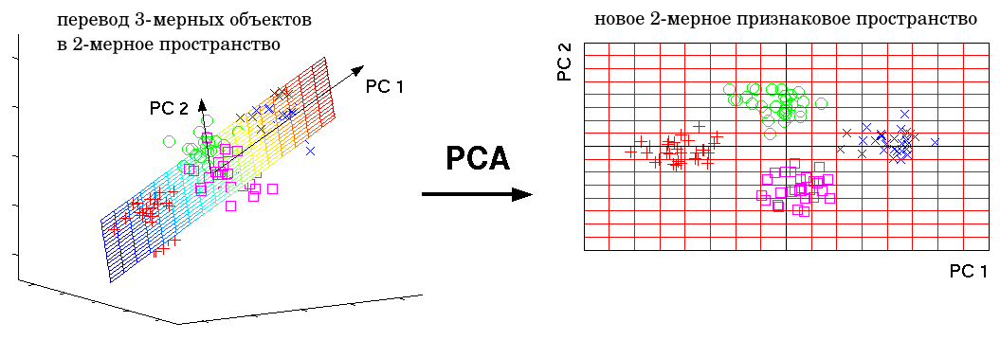

# Сокращение числа признаков

Исходных признаков может быть слишком много в силу избыточного сбора даже слабоинформативных данных. Либо могло появиться много новых признаков после их генерации из существующих. 

:::tip Почему больше не всегда лучше?

Число оцениваемых параметров модели растет с увеличением числа признаков. Например, линейные модели прогнозируют отклик, отталкиваясь от линейной комбинации признаков с оцениваемыми весами. Чем больше признаков, тем больше весов нужно оценить. При ограниченной обучающей выборке это будет приводить к неточной оценке коэффициентов и переобучению модели. Увеличение числа признаков также увеличивает накладные расходы на хранение и обработку данных.

:::

Поэтому, если число входных признаков велико, то их количество сокращают, что может осуществляться 

- методами отбора признаков (feature selection); 

- методами снижения размерности (dimensionality reduction).

Различие подходов графически показано ниже:

При отборе признаков используется <u>подмножество из исходных признаков</u>, а остальные просто отбрасываются. При снижении размерности каждый выходной признак получается некоторым преобразованием <u>над всеми исходными признаками</u>. 

Существует много методов отбора признаков. Многие из них описаны в [[1]](https://scikit-learn.org/stable/modules/feature_selection.html). Например, можно выбрать подмножество признаков, которые сильнее всего скоррелированы с откликом. А в качестве снижения размерности часто используется **метод главных компонент** (principal component analysis, PCA), который линейной трансформацией переводит объекты из многомерного признакового пространства в маломерное таким образом, чтобы сумма квадратов расстояний от исходных объектов до их проекций оказывалась наименьшей, как показано ниже (при переводе объектов из трёхмерного признакового пространства в двумерное):

Теоретические основы метода и способ реализации можно прочитать в [[2]](https://neerc.ifmo.ru/wiki/index.php?title=%D0%9C%D0%B5%D1%82%D0%BE%D0%B4_%D0%B3%D0%BB%D0%B0%D0%B2%D0%BD%D1%8B%D1%85_%D0%BA%D0%BE%D0%BC%D0%BF%D0%BE%D0%BD%D0%B5%D0%BD%D1%82_(PCA)).

## Литература

1. [Документация sklearn: feature selection.](https://scikit-learn.org/stable/modules/feature_selection.html)

2. [Вики-конспекты ИТМО: метод главных компонент.](https://neerc.ifmo.ru/wiki/index.php?title=%D0%9C%D0%B5%D1%82%D0%BE%D0%B4_%D0%B3%D0%BB%D0%B0%D0%B2%D0%BD%D1%8B%D1%85_%D0%BA%D0%BE%D0%BC%D0%BF%D0%BE%D0%BD%D0%B5%D0%BD%D1%82_(PCA))
