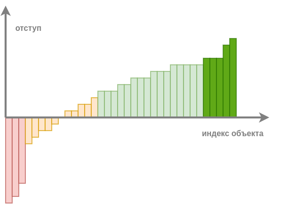

# Отступ классификации

## Введение

В регрессии (когда прогнозируем вещественное число) есть понятие <u>величины ошибки</u>, характеризующей степень того, насколько мы ошиблись в прогнозе:

$$
\varepsilon = f_\mathbf{w}(\mathbf{x})-y
$$

Соответственно, мы определяем функцию потерь от этой ошибки, характеризующую штраф за то или иное отклонение:

| задача    | название                              | формула                                                  |
| --------- | ------------------------------------- | -------------------------------------------------------- |
| регрессия | квадрат ошибки (squared error)        | $(f_\mathbf{w}(\mathbf{x})-y)^2$                         |
| регрессия | модуль ошибки (absolute error)        | $\vert f_\mathbf{w}(\mathbf{x})-y \vert$                 |
| регрессия | $\alpha$-нечувствительная, $\alpha>0$ | $\max\{0,\vert f_\mathbf{w}(\mathbf{x})-y\vert-\alpha\}$ |

Проинтерпретируйте $\alpha$-нечувствительные потери.

$\alpha$-нечувствительные потери штрафуют отклонение пропорционально величине отклонения за вычетом $\alpha$ и вообще не штрафуют, если отклонение оказалось по абсолютной величине меньше $\alpha$. Это полезно в приложениях, где существует некоторый допустимый уровень ошибки, таких как прогноз погоды для бытовых нужд, когда разница в $\pm 1$ градус несущественна.

Но как измерять степень рассогласованности классификационного прогноза с истинным значением? Можно смотреть на индикатор ошибки $\mathbb{I}\{f_\mathbf{w}(\mathbf{x})\ne y\}$, однако эта величина принимает всего два дискретных значения: 0 для верного и 1 - для неверного прогноза! Индикатор не позволяет понять, <u>насколько уверенно</u> модель пыталась предсказать правильный отклик! Для этого используется понятие **отступа** (margin).

## Отступ для многоклассовой классификации

:::tip Определение отступа

**Отступ** (margin) - непрерывная величина, измеряющая качество классификации по формуле:

$$
M(\mathbf{x},y)=g_y(\mathbf{x})-\max_{c\ne y}g_c(\mathbf{x}),
$$

где $g_y(\mathbf{x})$ - рейтинг верного класса, а $\max_{c\ne y}g_c(\mathbf{x})$ - максимальный рейтинг среди всех неверных. 

:::

Отступ по смыслу измеряет, насколько модель <u>уверенно назначала верный класс по сравнению со всеми неверными</u>. Чем отступ выше, тем модель была более уверена в правильном прогнозе. Если $M(\mathbf{x},y)>0$, то модель делает верный прогноз, а если $M(\mathbf{x},y)<0$, то неверный.

Если применить модель ко всем объектам обучающей выборки, посчитать на них отступ и отсортировать по нему, то получим примерно такой график:

По величине отступа объекты делятся на следующие категории:

- **Надежно классифицированные объекты** (обозначены светло-зелёным): отступ положительный и заметно больше нуля. При хорошей настройке модели большинство объектов будут принадлежать этой категории.

- **Объекты-эталоны** (обозначены насыщенным зелёным): отступ положительный и большой. Объекты, лежащие в глубине своего класса и описывающие характерных представителей своего класса.

- **Пограничные объекты** (обозначены оранжевым): отступ несильно отличается от нуля, объекты лежат на границе классов, и на таких объектах обычно достигается максимальное число ошибок.

- **Объекты-выбросы** (обозначены красным): отступ отрицательный и большой по абсолютной величине. Объекты лежат в глубине чужого класса. На них модель уверена, что класс один, хотя на самом деле он совсем другой.

Для повышения точности настройки модели полезно отфильтровать объекты-выбросы, чтобы они не мешали её настройке. 

При этом, если нужно сократить размер обучающей выборки для повышения эффективности обучения, то делать это можно взяв эталонные объекты (определяющие расположения классов) и пограничные (несущие более детальную информацию о границах между ними), добавляя в первую очередь те пограничные объекты, на которых отступ меньше, но которые всё ещё не являются выбросами. Уменьшение размера выборки известно в литературе как отбор прототипов (prototype selection). О более продвинутых подходах можно прочитать в [[1]](https://faculty.marshall.usc.edu/jacob-bien/papers/aoas2011protoclass.pdf).

Информацию об отступах объектов можно использовать и для более эффективного порядка обхода объектов в численных методах оптимизации модели методом [стохастического градиентного спуска](../Numerical-optimization/SGD) вместо выбора случайных групп объектов.

## Отступ для бинарной классификации

В случае бинарной классификации формула для отступа упрощается:

$$
M(\mathbf{x},y)=g_y(\mathbf{x})-g_{-y}(\mathbf{x})=y(g_{+1}(\mathbf{x})-g_{-1}(\mathbf{x}))=yg(\mathbf{x}),
$$

где, как и раньше, $g(\mathbf{x})=g_{+1}(\mathbf{x})-g_{-1}(\mathbf{x})$ определяет <u>относительную дискриминантную функцию</u>.

## Литература

1. [Bien J., Tibshirani R. Prototype selection for interpretable classification. – 2011.](https://faculty.marshall.usc.edu/jacob-bien/papers/aoas2011protoclass.pdf)
