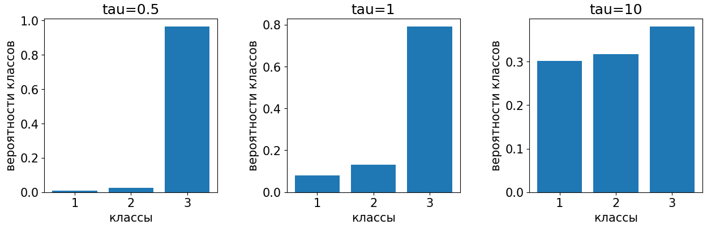

# Предсказание вероятностей и преобразование SoftMax

Часто в прикладных задачах требуется хорошо предсказывать не только <u>метку класса</u> $\hat{y}\in\{1,2,...C\}$, но и <u>вероятность каждого класса</u> $p(c), c=1,2,...C.$ Например, в задачах прогноза погоды важно не только предсказать, будет ли ясная погода или дождь, но и вероятность дождя. Ведь даже если она меньше 50%, но близка к ней, то имеет смысл брать зонтик.

Для предсказания вероятностей классов нужно использовать их [дискриминантные функции](Discriminant-functions#многоклассовый-классификатор-в-общем-виде) $g_c(\mathbf{x}), c=1,2,...C,$ характеризующие степень уверенности классификатора в том или ином классе. Поскольку дискриминантные функции могут принимать произвольные значения - как положительные, так и отрицательные - а сумма дискриминантных функций не обязательно равна единице, то к ним необходимо применить некоторое монотонно-возрастающее преобразование $F_{\tau}$, обеспечивающее два свойства:

- выходы должны быть неотрицательными;

- выходы должны суммироваться в единицу.

В качестве такого преобразования используют операцию SoftMax, используемую для перевода ненормированных рейтингов классов в их вероятности:

$$
\begin{pmatrix}
   g_1(\mathbf{x}) \\
   g_2(\mathbf{x}) \\
   \cdots \\
   g_C(\mathbf{x}) \\ 
\end{pmatrix}
\longrightarrow 
\begin{pmatrix}
   \cfrac{e^{g_1(\mathbf{x})/\tau}}{\sum_{i=1}^C e^{g_i(\mathbf{x})/\tau}} \\
   \cfrac{e^{g_2(\mathbf{x})/\tau}}{\sum_{i=1}^C e^{g_i(\mathbf{x})/\tau}} \\
   \cdots \\
   \cfrac{e^{g_C(\mathbf{x})/\tau}}{\sum_{i=1}^C e^{g_i(\mathbf{x})/\tau}} \\
\end{pmatrix}
=
\begin{pmatrix}
   \hat{p}(y=1|\mathbf{x}) \\
   \hat{p}(y=2|\mathbf{x}) \\
   \cdots \\
   \hat{p}(y=C|\mathbf{x}) \\ 
\end{pmatrix}
$$

  Как вы думаете, на что влияет параметр $\tau$?

Параметр $\tau$, называемый **температурой** (temperature), определяет контрастность получаемых вероятностей. Чем $\tau$ выше, тем метод становится менее чувствительным к индивидуальным различиям дискриминантных функций, результирующее распределение вероятностей становится более близким к равномерному. 

И наоборот, чем $\tau$ ниже, тем сильнее SoftMax реагирует на изменения рейтингов, а выходные вероятности становятся более контрастными.

Эти случаи показаны на рисунке:

:::tip Обобщение SoftMax-преобразования

SoftMax-преобразование можно обобщить, применяя любую монотонно возрастающую функцию $F_{\tau}(\cdot)$, принимающую неотрицательные значения:

$$
\begin{pmatrix}
   g_1(\mathbf{x}) \\
   g_2(\mathbf{x}) \\
   \cdots \\
   g_C(\mathbf{x}) \\ 
\end{pmatrix}
\longrightarrow 
\begin{pmatrix}
   \cfrac{F_{\tau}(g_1(\mathbf{x}))}{\sum_{i=1}^C F_{\tau}(g_i(\mathbf{x}))} \\
   \cfrac{F_{\tau}(g_2(\mathbf{x}))}{\sum_{i=1}^C F_{\tau}(g_i(\mathbf{x}))} \\
   \cdots \\
   \cfrac{F_{\tau}(g_C(\mathbf{x}))}{\sum_{i=1}^C F_{\tau}(g_i(\mathbf{x}))} \\
\end{pmatrix}
=
\begin{pmatrix}
   \hat{p}(y=1|\mathbf{x}) \\
   \hat{p}(y=2|\mathbf{x}) \\
   \cdots \\
   \hat{p}(y=C|\mathbf{x}) \\ 
\end{pmatrix}

$$

В частном случае $F_\tau(g)=e^{g/\tau}$ получим операцию SoftMax.

:::

Детальнее о SoftMax-преобразовании можно прочитать в [[1]](https://en.wikipedia.org/wiki/Softmax_function).

## Литература

1. [Wikipedia: softmax function.](https://en.wikipedia.org/wiki/Softmax_function)
