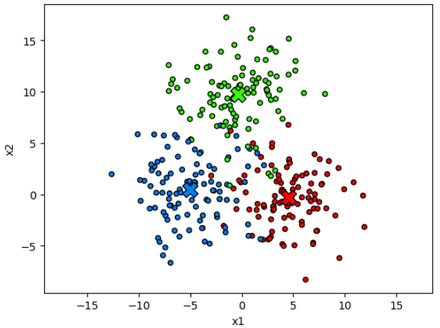
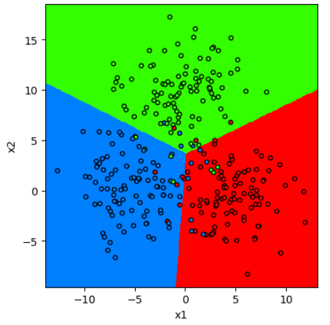

# Метод ближайших центроидов

## Идея метода

**Метод ближайших центроидов** (nearest centroids, [[1]](https://en.wikipedia.org/wiki/Nearest_centroid_classifier)) представляет собой простейший [метрический метод](Metric-methods) и решает задачу классификации. Рассмотрим демонстрационную обучающую выборку из двумерных объектов, разбитых на три класса. Класс объектов будем обозначать цветом.


Обучение метода заключается в вычислении **центроидов** для каждого класса. 

$$
\bm{\mu}_{c}=\frac{1}{N_{c}}\sum_{n: y_{n}=c}\mathbf{x}_{n}
$$

Ниже они обозначены крестиками соответствующего цвета.



На этапе предсказания класса для объекта $\mathbf{x}$ вычисляются расстояния до каждого из центроидов. Объекту назначается тот класс, расстояние до которого меньше всего:

$$
\hat{y}(\mathbf{x})=\argmin_{c}\rho(\mathbf{x},\bm{\mu}_{c})
$$

<details>
  <summary>Чему равны дискриминантные функции для этого метода?</summary>
<p>

[Дискриминантная функция](../General-classifiers/Discriminant-functions#многоклассовый-классификатор-в-общем-виде) каждого из классов вычисляет рейтинг соответствующего класса: чем он выше, тем класс более вероятен. Поэтому дискриминантная функция каждого класса будет равна расстоянию от $\mathbf{x}$ до центроида соответствующего класса <u>со знаком минус</u> (либо любой другой убывающей функции от расстояния).

</p>
</details>

Разделение признакового пространства методом ближайших центроидов для демонстрационного примера приведено ниже:



Как видим, границы между классами представляют собой прямые линии.

<details>
  <summary>Всегда ли границы между классами будут линейными гиперплоскостями?</summary>
<p>

Границы между классами $i$ и $j$ задаются условием $\{\mathbf{x}: g_i(\mathbf{x})=g_j(\mathbf{x})\}$, что в случае метода ближайших центроидов будет $\{\mathbf{x}: \rho(\mathbf{x},\bm{\mu}_i)=\rho(\mathbf{x},\bm{\mu}_j)\}$. Если использовать <u>евклидову функцию расстояния</u>, то это всегда будет линейной гиперплоскостью (докажите! подсказка: распишите уравнение границы в аналитическом виде).

</p>
</details>

## Варианты усложнения метода

Метод использует не объекты обучающей выборки, а их внутриклассовые усреднения (центроиды). Если хотим использовать только обучающие объекты, то в качестве центроидов нужно выбирать центральные объекты класса из обучающей выборки (т.е. такие объекты выборки, что расстояние от них до всех других объектов того же класса будет наименьшим).

За счет того, что сравнение $\mathbf{x}$ происходит лишь с центроидами, а не со всеми объектами выборки, <u>прогноз будет строиться быстро</u>. Однако метод способен выделять лишь выпуклые формы кластеров, поэтому в общем случае будет работать неточно. Его можно использовать как **бейзлайн** (простой метод, задающий нижнюю границу на точность), а также усложнить, характеризуя каждый класс не одним центроидом, а сразу несколькими в разных позициях.

Также метод можно обобщить, используя различные функции вычисления расстояния.

Описание метода и особенностей его реализации можно прочитать в документации sklearn [[2]](https://scikit-learn.org/stable/modules/neighbors.html#nearest-centroid-classifier).

## Пример запуска в Python

<div class="code_start">Метод ближайших центроидов:</div>

```py
from sklearn.neighbors import NearestCentroid
from sklearn.metrics import accuracy_score

X_train, X_test, Y_train, Y_test = get_demo_classification_data()  
model = NearestCentroid()      # инициализация модели
model.fit(X_train,Y_train);    # обучение модели
Y_hat = model.predict(X_test)  # построение прогнозов
print(f'Точность прогнозов: {100*accuracy_score(Y_test, Y_hat):.1f}%')
```

<div class="code_end"></div>

[Больше информации](https://scikit-learn.org/stable/modules/neighbors.html#nearest-centroid-classifier). [Полный код](https://github.com/victorkitov/ML/blob/main/%D0%9F%D1%80%D0%B8%D0%BC%D0%B5%D1%80%D1%8B%20%D0%B7%D0%B0%D0%BF%D1%83%D1%81%D0%BA%D0%B0%20%D0%BE%D1%81%D0%BD%D0%BE%D0%B2%D0%BD%D1%8B%D1%85%20%D0%BC%D0%B5%D1%82%D0%BE%D0%B4%D0%BE%D0%B2%20%D0%B2%20sklearn.ipynb). 

## Литература

1. [Wikipedia: nearest_centroid_classifier.](https://en.wikipedia.org/wiki/Nearest_centroid_classifier) 

2. [Документация sklearn: nearest centroid classifier.](https://scikit-learn.org/stable/modules/neighbors.html#nearest-centroid-classifier)
