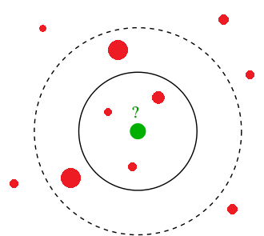
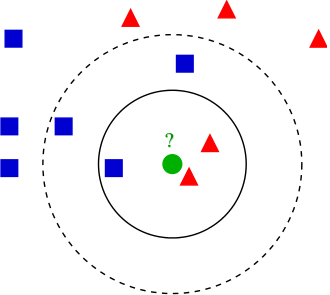
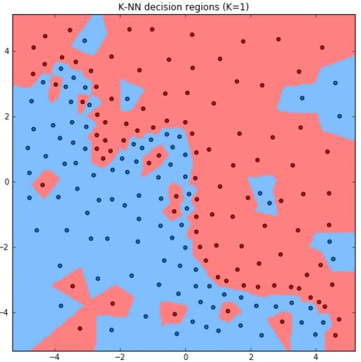
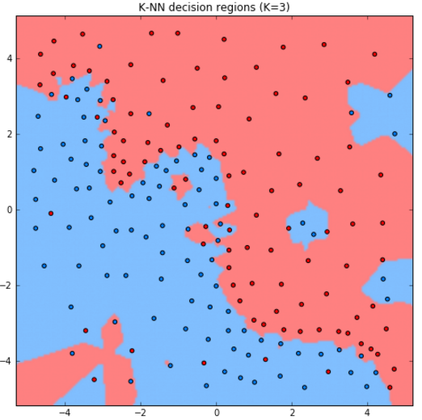
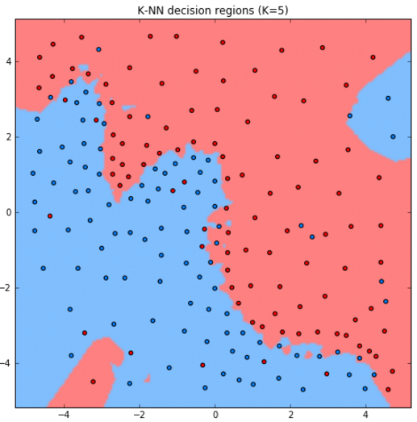
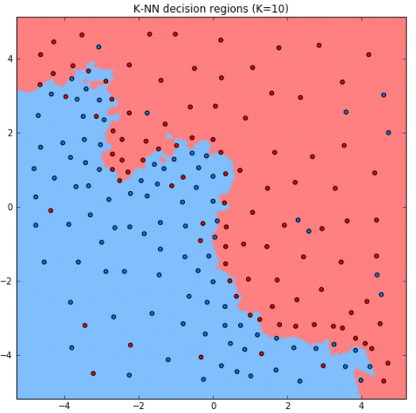
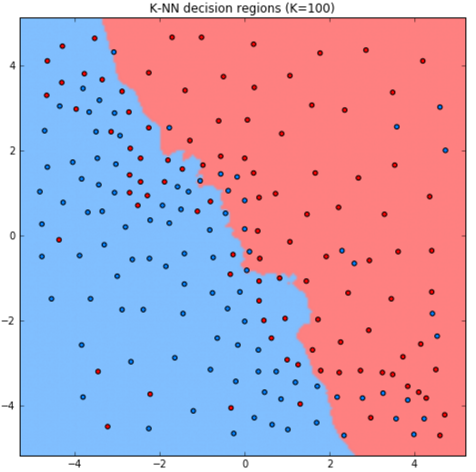
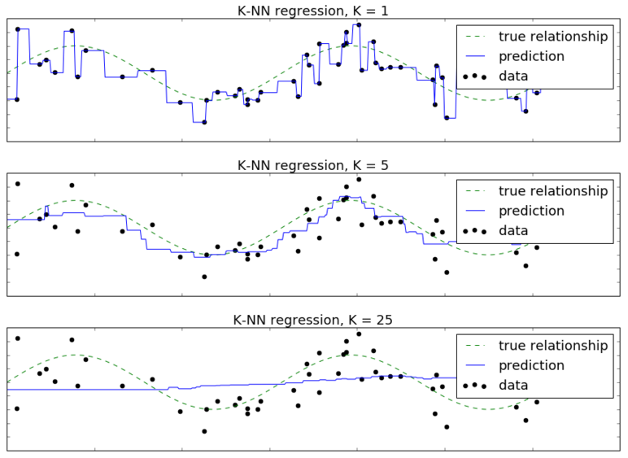

# Метод K ближайших соседей

## Идея метода

Метод K ближайших соседей (K nearest neighbors, [[1]](https://en.wikipedia.org/wiki/K-nearest_neighbors_algorithm)) умеет решать как задачу классификации, так и задачу регрессии. Обучение метода заключается лишь в сохранении обучающих объектов в памяти. На этапе построения прогноза для объекта $\mathbf{x}$ ищутся $K$ ближайших к нему объектов обучающей выборки ("ближайшие соседи"), после чего

- для классификации: назначается самый частый класс среди $K$ ближайших объектов;

- для регрессии: назначается средний отклик по откликам среди $K$ ближайших объектов.

Иллюстрация для двумерного пространства признаков и задачи регрессии приведена ниже:



Каждый объект обучающей выборки обозначен красным шаром, а радиус шара - величина отклика. Требуется построить прогноз для тестового объекта, обозначенного зелёным шаром. Его отклик (радиус) определяется средним значением откликов (радиусов) среди K ближайших объектов.

Выбор $K$ влияет на результат. Например, увеличение $K$ с 3 до 5 приводит к увеличению прогноза.

На следующем рисунке показана иллюстрация для задачи классификации. Класс обозначен цветом и формой. Требуется построить прогноз для объекта, обозначенного зелёным шаром.



Здесь также видно, что выбор $K$ влияет на результат. При $K=3$ целевому объекту будет назначен красный класс, а при $K=5$ - уже синий.

:::tip Прогноз вероятностей классов

Метод K ближайших соседей может выдавать и <u>вероятности классов</u>. Для этого достаточно усреднить частоты попадания классов в число ближайших соседей.

:::

## Анализ метода

Рассмотрим работу метода для задачи классификации двумерных объектов с различным выбором гиперпараметра $K$.











Как видим, при увеличении $K$ модель становится более простой (менее гибкой), поскольку усреднение производится по более широкой окрестности объектов. 

<details>
  <summary>Как будет работать метод при K=N?</summary>
<p>
  При K=N в качестве прогноза будет производиться агрегация сразу по всем объектам выборки, и метод выродится в константный прогноз, назначающий всем объектам самый распростаранённый класс в обучающей выборке.
</p>
</details>

В качестве другого примера рассмотрим задачу регрессии по одному признаку, где истинный отклик генерируется по формуле $y=\sin x+\varepsilon$, а $\varepsilon$ - случайный нормально распределённый шум. Обучающие объекты обозначены черными точками, а целевая зависимость - пунктирной линией. Сплошной линией обозначен прогноз метода $K$ ближайших соседей при различных значениях гиперпараметра $K$.



Здесь также видно, что при малом $K$ метод чересчур гибкий и переобучается под шум в данных. А при больших $K$ - недостаточно гибкий и недообучается.

<details>
  <summary>Почему гиперпараметр K нельзя подбирать по обучающей выборке?</summary>
<p>

Гиперараметр K определяет гибкость модели. Чем он ниже, тем модель получается более гибкой и тем точнее настраивается на данные. Соответственно, при выборке $K$ на основе обучающей выборки всегда будет оказываться, что наилучшим значением параметра будет $K=1$, при котором достигается 100% точность. Поэтому $K$ и является гиперпараметром (а не параметром, подбираемым на обучающей выборке), и выбирать его следует только на основе *прогнозов на внешней валидационной выборке*.

</p>
</details>

При $K=1$ метод называется **методом ближайшего соседа** (nearest neighbor method).

:::tip Родственный метод

В качестве альтернативы можно усреднять не по фиксированному числу ближайших объектов, а по всем объектам, попавшим в $\varepsilon$-окрестность целевого объекта $\mathbf{x}$, сколько бы их ни оказалось (radius nearest neighbor). В чем-то этот метод логичнее, поскольку позволяет контролировать похожесть объектов, по которым будет строиться прогноз. 

Однако он используется реже в связи со сложностью выбора радиуса окрестности $\varepsilon$. Если она слишком велика, то будет производиться усреднение по избыточному количеству объектов. А если слишком мала, то в окрестность может не попасть ни один объект!

:::

Указанный метод также допускает обобщение на произвольную функцию расстояния.

Более детально о теории метода ближайших соседей можно прочитать в [2], а также в документации библиотеке sklearn [[3]](https://scikit-learn.org/stable/modules/neighbors.html#nearest-neighbors) вместе с описанием реализации. Также идея метода и <u>основные методы повышения скорости его работы</u> описаны в учебнике ШАД [[4]](https://education.yandex.ru/handbook/ml/article/metricheskiye-metody).

## Пример запуска в Python

<div class="code_start">Метод K ближайших соседей для классификации:</div>

```py
from sklearn.neighbors import KNeighborsClassifier
from sklearn.metrics import accuracy_score
from sklearn.metrics import brier_score_loss

X_train, X_test, Y_train, Y_test = get_demo_classification_data()  
model = KNeighborsClassifier(n_neighbors=3)  # инициализация модели
model.fit(X_train,Y_train)                   # обучение модели                
Y_hat = model.predict(X_test)                # построение прогнозов
print(f'Точность прогнозов: {100*accuracy_score(Y_test, Y_hat):.1f}%')  

P_hat = model.predict_proba(X_test)  # можно предсказывать вероятности классов

loss = brier_score_loss(Y_test, P_hat[:,1])  # мера Бриера на вер-ти положительного класса
print(f'Мера Бриера ошибки прогноза вероятностей: {loss:.2f}')
```

<div class="code_end"></div>

[Больше информации](https://scikit-learn.org/stable/modules/neighbors.html#nearest-centroid-classifier). [Полный код](https://github.com/victorkitov/ML/blob/main/%D0%9F%D1%80%D0%B8%D0%BC%D0%B5%D1%80%D1%8B%20%D0%B7%D0%B0%D0%BF%D1%83%D1%81%D0%BA%D0%B0%20%D0%BE%D1%81%D0%BD%D0%BE%D0%B2%D0%BD%D1%8B%D1%85%20%D0%BC%D0%B5%D1%82%D0%BE%D0%B4%D0%BE%D0%B2%20%D0%B2%20sklearn.ipynb). 

<div class="code_start">Метод K ближайших соседей для регрессии:</div>

```py
from sklearn.neighbors import KNeighborsRegressor
from sklearn.metrics import mean_absolute_error

X_train, X_test, Y_train, Y_test = get_demo_regression_data()  
model = KNeighborsRegressor(n_neighbors=3)  # инициализация модели
model.fit(X_train,Y_train)                  # обучение модели                
Y_hat = model.predict(X_test)               # построение прогнозов
print(f'Средний модуль ошибки (MAE): \
            {mean_absolute_error(Y_test, Y_hat):.2f}')   
```

<div class="code_end"></div>

[Больше информации](https://scikit-learn.org/stable/modules/neighbors.html#nearest-neighbors-regression). [Полный код](https://github.com/victorkitov/ML/blob/main/%D0%9F%D1%80%D0%B8%D0%BC%D0%B5%D1%80%D1%8B%20%D0%B7%D0%B0%D0%BF%D1%83%D1%81%D0%BA%D0%B0%20%D0%BE%D1%81%D0%BD%D0%BE%D0%B2%D0%BD%D1%8B%D1%85%20%D0%BC%D0%B5%D1%82%D0%BE%D0%B4%D0%BE%D0%B2%20%D0%B2%20sklearn.ipynb). 

Далее мы проанализируем [достоинства и недостатки метода K ближайших соседей](KNN-analysis), рассмотрим его [обобщение](Weighted-KNN), при котором ближайшие объекты по-разному будут влиять на прогноз, а также рассмотрим [основные функции расстояния](Distance-functions) в машинном обучении.

## Литература

1. [Wikipedia: k-nearest neighbors algorithm.](https://en.wikipedia.org/wiki/K-nearest_neighbors_algorithm)
2. Webb A. R., Copsey K.D. Statistical pattern recognition. – John Wiley & Sons, 2011: k-nearest-neighbour method.
3. [Документация sklearn: nearest neighbors.](https://scikit-learn.org/stable/modules/neighbors.html#nearest-neighbors)
4. [Учебник ШАД: метрические методы.](https://education.yandex.ru/handbook/ml/article/metricheskiye-metody)
