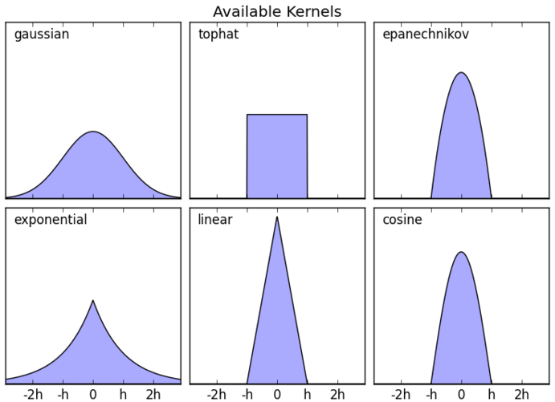

# Веса в метрических методах

Веса $w_i$, с которыми учитываются ближайшие соседи, должны быть неотрицательными и убывать с ростом расстояния до ближайшего соседа.

Их можно сделать зависимыми от порядкового номера $k\in\{1,2,...K\}$ ближайшего соседа:

$$
w_{k}=\alpha^{k},\quad\alpha\in(0,1) - \text{гиперпараметр}
$$

Тогда они будут убывать по экспоненциальному закону от порядкового номера соседа.

Также их можно сделать убывающими по линейному закону:

$$
w_{k}=\frac{K+1-k}{K}
$$

Однако более естественно и правильно сделать веса зависящими от расстояний между ближайшим соседом и целевым объектом $\rho(\mathbf{x},\tilde{\mathbf{x}}_k)$, а не от его порядкового номера. Пусть $(\tilde{\mathbf{x}}_{1},\tilde{y}_{1}),(\tilde{\mathbf{x}}_{2},\tilde{y}_{2}),...(\tilde{\mathbf{x}}_{K},\tilde{y}_{K})$ - ближайшие соседи в обучающей выборке для целевого объекта $\mathbf{x}$, для которого мы строим прогноз.

Веса можно сделать убывающими по гиперболическому закону:

$$
w_{k}=\frac{1}{\rho(\tilde{\mathbf{x}}_{k},\mathbf{x})}
$$

В чём недостаток такого выбора весов и как его исправить?

    При приближении к соседу его вес будет неограниченно возрастать, в результате чего отклик на этом объекте начнёт перевешивать отклики на других соседях. Чтобы воспрепятствовать неограниченному возрастанию весов, нужно его ограничить сверху некоторой константой $M>0$:

$$
w_{k}=\min\left\{ M; \frac{1}{\rho(\tilde{\mathbf{x}}_{k},\mathbf{x})} \right\}
$$

Также можно сделать веса убывающими по линейному закону:

$$
w_{i}=\begin{cases}
\frac{\rho(\tilde{\mathbf{x}}_{K},\mathbf{x})-\rho(\tilde{\mathbf{x}}_{i},\mathbf{x})}{\rho(\tilde{\mathbf{x}}_{K},\mathbf{x})-\rho(\tilde{\mathbf{x}}_{1},\mathbf{x})}, & \rho(\tilde{\mathbf{x}}_{K},\mathbf{x})\ne\rho(\tilde{\mathbf{x}}_{1},\mathbf{x})\\
1, & \rho(\tilde{\mathbf{x}}_{K},\mathbf{x})=\rho(\tilde{\mathbf{x}}_{1},\mathbf{x})
\end{cases}
$$

В более общем виде веса определяются по формуле:

$$
w_i=K\left(\frac{\rho(\mathbf{x},\tilde{\mathbf{x}}_i)}{h}\right)
$$

для некоторой убывающей функции $K(\cdot)$, называемой **ядром** (kernel) и зависящей от расстояния между объектами $\rho(\mathbf{x},\tilde{\mathbf{x}}_i)$, нормированной на **параметр ширины** окна $h>0$ (bandwidth), который в общем случае может представлять собой не константу, а тоже функцию от $\mathbf{x}$.

Графики популярных ядер $K(\cdot)$ приведены ниже вместе с формулами для их расчёта [[1]](https://scikit-learn.org/stable/auto_examples/neighbors/plot_kde_1d.html):

  

| Ядро             | Формула                                    |
| ---------------- | ------------------------------------------ |
| top-hat          | $\mathbb{I}[\vert u \vert<1]$              |
| линейное         | $\max\{0,1-\vert u \vert\}$                |
| Епанечникова     | $\max\{0,1-u^{2}\}$                        |
| экспоненциальное | $e^{-\vert u \vert}$                       |
| Гауссово         | $e^{-\frac{1}{2}u^{2}}$                    |
| квартическое     | $(1-u^{2})^{2}\mathbb{I}[\vert u \vert<1]$ |

Гиперпараметр ширины окна $h$ определяет, насколько сильно меняются веса при изменении расстояний до объектов. Чем $h$ выше, тем слабее веса зависят от расстояний, а при $h\to\infty$ веса стремятся к равномерным, и взвешенный метод ближайших соседей стремится к обычному (без весов).

Ширину окна можно варьировать в зависимости от целевого объекта, поэтому в общем случае она записывается как $h(\mathbf{x})$.

## Литература

1. [Документация sklearn: simple 1D kernel density estimation.](https://scikit-learn.org/stable/auto_examples/neighbors/plot_kde_1d.html)
