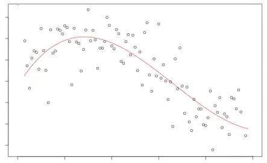
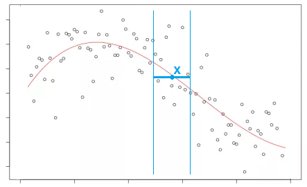

# Локально-постоянная регрессия

**Локально-постоянная регрессия** (local constant regression), известная также как **ядерная регрессия** (kernel regression [[1]](https://en.wikipedia.org/wiki/Kernel_regression)) и **регрессия Надарая-Ватсона** (Nadaraya–Watson regression), представляет собой непараметрический метод для моделирования сложных регрессионных зависимостей. Она была впервые предложена в работах [2] и [3].

Допустим, нам нужно моделировать некоторую нелинейную зависимость $y(\mathbf{x})$, показанную ниже:

Можно было бы искать наилучший в среднеквадратичном смысле константный прогноз:

$$
\widehat{y}=\arg\min_{\widehat{y}\in\mathbb{R}}\sum_{i=1}^{N}(\widehat{y}-y_{i})^{2}=\frac{1}{N}\sum_{n=1}^{N}y_{n}
$$

:::note Задание

Докажите, что оптимальный константный прогноз, минимизирующий средний квадрат ошибки, это действительно выборочное среднее.

Подсказка: поскольку оптимизационный критерий по $\hat{y}$ является [выпуклым](../Base-concepts/Loss-convexity), то не только необходимым, но и <u>достаточным</u> условием оптимальности будет равенство нулю его производной.

:::

Однако константный прогноз слишком прост и нам не подходит, поскольку целевая зависимость нелинейная. Поэтому для построения прогноза в точке $\mathbf{x}$ будем использовать <u>локально-постоянный прогноз</u>, получаемый в результате минимизации квадратов ошибок <u>в локальной окрестности от целевой точки</u>:

> Усредняя лишь по близлежащим точкам к целевой получим нелинейную аппроксимацию общего вида, показанную на рисунке выше красной линией.

В общем случае локально-постоянная регрессия ищет наилучший константный прогноз, усредняя <u>по всем объектам</u> обучающей выборки, <u>но с весами</u> - чем объект более удалён от целевой точки, тем вес его меньше, и тем слабее он влияет на прогноз:

$$
\widehat{y}(\mathbf{x})=\arg\min_{\widehat{y}\in\mathbb{R}}\sum_{i=1}^{N}{\color{red}w_{i}(\mathbf{x})}(\widehat{y}-y_{i})^{2}=\frac{\sum_{i=1}^{N}y_{i}{\color{red}w_{i}(\mathbf{x})}}{\sum_{i=1}^{N}{\color{red}w_{i}(\mathbf{x})}}
$$

:::note Задание

Докажите, что оптимальный константный прогноз, минимизирующий квадраты ошибок с весами, это действительно взвешенное среднее. 

:::

Веса $w_i(\mathbf{x})\ge 0$ определяются так же, как и в случае взвешенного учета ближайших соседей, через убывающую функцию ядра (kernel) $K(\cdot)$ от расстояния, нормированного на ширину окна $h>0$ (bandwidth):

$$
w_i(\mathbf{x})=K\left(\frac{\rho(\mathbf{x},\mathbf{x}_i)}{h}\right)
$$

Разница лишь в том, что теперь это веса для всех объектов обучающей выборки, а не только для ближайших соседей. Типовые ядра $K(\cdot)$ такие же, как раньше:

| Ядро             | Формула                                    |
| ---------------- | ------------------------------------------ |
| top-hat          | $\mathbb{I}[\vert u \vert<1]$              |
| линейное         | $\max\{0,1-\vert u \vert\}$                |
| Епанечникова     | $\max\{0,1-u^{2}\}$                        |
| экспоненциальное | $e^{-\vert u \vert}$                       |
| Гауссово         | $e^{-\frac{1}{2}u^{2}}$                    |
| квартическое     | $(1-u^{2})^{2}\mathbb{I}[\vert u \vert<1]$ |

а гиперпараметр ширины окна $h$ задаёт ширину усреднения. Для ядер top-hat, линейного, Епанечникова и квартического прогноз будет получаться усреднением только по точкам, лежащим на расстоянии не более чем $h$ от целевой. Для Гауссова и экспоненциального ядер усреднение всегда будет производиться по всем объектам, но основной вклад также будут давать объекты, лежащие в той же окрестности.

Вид ядра характеризует гладкость получаемой зависимости (рекомендуется Гауссово ядро и квартическое), однако на точность приближения больше всего влияет ширина окна $h$ - чем она выше, тем более плавной будет получаться моделируемая зависимость, которая при $h\to\infty$ будет стремиться к константе (обоснуйте!).

Целесообразно варьировать гиперпараметр $h$ для разных частей признакового пространства: чем гуще лежат обучающие объекты, тем меньше мы можем взять $h$, производя полноценное усреднение по всё еще большому числу объектов. Поэтому в общем виде этот гиперпараметр также можно сделать зависящим от $\mathbf{x}$:

$$
h=h(\mathbf{x})
$$

:::note Задание

При каком выборе $K(\cdot)$ и $h(\mathbf{x})$ локально-постоянная регрессия превратится в [метод K ближайших соседей](KNN)? 

:::

:::tip Обобщение

Поскольку прогноз локально-постоянной регрессии зависит от объектов только через расстояния до них, то это метрический метод, который мы можем обобщать, выбирая различные функции расстояния!

:::

Этот метод, будучи метрическим, наследует преимущества и недостатки метода ближайших соседей. 

## Литература

1. [Wikipedia: kernel regression.](https://en.wikipedia.org/wiki/Kernel_regression)

2. Nadaraya E. A. On estimating regression //Theory of Probability & Its Applications. – 1964. – Т. 9. – №. 1. – С. 141-142.

3. Watson G. S. Smooth regression analysis //Sankhyā: The Indian Journal of Statistics, Series A. – 1964. – С. 359-372.
