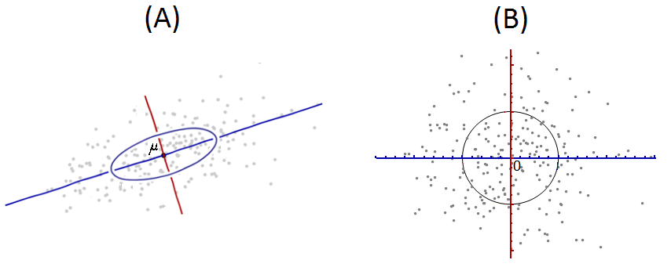
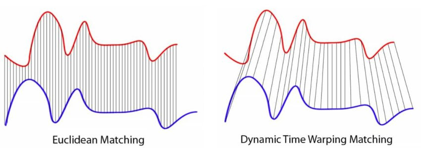

# Функции расстояния

Преимуществом метрических методов является то, что их можно применять с любой **функцией расстояния** (distance function) между объектами $\rho(\mathbf{x},\mathbf{z})$. По смыслу расстояние измеряет непохожесть объектов между собой, и его не надо путать с **функцией похожести** (similarity function) $S(\mathbf{x},\mathbf{z})$, принимающей более высокие значения между более похожими объектами.

:::tip Взаимосвязь расстояния и похожести

Мы всегда можем преобразовать расстояние в похожесть и наоборот, применяя некоторую убывающую функцию $K(\cdot)$:

$$
S(\mathbf{x},\mathbf{z})=K(\rho(\mathbf{x},\mathbf{z}))
$$

Например, $S(\mathbf{x},\mathbf{z})=1-\rho(\mathbf{x},\mathbf{z})$ или $S(\mathbf{x},\mathbf{z})=1/\rho(\mathbf{x},\mathbf{z})$.

:::

## Сравнение векторов вещественных чисел

Если $\mathbf{x},\mathbf{z}\in\mathbb{R}^D$, то часто используются следующие функции расстояния:

| **Название**          | $\rho(\mathbf{x},\mathbf{z})$                                                                                           |
| --------------------- | ----------------------------------------------------------------------------------------------------------------------- |
| Евклидово             | $\sqrt{\sum_{i=1}^{D}(x^{i}-z^{i})^{2}}$                                                                                |
| $L_1$ (Манхэттенская) | $\sum_{i=1}^{D}\lvert x^{i}-z^{i}\rvert$                                                                                |
| $L_{\infty}$          | $\max_{i=1,2,...D}\lvert x^{i}-z^{i} \rvert$                                                                            |
| $L_p$                 | $\sqrt[p]{\sum_{i=1}^{D}\left\lvert x^{i}-z^{i}\right\rvert^{p}}$                                                       |
| Канберра              | $\frac{1}{D}\sum_{i=1}^{D}\frac{\lvert x^{i}-z^{i}\rvert}{\left\lvert x^{i}\right\rvert+\left\lvert z^{i}\right\rvert}$ |
| Ланса-Уильямса        | $\frac{\sum_{i=1}^{D}\vert x^{i}-z^{i}\vert}{\sum_{i=1}^{D}\left\vert x^{i}+z^{i}\right\vert}$                          |

## Косинусная мера близости

Очень популярна **косинусная мера близости** [[1]](https://en.wikipedia.org/wiki/Cosine_similarity):

$$
S(\mathbf{x},\mathbf{z})=\frac{\mathbf{x}^{T}\mathbf{z}}{\left\lVert \mathbf{x}\right\rVert \left\lVert \mathbf{z}\right\rVert }=\frac{\sum_{i=1}^{D}x^{i}z^{i}}{\sqrt{\sum_{i=1}^{D}\left(x^{i}\right)^{2}}\sqrt{\sum_{i=1}^{D}\left(z^{i}\right)^{2}}},
$$

измеряющая косинус угла между векторами $\mathbf{x}$ и $\mathbf{z}$, поэтому принимающая значения на отрезке $[-1,1]$. 

Согласно этой мере объекты близки, если угол между ними мал, а, соответственно, косинус этого угла близок к единице. Косинусная мера близости не зависит от длин сравниваемых векторов (докажите!).

> Это полезно в некоторых приложениях, таких как анализ текстов, кодируемых счётчиками встречаемости в них слов. Если продублировать документ, то счётчики всех слов увеличатся вдвое, как и длина вектора признаков, кодирующего документ. Поскольку дублирование текста не оказывает влияние на смысл документа, то оно не должно изменять попарные расстояния между документами, что и наблюдается для косинусной меры близости.

## Расстояние Махаланобиса

Для сравнения векторов, элементы которых сильно скоррелированы между собой, используется Евклидово расстояние, но не между исходными объектами $\mathbf{x},\mathbf{z}$, а между их декоррелированными версиями:

$$
\mathbf{x}'=\Sigma^{-1/2}(\mathbf{x}-\bm{\mu}), \mathbf{z}'=\Sigma^{-1/2}(\mathbf{z}-\bm{\mu}), \text{ где } \Sigma^{-1/2}=(\Sigma^{-1})^{1/2}=(\Sigma^{1/2})^{-1}
$$

:::note Задача

Докажите, что $\mathbf{x}'$ и $\mathbf{z}'$ будут иметь нулевое среднее и единичную матрицу ковариаций, т.е. отдельные элементы векторов будут не скоррелированы между собой.

:::

Графически процесс перевода из скоррелированного пространства (A) в декоррелированное (B) показан ниже:

В терминах исходных векторов это расстояние выражается как 

$$
\rho(\mathbf{x},\mathbf{z})=\sqrt{(\mathbf{x}-\mathbf{z})^{T}\Sigma^{-1}(\mathbf{x}-\mathbf{z})}
$$

и называется **расстоянием Махаланобиса** [[2]](https://en.wikipedia.org/wiki/Mahalanobis_distance).

:::note Задача

Докажите, что Евклидово расстояние между декореллированными версиями объектов $\mathbf{x}$ и $\mathbf{z}$ будет считаться по формуле выше.

:::

В более общем случае расстояние можно определить через произвольную неотрицательно-определённую матрицу $M$, которую можно настраивать по данным (metric learning [[3]](https://www.nowpublishers.com/article/Details/MAL-019)):

$$
\rho(\mathbf{x},\mathbf{z})=\sqrt{(\mathbf{x}-\mathbf{z})^{T}M(\mathbf{x}-\mathbf{z})}
$$

## Сравнение бинарных векторов

Для бинарных векторов, состоящих только из нулей и единиц, часто используют **расстояние Хэмминга** [[4]](https://en.wikipedia.org/wiki/Hamming_distance):

$$
\rho(\mathbf{x},\mathbf{z})=\sum_{n=1}^N \mathbb{I}\{x^i \ne z^i\}
$$

## Сравнение множеств

Для сравнения двух множеств X и Z (например наборов товаров, купленных в магазине по двум чекам) используется **мера близости Жаккара** (Jaccard index [[5]](https://en.wikipedia.org/wiki/Jaccard_index)), равная числу элементов в пересечении множеств, нормированному на число элементов в их объединении:

$$
S(X,Z)=\frac{\vert X \cap Z\vert}{\vert X \cup Z \vert}
$$

Мера принимает значения в отрезке $[0,1]$. 

## Сравнение строк

Для сравнения строк часто используется **редакторское расстояние** (edit distance), называемое также **расстоянием Левенштейна** (Levenstein distance [[6]](https://en.wikipedia.org/wiki/Levenshtein_distance), предложена в [[7]](https://www.mathnet.ru/links/361e4559bd0a358274f1c81ed836f91b/dan31411.pdf)). Для двух строк $x$  и $z$ оно вычисляется как минимальное число операций вставки символа, удаления символа и замены одного символа другим, необходимое для перевода одной строки в другую. Например, расстояние между строками "вагон" и "авто" будет 4, поскольку минимально требуется 4 операции для преобразования одной строки в другую:

|     | операция      | результат |
| --- | ------------- | --------- |
|     |               | ВАГОН     |
| 1   | удаление В    | АГОН      |
| 2   | замена Г на В | АВОН      |
| 3   | вставка Т     | АВТОН     |
| 4   | удаление Н    | АВТО      |

> Строки могут быть произвольной длины, содержать пробелы и описывать целые тексты!

Существует эффективный алгоритм, позволяющий найти минимальное количество редакторских операций за полиномиальное время от длин строк [[8]](https://en.wikipedia.org/wiki/Edit_distance), предложенный в [[9]](https://dl.acm.org/doi/abs/10.1145/146370.146380). 

## Сравнение временных рядов

Временные ряды можно сравнивать как вектора их последовательных значений, но только в случае, когда они состоят из одинакового количества элементов. Перед сравнением может применяться приведение их значений к одному масштабу (например, нулевое среднее и единичная дисперсия). 

Также динамику рядов можно раскладывать по базису некоторых функций, а ряды представлять в виде коэффициентов разложения по базису и сравнивать обычными функциями расстояния между векторами признаков.

Если временные ряды разные по длительности, то можно более короткий временной ряд растянуть до длины более длинного временного ряда. 

Альтернативно можно использовать **алгоритм динамической трансформации временной шкалы** (dynamic time warping [[10]](https://en.wikipedia.org/wiki/Dynamic_time_warping)), в котором перед сравнением ищется оптимальное локальное растяжение участков каждого из рядов, чтобы они лучше подходили друг к другу, как показано ниже на рисунке справа ([источник](https://arxiv.org/abs/2103.13922)):

Этот алгоритм позволяет сравнивать временные ряды разной длины по наличию в них схожей динамики, даже если она происходила с разной скоростью. Расчёт расстояния также может быть эффективно произведён за полиномиальное время от длин сравниваемых рядов.

## Литература

1. [Wikipedia: cosine similarity.](https://en.wikipedia.org/wiki/Cosine_similarity)

2. [Wikipedia: Mahalanobis distance.](https://en.wikipedia.org/wiki/Mahalanobis_distance)

3. [Kulis B. et al. Metric learning: A survey //Foundations and Trends® in Machine Learning. – 2013. – Т. 5. – №. 4. – С. 287-364.](https://www.nowpublishers.com/article/Details/MAL-019)

4. [Wikipedia: Hamming distance.](https://en.wikipedia.org/wiki/Hamming_distance)

5. [Wikipedia: Jaccard index.](https://en.wikipedia.org/wiki/Jaccard_index)

6. [Wikipedia: Levenshtein distance.](https://en.wikipedia.org/wiki/Levenshtein_distance)

7. [Левенштейн В. И. Двоичные коды с исправлением выпадений, вставок и замещений символов //Доклады Академии наук. – Российская академия наук, 1965. – Т. 163. – №. 4. – С. 845-848.](https://www.mathnet.ru/links/361e4559bd0a358274f1c81ed836f91b/dan31411.pdf)

8. [Wikipedia: edit distance.](https://en.wikipedia.org/wiki/Edit_distance)

9. [Kukich K. Techniques for automatically correcting words in text //ACM computing surveys (CSUR). – 1992. – Т. 24. – №. 4. – С. 377-439.](https://dl.acm.org/doi/abs/10.1145/146370.146380)

10. [Wikipedia: dynamic time warping.](https://en.wikipedia.org/wiki/Dynamic_time_warping)
