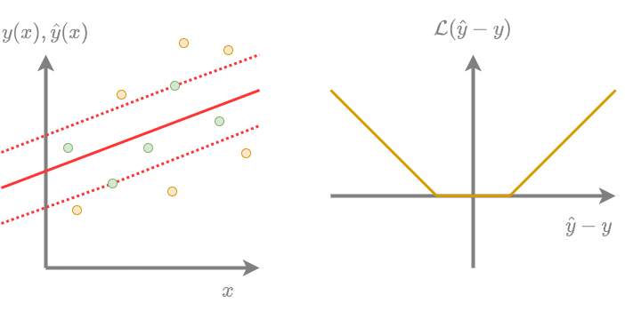

# Регрессия опорных векторов

Ранее мы везде настраивали коэффициенты [линейной регрессии](Linear-regression) минимизируя квадрат ошибки:

$$
\mathcal{L}(\hat{y},y)=(\hat{y}-y)^2
$$

Но их можно настраивать, используя и другие функции потерь, более соответствующие смыслу задачи! 

Например, когда для нас несущественны небольшие отклонения в пределах $\varepsilon>0$, а сверх этого потери возрастают линейно, то можно использовать для настройки $\varepsilon$-нечувствительную функцию потерь ($\varepsilon$-insensitive loss):

$$
\mathcal{L}(\hat{y},y)=
\begin{cases}
   0, & \text{если } |\hat{y}-y|\le \varepsilon \\
   |\hat{y}-y|-\varepsilon, & \text{если } |\hat{y}-y| > \varepsilon 
\end{cases}
$$

**Регрессия опорных векторов** (support vector regression) - это линейная регрессия, веса которой настраиваются, используя $\varepsilon$-нечувствительную функцию потерь с L2-регуляризацией. На графике ниже показан пример настроенной регрессии опорных векторов по точкам (слева) и $\varepsilon$-нечувствительная функция потерь (справа):

После настройки метода все объекты обучающей выборки разделятся на опорные (support vectors) и неинформативные (non-informative vectors). 

Опорные объекты (выше обозначены желтыми кружками): 

- прогнозируются с ошибкой по модулю больше или равной $\varepsilon$; 

- <u>влияют</u> на наклон прогнозирующей гиперплоскости . 

В свою очередь, неинформативные объекты (обозначены зелёными кружками): 

- прогнозируются с ошибкой по модулю меньше $\varepsilon$; 

- <u>не влияют</u> на наклон прогнозирующей гиперплоскости, поскольку на них функция потерь равна нулю. 

Именно опорные объекты определяют решение задачи. Если же исключить неинформативные объекты из выборки, то итоговое решение не поменяется, поскольку потери на них равны нулю. 

> Если число опорных объектов невелико (а его можно контролировать, изменяя $\varepsilon$), то можно интерпретировать модель, анализируя объекты, повлиявшие на решение.

:::tip Обобщение метода (kernel trick)

Оптимизационную задачу для регрессии опорных векторов и формулу для построения прогноза можно переформулировать так, что прогноз будет зависеть только от скалярных произведений между векторами $\lang \mathbf{x},\mathbf{x}'\rang$, а не от самих векторов $\mathbf{x},\mathbf{x}'$. Методы, для которых выполнено это свойство, можно обобщить через ядра (применить так называемый **kernel trick** [[1]](https://en.wikipedia.org/wiki/Kernel_method)), заменив все скалярные произведения на другую функцию, удовлетворяющую ряду свойств и называемую **ядром Мерсера**: 

$$
\lang \mathbf{x},\mathbf{x}'\rang \to K(\mathbf{x},\mathbf{x}').
$$

Регрессию опорных векторов таким образом можно обобщить и превратить из линейного метода в нелинейный!

:::

Более детально с регрессией опорных векторов, её обобщениями и реализациями алгоритмов настройки параметров вы можете ознакомиться в [[1]](https://alex.smola.org/papers/2004/SmoSch04.pdf).

## Литература

1. [Wikipedia: kernel method.](https://en.wikipedia.org/wiki/Kernel_method)

2. [Smola A. J., Schölkopf B. A tutorial on support vector regression //Statistics and computing. – 2004. – Т. 14. – С. 199-222.](https://alex.smola.org/papers/2004/SmoSch04.pdf)
