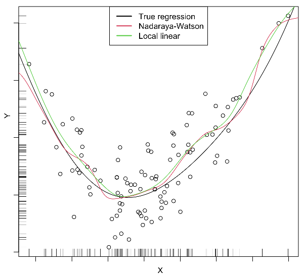

# Локально-линейная регрессия

В традиционной линейной регрессии прогноз строится как линейная комбинация признаков:

$$
\hat{y}(\mathbf{x})=w_0+w_1 x^1+w_2 x^2+...+w_D x^D=w_0+\mathbf{w}^T \mathbf{x}, \tag{1}
$$

где веса находятся **из принципа минимизации наименьших квадратов**:

$$
\sum_{n=1}^N (w_0+\mathbf{w}^T \mathbf{x}_n-y_n)^2\to\min_{w_0,\mathbf{w}}  
$$

Обратим внимание, что формула (1) предполагает глобальную линейную связь между признаками и откликами. Но как быть, если реальная зависимость нелинейна? Один из вариантов - добавлять нелинейные трансформации в число признаков. Другой подход - использовать линейную зависимость, но <u>со своими коэффициентами для каждого объекта</u> $\mathbf{x}$, что реализуется в алгоритме **локально-линейной регрессии** (local linear regression, locally weighted scatterplot smoothing, LOWESS [[1]](https://en.wikipedia.org/wiki/Local_regression)), в которой прогноз $\hat{y}(\mathbf{x})$ также строится по формуле (1), однако параметры $w_0,\mathbf{w}$ находятся по объектам, лежащим недалеко от $\mathbf{x}$, за счёт минимизации <u>взвешенной</u> суммы квадратов ошибок:

$$
\sum_{n=1}^N \alpha_n(\mathbf{x})(w_0+\mathbf{w}^T \mathbf{x}_n-y_n)^2\to\min_{w_0,\mathbf{w}} \tag{2}
$$

Как видим, объекты $(\mathbf{x}_1,y_1),(\mathbf{x}_2,y_2),...(\mathbf{x}_N,y_N)$ учитываются с весами $\alpha_1,\alpha_2,...\alpha_N$, где вес каждого объекта определяется <u>близостью</u> к прогнозируемому объекту $\mathbf{x}$: чем он ближе, тем его вес больше. Это позволяет вычислять коэффициенты линейной регрессии <u>адаптивно к той точке, в которой нужно построить прогноз</u>. В другой точке $\mathbf{x}$ зависимость также будет линейной, но уже с другими коэффициентами.

> Поэтому прогнозная функция для всевозможных $\mathbf{x}$ уже будет получаться <u>нелинейной</u>.

Веса $\alpha_n(\mathbf{x})\ge 0$ вычисляются по тем же формулам, что и веса [локально-постоянной регрессии](../Metric-methods/Local-constant-regression).

По сравнению с [локально-постоянной регрессией](../Metric-methods/Local-constant-regression), локально-линейный вариант более вычислительно трудоёмкий, поскольку необходимо заново находить минимум (2) для каждого тестового объекта $\mathbf{x}$. Зато он более гибкий. В частности локально-линейная регрессия лучше экстраполирует зависимости в областях, где обучающих примеров мало, как показано на рисунке по краям:

## Литература

1. [Wikipedia: local regression.](https://en.wikipedia.org/wiki/Local_regression) 
