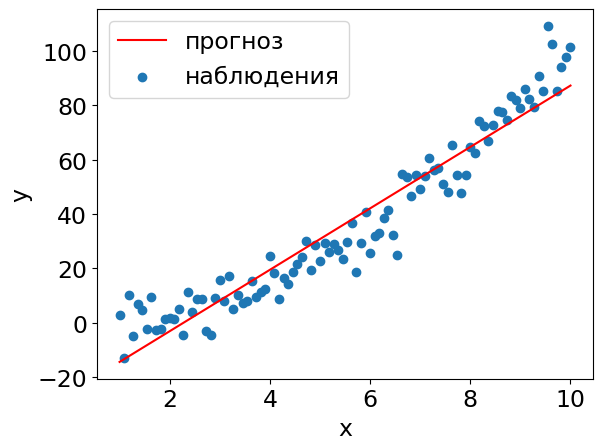

# Поточечный график

Для визуализации качества регрессионных прогнозов строят **поточечный график** (scatter plot), показывающий зависимость предсказанных откликов от реальных, то есть визуализируют множество точек 

$$
\{ y_n,\hat{y}_n \}_n
$$

> Прогнозы будут тем лучше, чем ближе они будут лежать к диагональной прямой $\hat{y}=y$.

Рассмотрим следующую одномерную зависимость признака от отклика в осях $\mathbf{x},y$:

Тогда в осях $y,\hat{y}$ прогнозы будут выглядеть так:

По второму графику сразу видно, что модель систематически занижает прогнозы для малых $y$ и для больших, а для средних наоборот завышает. Это можно использовать для более тонкой настройки регрессионной модели.

По близости точек к диагонали можно судить о точности прогнозов. Также по графику легко можно идентифицировать выбросы - это будут те точки, которые сильно отклоняются от диагонали.

:::tip Визуализация в случае большого числа объектов

Если наблюдений слишком много, то вместо поточечной визуализации можно строить эмпирическое распределение плотности точек, например, в виде двумерной гистограммы.

:::
