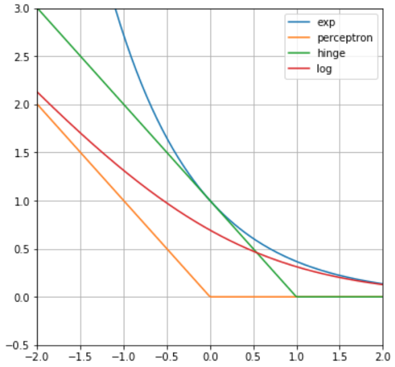

# Оценка весов линейного классификатора

## Отступ линейного бинарного классификатора

Как выводилось [ранее](../General-classifiers/Margin#отступ-для-бинарной-классификации), отступ бинарного классификатора $\hat{y}=\text{sign}(g(\mathbf{x}))$ с относительной дискриминантной функцией $g(\mathbf{x})$ определяется как

$$
M(\mathbf{x},y)=yg(\mathbf{x})
$$

В случае линейного бинарного классификатора $\hat{y}=\text{sign}(w_0+\mathbf{w}^T\mathbf{x})$ он записывается как 

$$
M(\mathbf{x},y)=y(w_0+\mathbf{w}^T \mathbf{x}),
$$

где $y\in\{+1,-1\}$.

По смыслу отступ служит непрерывной мерой качества классификации объекта $(\mathbf{x},y)$ - чем он выше, тем классификация лучше. Если $M(\mathbf{x},y)>0$, то классификация корректна, а если $M(\mathbf{x},y)<0$, то некорректна.

## Численная оценка весов линейного бинарного классификатора

Как подобрать оптимальные параметры $w_0$ и $\mathbf{w}$? В общем случае оптимальные веса нельзя найти аналитически, поэтому для их нахождения используются [численные методы](../Numerical-optimization).

Их можно было бы подбирать таким образом, чтобы минимизировать число неправильных классификаций, что эквивалентно критерию

$$
\frac{1}{N}\sum_{n=1}^N \mathbb{I}\{M(\mathbf{x}_n,y_n) \le 0\}=\frac{1}{N}\sum_{n=1}^N \mathcal{L}(M(\mathbf{x}_n,y_n)) \to \min_{w_0,\mathbf{w}} 
$$

c функцией потерь $\mathcal{L}(\mathbf{x}_n,y_n)=\mathbb{I}\{y_n(w_0+\mathbf{w}^T \mathbf{x}_n)\le 0\}$. 

Однако эта функция принимает всего два значения: единицу с одной стороны разделяющей гиперплоскости $w_0+\mathbf{w}^T \mathbf{x}=0$ и ноль с другой. В результате критерий  получится кусочно-постоянной (ступенчатой) функцией, у которой почти всюду градиент по весам <u>будет равен нулю</u>, вследствие чего мы не сможем найти веса [численными методами](../Numerical-optimization), основанными на градиенте функции!

Поэтому на практике используется не представленная выше кусочно-постоянная функция потерь, а другие гладкие (*непрерывно-дифференцирируемые*) функции с невырожденными градиентами на широком спектре значений. 

## Основные функции потерь

Основные функции потерь, используемые для настройки линейных бинарных классификаторов, приведены ниже: 

| название            | английское название | формула $\mathcal{L}(M)$        |
| ------------------- | ------------------- | ------------------------------- |
| экспоненциальная    | exponential         | $e^{-M}$                        |
| функция персептрона | perceptron          | $[-M]_{+}$                      |
| шарнирная           | hinge               | $[1-M]_{+}$                     |
| логистическая       | logistic            | $\log_{2}\left(1+e^{-M}\right)$ |

Графики функций потерь показаны ниже:

  
Какая из представленных функций остановит обучение весов сразу, как только точность классификации достигнет 100% точности на обучающей выборке?

Функция персептрона, поскольку для верно классифицированных объектов отступ $M$ будет положителен, а функция потерь станет равной нулю. Это <u>не является оптимальной стратегией</u>, поскольку граница между классами может пройти очень близко к объектам, а новые объекты тестовой выборки могут попадать уже с неверной стороны от разделяющей гиперплоскости и неверно классифицироваться.

Другие же функции потерь продолжат обучение, чтобы провести линейную гиперплоскость дальше даже от верно классифицированных объектов. В результате они окажутся глубже в областях своих классов. И при появлении новых объектов, похожих на обучающие, они всё равно будут классифицироваться правильно.

  
Какая из представленных функций наименее устойчива к [нетипичным объектам-выбросам](../Data-preprocessing/Outlier-filtering)?

Объект-выброс лежит далеко от основной массы объектов и, соответственно, будет, скорее всего, лежать далеко от разделяющей гиперплоскости и иметь высокий отступ по абсолютной величине. А если он неверно классифицируется, то отступ будет большим по модулю и отрицательным. Сильнее всего это будет штрафоваться <u>экспоненциальной функцией потерь</u>. Поэтому эта функция потерь не рекомендуется на практике, если в выборке могут быть нетипичные объекты-выбросы.

### Регуляризация

Как и [в случае линейной регрессии](../Linear-regression-extensions/Regularization-in-linear-regression), при настройке линейных классификаторов рекомендуется использовать регуляризацию:

$$
\frac{1}{N}\sum_{n=1}^N \mathcal{L}(M(\mathbf{x}_n,y_n)) {\color{red}+\lambda R(\mathbf{w})} \to \min_{w_0,\mathbf{w}}
$$

Гиперпараметр $\lambda>0$ контролирует сложность (гибкость) модели. L1- и ElasticNet-регуляризации способны отбирать признаки, зануляя часть коэффициентов при признаках, а L2-регуляризация - нет. Однако L2-регуляризация равномернее распределяет влияние на отклик похожих признаков.

### Влияние масштаба признаков

Прогнозы линейного классификатора без регуляризации не зависят от масштабирования признаков (при последующей перенастройке модели). Но если использовать регуляризацию, то больший эффект начинают оказывать признаки с большим разбросом значений.

  
Почему?

Потому что признакам с малым разбросом будут соответствовать более высокие по модулю значения весов, которые будут сильнее подвергаться регуляризации и прижиматься к нулю. Поэтому соответствующие признаки будут влиять на прогноз слабее. 

В связи с этим рекомендуется предварительное приведение всех вещественных признаков к одному масштабу одним из [методов нормализации признаков](../Data-preprocessing/Feature-normalization).

---

Далее мы рассмотрим частные случаи бинарного классификатора - [метод опорных векторов](SVM) и [логистическую регрессию](Binary-logistic-regression), после чего обобщим логистическую регрессию [на многоклассовый случай](Multiclass-logistic-regression). В отдельном разделе учебника будут рассмотрены методы [численной настройки](../Numerical-optimization) параметров моделей.

Дополнительно погрузиться в тему вы можете, прочитав соответствующие главы учебника ШАД [[1]](https://education.yandex.ru/handbook/ml/article/linear-models) и учебника А.Г. Дьяконова [[2]](https://github.com/Dyakonov/MLDM_BOOK/blob/main/book_023_linclass_202308.pdf).

## Литература

1. [Учебник ШАД: линейные модели.](https://education.yandex.ru/handbook/ml/article/linear-models)

2. [Дьяконов А.Г. Машинное обучение и анализ данных: линейные классификаторы.](https://github.com/Dyakonov/MLDM_BOOK/blob/main/book_023_linclass_202308.pdf)
