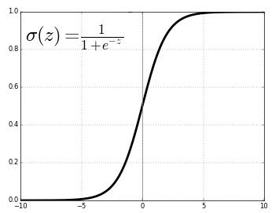

# Бинарная логистическая регрессия

## Идея метода

> **Логистическая регрессия** (logistic regression) - это частный случай [линейной классификации](./Linear-classification), когда для оценки весов используется [логистическая функция потерь](Linear-classifier-methods#основные-функции-потерь). 

Достоинством метода является то, что он может выдавать не только метки классов, но и  <u>их вероятности</u>.

Для удобства обозначений включим дополнительный признак, равный тождественной единице, в число признаков:

$$
\begin{align*}
   \mathbf{x}&=[1,x^1,x^2,...x^D] \\
   \mathbf{w}&=[w_0,w_1,w_2,...w_D]
\end{align*}
$$

Тогда линейный бинарный классификатор можно переписать в более компактном виде:

$$
\hat{y}=\text{sign}(\mathbf{w}^T \mathbf{x})
$$

Эквивалентно логистическая регрессия может быть переформулирована в виде <u>вероятностной модели</u>, выдающей вероятность положительного класса по правилу:

$$
p(y=+1|\mathbf{x})=\sigma(\mathbf{w}^{T}\mathbf{x}),
$$

где график сигмоидной функции $\sigma(z)$ представлен ниже:



Она удовлетворяет следующему свойству:

$$
1-\sigma(z)=1-\frac{1}{1+e^{-z}}=\frac{e^{-z}}{1+e^{-z}}=\frac{1}{1+e^{z}}=\sigma(-z),
$$

поэтому

$$
p(y=-1|\mathbf{x})=1-p(y=+1|\mathbf{x})=\sigma(-\mathbf{w}^{T}\mathbf{x})
$$

Таким образом, для $y\in\{+1,-1\}$ вероятностный прогноз строится по правилу:

$$
p(y|\mathbf{x})=\sigma(y \mathbf{w}^T \mathbf{x})
$$

Оценим $\mathbf{w}$ методом условного максимального правдоподобия:

$$
P(Y|X)=\prod_{n=1}^{N}p(y_{n}|\mathbf{x}_{n})=\prod_{n=1}^{N}\sigma(\mathbf{w}^T \mathbf{x}_{n} y_{n})=\prod_{n=1}^{N}\frac{1}{1+e^{-\mathbf{w}^T \mathbf{x}_{n} y_{n}}}\to\max_{\mathbf{w}}
$$

Поскольку максимизация положительной функции эквивалентна минимизации обратной к ней, то исходная задача эквивалентна следующей:

$$
\prod_{n=1}^{N}\left(1+e^{-\mathbf{w}^T \mathbf{x}_{n} y_{n}}\right)\to\min_{\mathbf{w}}
$$

Прологарифмировав критерий, получим классическую задачу минимизации эмпирического риска с **логистической функцией потерь** (logistic loss):

$$
\sum_{n=1}^{N}\log_{2}(1+e^{-\mathbf{w}^T \mathbf{x}_{n} y_{n}})\to\min_{\mathbf{w}}
$$

## Пример запуска в Python

<div class="code_start">Логистическая регрессия для бинарной классификации:</div>

```py
from sklearn.linear_model import LogisticRegression
from sklearn.metrics import brier_score_loss
from sklearn.metrics import accuracy_score

X_train, X_test, Y_train, Y_test = get_demo_classification_data()  
model = LogisticRegression(C=1, penalty='l2')    # инициализация модели, (1/C) - вес при регуляризаторе
model.fit(X_train, Y_train)     # обучение модели   
Y_hat = model.predict(X_test)   # построение прогнозов
print(f'Точность прогнозов: {100*accuracy_score(Y_test, Y_hat):.1f}%')  

P_hat = model.predict_proba(X_test)  # можно предсказывать вероятности классов

loss = brier_score_loss(Y_test, P_hat[:,1])  # мера Бриера на вероятности положительного класса
print(f'Мера Бриера ошибки прогноза вероятностей: {loss:.2f}')  
```

<div class="code_end"></div>

[Больше информации](https://scikit-learn.org/stable/modules/linear_model.html#logistic-regression). [Полный код](https://github.com/victorkitov/ML/blob/main/%D0%9F%D1%80%D0%B8%D0%BC%D0%B5%D1%80%D1%8B%20%D0%B7%D0%B0%D0%BF%D1%83%D1%81%D0%BA%D0%B0%20%D0%BE%D1%81%D0%BD%D0%BE%D0%B2%D0%BD%D1%8B%D1%85%20%D0%BC%D0%B5%D1%82%D0%BE%D0%B4%D0%BE%D0%B2%20%D0%B2%20sklearn.ipynb). 

Настраивать логистическую регрессию можно различными численными методами. Их сравнение приводится в [[1]](https://citeseerx.ist.psu.edu/document?repid=rep1&type=pdf&doi=d9a53a7108ca6c715d572fcebb567895b190a4cb). В следующей главе мы рассмотрим [обобщение логистической регрессии](Multiclass-logistic-regression) для решения задачи многоклассовой классификации.

Больше информации о логистической регрессии вы можете прочитать в [[2]](https://education.yandex.ru/handbook/ml/article/linear-models), [[3]]([Дьяконов А.Г. Машинное обучение и анализ данных: линейные классификаторы.](https://github.com/Dyakonov/MLDM_BOOK/blob/main/book_023_linclass_202308.pdf)) и [4].

## Литература

1. [Minka T. P. A comparison of numerical optimizers for logistic regression //Unpublished draft. – 2003. – С. 1-18.](https://citeseerx.ist.psu.edu/document?repid=rep1&type=pdf&doi=d9a53a7108ca6c715d572fcebb567895b190a4cb)
