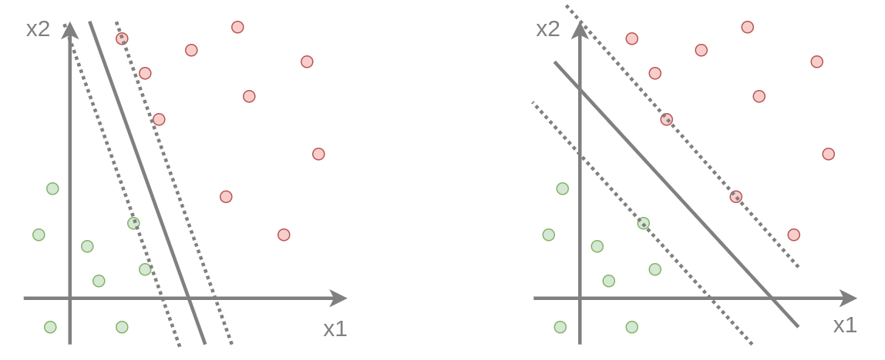
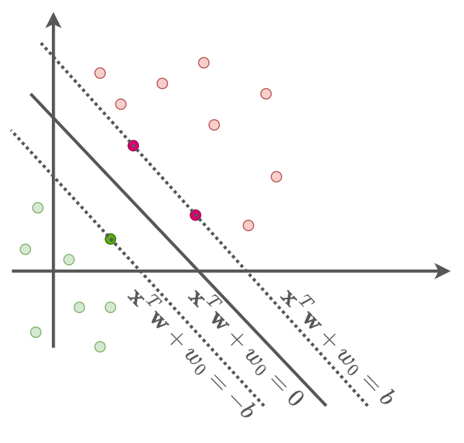
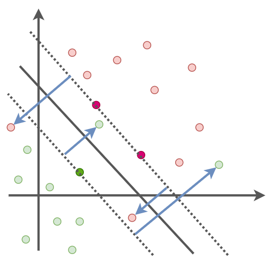

# Метод опорных векторов

**Метод опорных векторов** (support vector machine, SVM [[1]](https://link.springer.com/article/10.1007/Bf00994018)) является одним из самых популярных метод классификации. Его популярности способствует:

- Геометрическая интерпретация - в линейно разделимом случае бинарной классификации он разделяет классы таким образом, чтобы обеспечить <u>максимальное расстояние от ближайших объектов разных классов до разделяющей гиперплоскости</u>, что способствует высокой [обобщающей способности](../Base-concepts/Generalization-ability) метода.

- Возможность выразить формулу построения прогноза через скалярные произведения одних объектов на другие. Заменяя скалярные произведения на другие функции (из определённого класса) можно обобщить метод, <u>превратив его из линейного классификатора в нелинейный</u>, используя так называемое [ядерное обобщение](../Kernel-method/Kernel-trick).

Далее мы рассмотрим геометрическое обоснование метода опорных векторов в случае, когда классы линейно разделимы. Потом обобщим метод на случай линейно неразделимых классов. В конце рассмотрим обобщение метода опорных векторов на многоклассовый случай и приведём пример запуска метода в python, используя библиотеку sklearn.

## Бинарная классификация

### Линейно разделимый случай

Рассмотрим бинарную классификацию в случае, когда классы <u>линейно разделимы</u> (linearly separable), то есть когда существует линейная гиперплоскость, безошибочно разделяющая классы для всех объектов обучающей выборки.

Как видно на рисунке ниже, в линейно разделимом случае решение будет неоднозначным - существуют различные гиперплоскости, безошибочно разделяющие объекты разных классов:



При этом способ разделения справа является более предпочтительным, поскольку **зазор** (margin, пограничная полоса между объектами разных классов) шире, что обеспечивает более высокую [обобщающую способность](../Base-concepts/Generalization-ability) классификатора при применении его к новым данным тестовой выборки.

> Действительно, при предположении, что объекты одного класса похожи друг на друга, новые объекты красного класса будут появляться рядом с известными представителями красного класса. То же справедливо и для новых представителей зелёного класса. Если гиперплоскость проведена таким образом, чтобы быть максимально удалённой от представителей каждого класса, то <u>вероятность ошибки на новых данных будет ниже</u>!

Формализуем критерий нахождения гиперплоскости таким образом, чтобы максимизировать расстояние до представителей каждого класса.

Гиперплоскость $\mathbf{x}^T\mathbf{
w}+w_0=0$ разделяет классы $y\in\{+1,-1\}$, если выполнены следующие условия:

$$
\begin{cases}
\mathbf{x}_{n}^{T}\mathbf{w}+w_{0}\ge b, & \text{если } y_{n}=+1; \\
\mathbf{x}_{n}^{T}\mathbf{w}+w_{0}\le-b, & \text{если }y_{n}=-1; \\
n=1,2,...N;
\end{cases}
$$

где $b>0$ - некоторый параметр. Это проиллюстрировано ниже:



Параметры $\mathbf{w},w_0,b$ определены с точностью до общего положительного множителя, поэтому, не ограничивая общности, условие разделимости можно записать в виде:

$$
\begin{cases}
\mathbf{x}_{n}^{T}\mathbf{w}+w_{0}\ge 1, & y_{n}=+1; \\
\mathbf{x}_{n}^{T}\mathbf{w}+w_{0}\le-1, & y_{n}=-1; \\
n=1,2,...N;
\end{cases}
$$

где мы разделили неравенства на $b>1$. Это равнозначно выбору $b=1$.

Условие разделимости классов можно эквивалентно записать одной строкой:

$$
y_n (\mathbf{x}_n^\top \mathbf{w} + w_0) \geq 1, \quad n = 1, 2, \ldots, N
$$

Теперь среди всех гиперплоскостей, разделяющих классы, мы бы хотели выбрать ту, которая будет <u>максимизировать пограничную полосу между классами</u>, называемую **зазором** (margin). Для этого нужно, чтобы расстояние от ближайших объектов обучающей выборки $\mathbf{x}$  до гиперплоскости $H=\{\mathbf{x}:\mathbf{x}^{T}\mathbf{w}+w_{0}=0\}$ оказалось наибольшим.

Как показывалось [ранее](Linear-classification#геометрическая-интерпретация), это расстояние равно: 

$$
\rho(\mathbf{x},H)=\frac{|\mathbf{x}^{T}\mathbf{w}+w_{0}|}{||\mathbf{w}||}
$$

Поскольку ближайшие объекты будут лежать на гиперплоскостях $\mathbf{x}_{n}^{T}\mathbf{w}+w_{0}=\pm b$, а $b=1$, то расстояние от разделяющей гиперплоскости до ближайших объектов будет $1/||\mathbf{w}||$, а зазор будет равен $2/||\mathbf{w}||$.

Отсюда получаем оптимизационную задачу для нахождения безошибочного линейного классификатора, обеспечивающего <u>максимизацию зазора</u>: 

$$
\begin{cases}
\frac{2}{\left\lVert \mathbf{w}\right\rVert }\to\underset{\mathbf{w},w_{0}}{\max},\\
y_{n}(\mathbf{x}_{n}^{T}\mathbf{w}+w_{0})\ge 1, \\
n=1,2,...N.
\end{cases}
$$

Используя свойство 

$$
\argmax_\mathbf{w}\frac{2}{\left\lVert \mathbf{w}\right\rVert }=\argmin_\mathbf{w}\frac{\left\lVert \mathbf{w}\right\rVert }{2}=\argmin_\mathbf{w}\frac{\left\lVert \mathbf{w}\right\rVert ^{2}}{2},
$$

получим окончательный вид оптимизационной задачи для нахождения весов метода опорных векторов <u>в линейно разделимом случае</u>:

$$
\begin{cases}
\frac{1}{2}\mathbf{w}^{T}\mathbf{w}\to\underset{\mathbf{w},w_{0}}{\min},\\
y_{n}(\mathbf{x}_{n}^{T}\mathbf{w}+w_{0})=M(\mathbf{x}_{n},y_{n})\ge 1, \\
n=1,2,...N.
\end{cases} \tag{1}
$$

:::tip Интуиция оптимизационной задачи

Оптимизационную задачу выше можно проинтерпретировать как нахождение такого линейного классификатора, который: 

1. обеспечивает уверенную классификацию всех объектов (с [отступом](../General-classifiers/Margin) $M(\mathbf{x}_{n},y_{n})$ не ниже единицы)

2. является максимально простым за счёт минимизации L2-нормы весов (обеспечивая [регуляризацию](../Base-concepts/Regularization) модели).

:::

Заметим, что решение будет зависеть только от объектов, 

- имеющих отступ $y_{n}(\mathbf{x}_{n}^{T}\mathbf{w}+w_{0})=M(\mathbf{x}_{n},y_{n})= 1$, 

- которые лежат на гиперплоскостях

$$
y_n (\mathbf{x}_n^\top \mathbf{w} + w_0) = \pm 1
$$

Такие объекты называются **опорными векторами** (support vectors).

> Включение/исключение других объектов с отступом $M(\mathbf{x}_{n},y_{n})>1$ не будет оказывать влияния на решение (подумайте почему), поэтому такие объекты называются **неинформативными** (non-informative).

### Линейно неразделимый случай

В общем случае классы не будут линейно разделимыми, то есть не будет существовать гиперплоскости, безошибочно разделяющей классы, как показано ниже:



Синими стрелками помечены объекты, нарушающие условия разделимости:

$$
y_n (\mathbf{x}_n^\top \mathbf{w} + w_0) \geq 1, \quad n = 1, 2, \ldots, N.
$$

> Если бы мы применили линейно разделимый метод опорных векторов к неразделимым данным, то получили бы пустое множество решений, поскольку обеспечить безошибочную классификацию (и неотрицательный отступ) для всех объектов было бы невозможно!

Чтобы находить решение и для случая линейно неразделимых данных, каждому объекту разрешается отклоняться от требования

$$
y_{n}(\mathbf{x}_{n}^{T}\mathbf{w}+w_{0})=M(\mathbf{x}_{n},y_{n}) \ge 1
$$

на величину нарушения $\xi_n \ge 0$. При этом, чтобы минимизировать возможные нарушения, суммарная величина всех нарушений штрафуется в оптимизационном критерии, что даёт следующую оптимизационную задачу:

$$
\begin{cases}
\frac{1}{2}\mathbf{w}^{T}\mathbf{w}+{\color{red}C\sum_{n=1}^{N}\xi_{n}}\to\min_{\mathbf{w},w_{0},{\color{red}\bm{\xi}}}\\
y_{n}(\mathbf{w}^{T}\mathbf{x}_{n}+w_{0})=M(\mathbf{x}_{n},y_{n})\ge1{\color{red}-\xi_{n}},\\
{\color{red}\xi_{n}\ge0,\,n=1,2,...N}
\end{cases} \tag{2}
$$

Эта задача <u>всегда имеет решение</u> для любых данных при достаточно больших нарушениях $\xi_n$ и представляет собой итоговую оптимизационную задачу по умолчанию для метода опорных векторов.

> Гиперпараметр $C\ge 0$ управляет противоречием между точностью модели и её простотой (выразительной способностью). Подумайте как именно.

В отличие от задачи (1), в (2) оптимизация <u>дополнительно производится</u> по величинам нарушений $\bm{\xi}=[\xi_1,\xi_2,...\xi_N]$, оптимальные значения для которых легко найти:

$$
\xi^*_n=\max\{0,1-M_{n}(\mathbf{w},w_{0})\}, \tag{3}
$$

поскольку

- $\xi^*_n\ge 0$; 

- при $M_{n}(\mathbf{w},w_{0})\ge 1$ неравенство на отступ в (2) не нарушено, и $\xi^*_n=0$; 

- при $M_{n}(\mathbf{w},w_{0})<1$ $\xi^*_n$ должно выбираться минимально возможным, чтобы удовлетворить неравенству, то есть равным $1-M_{n}(\mathbf{w},w_{0})$. 

Подставляя оптимальные значения $\bm{\xi}^*$ из (3) в (2), получим эквивалентную <u>безусловную</u> задачу оптимизации:

$$
\frac{1}{2C}\left\lVert \mathbf{w}\right\rVert _{2}^{2}+\sum_{n=1}^{N}\max\{0,1-M_{n}(\mathbf{w},w_{0})\}\to\min_{\mathbf{w},w_{0}} \tag{4}
$$

что соответствует [оценке линейного бинарного классификатора](Linear-classifier-methods#основные-функции-потерь)

- с функцией потерь [hinge](Linear-classifier-methods#основные-функции-потерь)

- и [L2-регуляризацией](../Base-concepts/Regularization).

### L1-SVM

В качестве популярной вариации метода опорных векторов используется метод L1-SVM [[2]](https://proceedings.neurips.cc/paper/2003/hash/49d4b2faeb4b7b9e745775793141e2b2-Abstract.html), в котором веса штрафуются не по квадрату L2-нормы, а по L1-норме, что даёт следующую задачу условной оптимизации:

$$
\begin{cases}
||\mathbf{w}||_1+C\sum_{n=1}^{N}\xi_{n}\to\min_{\mathbf{w},w_{0},\bm{\xi}}\\
y_{n}(\mathbf{w}^{T}\mathbf{x}_{n}+w_{0})=M_{n}(\mathbf{w},w_{0})\ge1-\xi_{n},\\
\xi_{n}\ge 0,\,n=1,2,...N,
\end{cases} 
$$

которая эквивалентная безусловной оптимизации:

$$
\frac{1}{C}\left\lVert \mathbf{w}\right\rVert_1 +\sum_{n=1}^{N}\max\{0,1-M_{n}(\mathbf{w},w_{0})\}\to\min_{\mathbf{w},w_{0}} 
$$

Штраф весов по L1-норме способен [в точности занулять веса](../Base-concepts/Regularization#популярные-функции-регуляризации) при оптимизации, что делает прогноз зависимым лишь от части наиболее информативных признаков. Такая возможность полезна, когда заранее известно, что используется <u>много слабо информативных и нерелевантных признаков</u>.

## Многоклассовая классификация

Рассмотрим многоклассовую классификацию, в которой $y\in\{1,2,...C\}$. Решить эту задачу можно набором бинарных классификаторов, как описано в [следующей главе](../Multiclass-with-binary-classifiers).

Однако для метода опорных векторов существует модификация, позволяющая производить многоклассовую классификацию напрямую (multiclass support vector machines [[3]](https://www.jmlr.org/papers/v2/crammer01a.html)).

В предложенном подходе настраиваются коэффициенты многоклассового классификатора с [функциями рейтинга](../General-classifiers/Discriminant-functions#многоклассовый-классификатор-в-общем-виде) для каждого класса:

$$
g_{c}(\mathbf{x})=(\mathbf{w}^{c})^{T}\mathbf{x}+w_{0}^{c},\qquad c=1,2,...C
$$

Прогноз строится, назначая класс, обладающий максимальным рейтингом.

### Линейно разделимый случай

В <u>линейно разделимом случае</u> веса предлагается находить из следующей оптимизационной задачи:

$$
\begin{cases}
\sum_{c=1}^{C}(\mathbf{w}^{c})^{T}\mathbf{w}^{c}\to\min_{\{ \mathbf{w}^{c},w^{c}_0\}_{c}}\\
(\mathbf{w}^{y_{n}})^{T}\mathbf{x}_{n}+w_{0}^{y_{n}}-(\mathbf{w}^{c})^{T}\mathbf{x}-w_{0}^{c}\ge1\quad\forall c\ne y_{n},\\
n=1,2,...N
\end{cases}
$$

> По сути требуется найти найти максимально простой классификатор (по L2-норме весов), выдающий рейтинги для верных классов, которые хотя бы на единицу превосходят рейтинги для неправильных классов.

### Линейно неразделимый случай

В более общем линейно неразделимом случае (по умолчанию) объектам разрешается отклоняться от ограничения на рейтинги на величины нарушений $\bm{\xi}=[\xi_1,\xi_2,...\xi_N]$, которые штрафуются по величине:

$$
\begin{cases}
\sum_{c=1}^{C}(\mathbf{w}^{c})^{T}\mathbf{w}^{c}{\color{red}+C\sum_{n=1}^{N}\xi_{n}}\to\min_{\{ \mathbf{w}^{c},w^{c}_0\}_{c},\bm{\xi}} \\
(\mathbf{w}^{y_{n}})^{T}\mathbf{x}_{n}+w_{0}^{y_{n}}-(\mathbf{w}^{c})^{T}\mathbf{x}_{n}-w_{0}^{c}\ge1-{\color{red}\xi_{n}}\quad\forall c\ne y_{n},\\
{\color{red}\xi_{n}\ge 0},\quad n=1,2,...N
\end{cases} \tag{5}
$$

Последнюю задачу можно эквивалентно переписать в виде безусловной оптимизации, как показано ниже.

### Переход к безусловной оптимизации

Из второго ограничения (5):

$$
\xi_n \ge 1 - \big[ (\mathbf{w}^{y_n})^{T} \mathbf{x}_{n} + w_{0}^{y_{n}} - (\mathbf{w}^{c})^{T} \mathbf{x}_{n} - w_{0}^c \big],
\quad \forall c \ne y_n
$$

Следовательно, чтобы удовлетворить всем условиям, $\xi_n$ должно быть не меньше максимального нарушения по всем $c \ne y_n$:

$$
\xi_n \ge \max_{c \ne y_n} \left[ 1 - (\mathbf{w}^{y_n})^{T} \mathbf{x}_{n} - w_{0}^{y_{n}} + (\mathbf{w}^{c})^{T} \mathbf{x}_{n} + w_{0}^c \right]
$$

С учётом $\xi_n \ge 0$ получаем:

$$
\xi_n = \max\Big\{0, \; \max_{c \ne y_n} \big[ 1 - (\mathbf{w}^{y_n})^{T} \mathbf{x}_{n} - w_{0}^{y_{n}} + (\mathbf{w}^{c})^{T} \mathbf{x}_{n} + w_{0}^c \big] \Big\}
$$

Это обобщение [функции потерь hinge](Linear-classifier-methods#основные-функции-потерь) на многоклассовый случай:

$$
\mathcal{L}(y_n, f(\mathbf{x}_n)) =
\max\Big\{0, \; \max_{c \ne y_n} \big[ 1 - (\mathbf{w}^{y_n})^{T} \mathbf{x}_{n} - w_{0}^{y_{n}} + (\mathbf{w}^{c})^{T} \mathbf{x}_{n} + w_{0}^c \big] \Big\},
$$

где $f(\mathbf{x}_n)$ — вектор оценок рейтингов для всех классов.

Подставив $\xi_n = \mathcal{L}(y_n, f(\mathbf{x}_n))$ в функционал, получим:

$$
\sum_{c=1}^C (\mathbf{w}^c)^T \mathbf{w}^c \;+\; C \sum_{n=1}^N \mathcal{L}\big(y_n, f(\mathbf{x}_n)\big) \to\min_{\{ \mathbf{w}^{c},w^{c}_0\}_{c}}
$$

В [[4]](https://ieeexplore.ieee.org/abstract/document/991427) приводится эмпирическое сравнение различных вариантов многоклассового метода опорных векторов.

## Обобщение метода через ядра

Решение условных задач оптимизации (2) и (5), используя условия Каруша-Куна-Таккера [[5]](https://ru.wikipedia.org/wiki/Условия_Каруша_—_Куна_—_Таккера), можно свести к двойственной задаче оптимизации, из которой формулу построения прогноза можно выразить как зависимость не от самих признаковых описаний объектов, а от попарных скалярных произведений между объектами: 

$$
\hat{y}(\mathbf{x})=F(\langle \mathbf{x},\mathbf{x}_1 \rangle, \langle \mathbf{x},\mathbf{x}_2 \rangle,...)
$$

Это позволяет применить [ядерное обобщение метода](../Kernel-method/Kernel-trick) (kernel method, [[6]](https://en.wikipedia.org/wiki/Kernel_method)) заменяя операции стандартного скалярного произведения специальными функциями $K(\cdot,\cdot)$ - **ядрами Мерсера** (Mercer kernel [[7]](https://neerc.ifmo.ru/wiki/index.php?title=%D0%AF%D0%B4%D1%80%D0%B0)):

$$
\hat{y}(\mathbf{x})=F(K(\mathbf{x},\mathbf{x}_1), K(\mathbf{x},\mathbf{x}_2),...)
$$

Ядра Мерсера соответствуют обычному скалярному произведению, но не в исходном пространстве признаков $\mathbf{x}$, а в нелинейно преобразованном $\phi(\mathbf{x})$:

$$
K(\mathbf{x},\mathbf{x}')=\langle \phi(\mathbf{x}), \phi(\mathbf{x}') \rangle,
$$

что соответствует превращению линейного метода опорных векторов в нелинейный метод классификации! Детально это разобрано в [отдельной главе](../Kernel-method/Kernel-SVM).

Дополнительно ознакомиться с методом опорных векторов можно в [[8]](https://neerc.ifmo.ru/wiki/index.php?title=%D0%9C%D0%B5%D1%82%D0%BE%D0%B4_%D0%BE%D0%BF%D0%BE%D1%80%D0%BD%D1%8B%D1%85_%D0%B2%D0%B5%D0%BA%D1%82%D0%BE%D1%80%D0%BE%D0%B2_(SVM)). 

## Пример запуска в Python

<div class="code_start">Пример запуска метода опорных векторов для двух классов:</div>

```py
from sklearn.svm import SVC   
from sklearn.metrics import accuracy_score

X_train, X_test, Y_train, Y_test = get_demo_classification_data()  
model = SVC(C=1)                # инициализация модели, (1/C) - вес при регуляризаторе
model.fit(X_train, Y_train)     # обучение модели   
Y_hat = model.predict(X_test)   # построение прогнозов
print(f'Точность прогнозов: {100*accuracy_score(Y_test, Y_hat):.1f}%')  

# Можно считать информацию по опорным векторам:
print(f'Число опорных векторов к каждом классе: {model.n_support_}')
print(model.support_vectors_[:5])   # выводим первые 5 опорных векторов

model = SVC(kernel='rbf', gamma=1)   # инициализация модели с использованием Гауссова ядра
model.fit(X_train, Y_train)          # обучение модели   
Y_hat = model.predict(X_test)        # построение прогнозов
print(f'Точность прогнозов: {100*accuracy_score(Y_test, Y_hat):.1f}%')    
```

<div class="code_end"></div>

[Больше информации](https://scikit-learn.org/stable/modules/svm.html). [Полный код](https://github.com/victorkitov/ML/blob/main/%D0%9F%D1%80%D0%B8%D0%BC%D0%B5%D1%80%D1%8B%20%D0%B7%D0%B0%D0%BF%D1%83%D1%81%D0%BA%D0%B0%20%D0%BE%D1%81%D0%BD%D0%BE%D0%B2%D0%BD%D1%8B%D1%85%20%D0%BC%D0%B5%D1%82%D0%BE%D0%B4%D0%BE%D0%B2%20%D0%B2%20sklearn.ipynb). 

## Литература

1. [Cortes C., Vapnik V. Support-vector networks //Machine learning. – 1995. – Т. 20. – С. 273-297.](https://link.springer.com/article/10.1007/Bf00994018)

2. [Zhu J. et al. 1-norm support vector machines //Advances in neural information processing systems. – 2003. – Т. 16.](https://proceedings.neurips.cc/paper/2003/hash/49d4b2faeb4b7b9e745775793141e2b2-Abstract.html)

3. [Crammer K., Singer Y. On the algorithmic implementation of multiclass kernel-based vector machines //Journal of machine learning research. – 2001. – Т. 2. – №. Dec. – С. 265-292.](https://www.jmlr.org/papers/v2/crammer01a.html)

4. [Hsu C. W., Lin C. J. A comparison of methods for multiclass support vector machines //IEEE transactions on Neural Networks. – 2002. – Т. 13. – №. 2. – С. 415-425.](https://ieeexplore.ieee.org/abstract/document/991427)

5. [Wikipedia: Условия Каруша — Куна — Таккера.](https://ru.wikipedia.org/wiki/Условия_Каруша_—_Куна_—_Таккера)

6. [Wikipedia: kernel method.](https://en.wikipedia.org/wiki/Kernel_method)

7. [Викиконспекты ИТМО: Ядра.](https://neerc.ifmo.ru/wiki/index.php?title=%D0%AF%D0%B4%D1%80%D0%B0)

8. [Викиконспекты ИТМО: метод опорных векторов.](https://neerc.ifmo.ru/wiki/index.php?title=%D0%9C%D0%B5%D1%82%D0%BE%D0%B4_%D0%BE%D0%BF%D0%BE%D1%80%D0%BD%D1%8B%D1%85_%D0%B2%D0%B5%D0%BA%D1%82%D0%BE%D1%80%D0%BE%D0%B2_(SVM))
