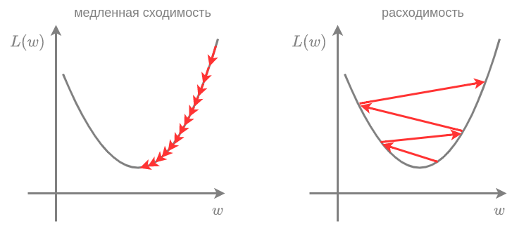
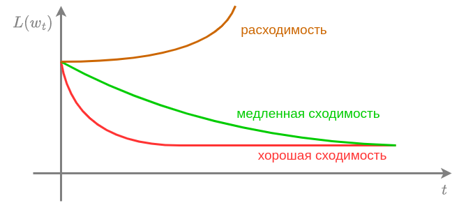

# Метод градиентного спуска

## Идея метода

**Метод градиентного спуска** (gradient descent [[1]](https://en.wikipedia.org/wiki/Gradient_descent)) минимизирует функцию потерь, <u>итеративно сдвигая веса на антиградиент этой функции с небольшим весом</u>.

Псевдокод метода:

> инициализируем $\mathbf{w}$ случайно
> 
> пока не выполнено условие остановки:
> 
>                     $\mathbf{w}:=\mathbf{w}-\varepsilon\nabla_{\mathbf{w}}L(\mathbf{w})$

Здесь $\varepsilon>0$ - гиперпараметр, характеризующий **шаг обновления весов** (learning rate). Он выбирается небольшой константой.

В качестве **условия остановки** обычно выбирается условие, что от итерации к итерации функция потерь <u>перестаёт существенно меняться</u>. Также можно допустить досрочное окончание оптимизации, если достигнуто максимальное число итераций.

:::tip Аналогия с путником в горах

Поскольку антиградиент $-\nabla_{\mathbf{w}}L(\mathbf{w})$ показывает [локальное направление максимального уменьшения функции](Gradient-optimization), метод градиентного спуска можно уподобить путнику, заблудившемуся ночью в горах, который, пытаясь спуститься вниз как можно быстрее, каждый раз делает шаг в направлении наиболее крутого склона. 

Кстати, так можно и скатиться с обрыва! Чтобы не улететь, путник использует альпинистское снаряжение, чтобы упасть не больше чем на длину страхующей веревки. Аналогично и в методе градиентного спуска, если рельеф функции потерь резко меняется, то можно допускать сдвиги по величие не больше, чем на заранее заданный порог безопасности, ограничивая  норму градиента, на который осуществляют сдвиг:

$$
\mathbf{w}:=
\begin{cases}
\mathbf{w}-\varepsilon\nabla_{\mathbf{w}}L(\mathbf{w}), \text{ если }\|\nabla_{\mathbf{w}}L(\mathbf{w})\|<h \\
\mathbf{w}-\varepsilon\nabla_{\mathbf{w}}h L(\mathbf{w})/\|L(\mathbf{w})\|, \text{ иначе. }
\end{cases}
$$

Такой подход называется **обрезкой градиента** (gradient clipping [[1]](https://www.geeksforgeeks.org/deep-learning/understanding-gradient-clipping/)) и часто используется в настройке нейросетей, где функция потерь имеет сложный рельеф с резкими перепадами. Эта проблема особенно актуальна при настройке сложных нейросетевых моделей.

:::

## Выбор шага обучения

Гиперпараметр $\varepsilon>0$ выбирается пользователем и представляет собой небольшую величину, влияющую на характер сходимости. Если $\varepsilon$ выбрать слишком малым, то потребуется очень много шагов оптимизации, чтобы дойти до минимума. Если, наоборот, его выбрать слишком большим, то метод может расходиться. Эти ситуации показаны на рисунке слева и справа соответственно:

Для подбора $\varepsilon$ необходимо построить зависимость функции потерь $L(\mathbf{w}_t)$ от номера итерации  $t$  и выбрать $\varepsilon$ таким, чтобы сходимость была максимально быстрой, и не возникало расходимости:

:::tip Ускорение сходимости

Дополнительно ускорить сходимость может [нормализация признаков](../Data-preprocessing/Feature-normalization) (приведение их к одному масштабу). Это позволяет отчасти решить проблему "вытянутых долин" в рельефе функции потерь, из-за которых приходится выбирать маленький шаг, чтобы не разойтись вдоль быстро меняющихся направлений.

:::

## Выбор начального приближения

В методе градиентного спуска начальное значение весов $\mathbf{w}$ инициализируется случайно. В случае выпуклой функции потерь любой глобальный минимум является глобальным (докажите!), поэтому старт из разных начальных приближений приведёт к решению того же качества. 

> Если же функция потерь невыпукла, то она может содержать много локальных минимумов, и выбор начального приближения <u>может влиять на то, к какому минимуму алгоритм оптимизации в итоге сойдётся</u>! Поэтому для невыпуклых потерь предлагается запускать алгоритм несколько раз из разных начальных приближений, а потом выбрать наилучшее решение (обеспечивающее минимальное значение функции потерь).

Также стоит отметить, что выбор начального приближения ближе к предполагаемому минимуму уменьшит число итераций до сходимости и ускорит настройку модели.

## Условия сходимости

Для сходимости метода достаточно, чтобы функция потерь была непрерывно-дифференцируема, выпукла вниз в окрестности оптимума, удовлетворяла условию Липшица (имела ограниченную производную), а шаг обучения был достаточно мал. Детальнее об методе градиентного спуска, условиях и скорости его сходимости можно прочитать в [[3]](http://w.ict.nsc.ru/books/textbooks/akhmerov/mo_unicode/index.html).

## Литература

1. [Wikipedia: gradient descent.](https://en.wikipedia.org/wiki/Gradient_descent)

2. [Geeksforgeeks: understanding gradient clipping.](https://www.geeksforgeeks.org/deep-learning/understanding-gradient-clipping/)

3. [Ахмеров Р.Р. Методы оптимизации гладких функций.](http://w.ict.nsc.ru/books/textbooks/akhmerov/mo_unicode/index.html)
