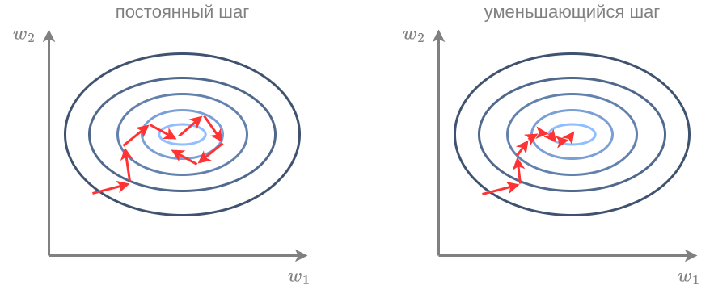

# Метод стохастического градиентного спуска

## Идея метода

Вспомним, что функция потерь в машинном обучении представляет собой [эмпирический риск](../Base-concepts/Function-selection#теоретический-и-эмпирический-риск), то есть средние потери по объектам обучающей выборки:

$$
L(\mathbf{w}) = \frac{1}{N}\sum_{n=1}^{N}\mathcal{L}(f_{\mathbf{w}}(\mathbf{x}_{n}),\,y_{n})
$$

Рассмотрим детальнее метод [градиентного спуска](Gradient-descent) с учётом вида функции потерь:

> инициализируем $\mathbf{w}_0$ случайно
> 
> пока не выполнено условие остановки:
> 
>                     $\mathbf{w}:=\mathbf{w}-\varepsilon\nabla_{\mathbf{w}}L(\mathbf{w}) = \mathbf{w}-\varepsilon\frac{1}{N}\sum_{n=1}^N \nabla_{\mathbf{w}}\mathcal{L}(\hat{y}(\mathbf{x}_n),y_n)$

Получается, что на каждом шаге алгоритма необходимо вычислять производные функции потерь <u>на всех объектах обучающей выборки</u>, которых может быть очень много! 

Это приводит к медленной работе метода. При этом, поскольку алгоритм состоит из многих итераций с малым шагом $\varepsilon$, нам совсем не обязательно вычислять точное значение градиента $L(\mathbf{w})$, а достаточно сдвигаться лишь <u>примерно в сторону уменьшения функции</u>.

Идея метода **стохастического градиентного спуска** (stochastic gradient descent, SGD) заключается в использовании быстро вычислимой аппроксимации эмпирического риска для расчета градиента. Для этого используется приближение средними потерями на $K$ <u>случайных объектах</u>:

$$
L(\mathbf{w})=\frac{1}{N}\sum_{n=1}^{N}\mathcal{L}(\mathbf{x}_{n},y_{n}|\mathbf{w})\approx\frac{1}{K}\sum_{n\in I}\mathcal{L}(\mathbf{x}_{n},y_{n}|\mathbf{w})=\tilde{L}(\mathbf{w}) 
$$

где $I=\{n_1,...n_K\}$ - индексы $K$ случайных объектов обучающей выборки, называемых **минибатчом** (minibatch). Используя эту аппроксимацию, получим  метод стохастического градиентного спуска:

> инициализируем настраиваемые веса $\mathbf{w}$ случайно
> 
> пока не выполнено условие остановки:
> 
>              случайно выбрать $K$ объектов $I=\{n_1,...n_K\}$ из $\{1,2,...N\}$
> 
>                     $\mathbf{w}:=\mathbf{w}-\varepsilon\nabla_{\mathbf{w}}\tilde{L}(\mathbf{w}) = \mathbf{w}-\varepsilon_t\frac{1}{K}\sum_{n\in I} \nabla_{\mathbf{w}}\mathcal{L}(\hat{y}(\mathbf{x}_n),y_n)$

Как видим, одна итерация стохастического градиентного спуска выполняется за $O(K)$ операций, а не за $O(N)$, как в обычном методе градиентного спуска, причём $K$ мы выбираем сами, и он берётся <u>намного меньше</u> $N$!

Поскольку по каждой итерации метода минибатч сэмплируется случайно, то, при достаточном числе итераций, алгоритм всё равно обойдет все объекты выборки. 

На практике объекты обучающей выборки переставляются в случайном порядке, а затем извлекаются последовательно по $K$ штук за раз. Однократный проход по всем объектам обучающей выборки называют **эпохой** (epoch).

:::tip Онлайн-обучение

В режиме онлайн-обучения (online learning [[1]](https://en.wikipedia.org/wiki/Online_machine_learning)) обучающие объекты поступают последовательно, а целевая зависимость часто динамически меняется со временем. Так происходит, например, при прогнозе цен на акции на бирже. В подобных сценариях вместо случайного сэмплирования объектов по всей истории наблюдений чаще сэмплируют недавние, более свежие наблюдения, лучше отражающие текущую зависимость в данных.

:::

## Выбор K

Если $K$ велико, а объекты содержат повторяющуюся информацию, то точность аппроксимации будет высокой при более быстрой сходимости по сравнению с методом градиентного спуска. 

Интересно, что метод будет сходиться даже при $K=1$. Конечно, оценка эмпирического риска всего по одному объекту будет очень грубой. Однако, поскольку эта оценка является несмещённой (за счёт случайного выбора объекта), метод всё равно будет сходиться, надо лишь использовать более малый шаг обучения $\varepsilon$. Тогда за увеличенное количество итераций мы сможем обойти существенную часть объектов выборки и в итоге сместить веса в правильную сторону. 

На практике $K$ выбирают таким, чтобы минибатч помещался в память и векторные операции, связанные с его обработкой, производились за один такт параллельных вычислений устройства.

## Сходимость

Для сходимости функция потерь должна быть непрерывно-дифференцируемой, выпуклой в окрестности оптимума и удовлетворять условию Липшица (иметь ограниченную производную [[2]](https://en.wikipedia.org/wiki/Lipschitz_continuity)). Детальнее об условиях сходимости можно прочитать в учебнике ШАД [[3]](https://education.yandex.ru/handbook/ml/article/shodimost-sgd). Важным отличием условий сходимости стохастического градиентного спуска является то, что шаг сходимости должен быть **не константой $\varepsilon$, а последовательностью $\varepsilon_t$**, стремящейся к нулю в окрестности оптимума.

Действительно, при постоянном шаге, из-за того, что мы сдвигаемся <u>не на точный градиент, а на его грубую аппроксимацию</u>, даже дойдя до оптимума, метод будет совершать случайное блуждание в его окрестности. Для сходимости нужно постепенно уменьшать шаг, как показано ниже справа:

:::tip Скорость уменьшения шага для сходимости

Формально метод сходится, если шаг удовлетворяет следующим двум условиям:

$$
\begin{aligned}
\sum_{t=1}^{+\infty}\varepsilon_{t}=+\infty & \qquad\text{достигаем произвольной точки}\\
\sum_{t=1}^{+\infty}\varepsilon_{t}^{2}<+\infty & \qquad\varepsilon_{t}\text{ сходится к нулю достаточно быстро}
\end{aligned}

$$

Например, этому условию удовлетворяет последовательность

$$
\varepsilon_t=\frac{a}{1+bt}, \text{ где $a,b>0$ - гиперпараметры.}
$$

На практике шаг часто берут небольшой константой, а потом её уменьшают, когда функция потерь перестаёт устойчиво уменьшаться, после чего продолжают обучение с уменьшенным шагом. Так делают несколько раз, и в библиотеках оптимизации, такой как PyTorch, такая стратегия уже реализована [[4]](https://docs.pytorch.org/docs/stable/generated/torch.optim.lr_scheduler.ReduceLROnPlateau.html).

:::

---

Далее в учебнике будет рассмотрено повышение скорости и устойчивости метода стохастического спуска за счёт [внесения инерции](Momentum-Nesterov), а также [метод Ньютона](Newton-method) оптимизации второго порядка. Также во второй части учебника по глубокому обучению будут описаны [специализированные методы оптимизации](../../Neural-networks/Training-neural-networks) для настройки нейросетей.

Вы также можете прочитать про метод градиентного и стохастического градиентного спуска у викиконспектах ИТМО [[5]](https://neerc.ifmo.ru/wiki/index.php?title=%D0%A1%D1%82%D0%BE%D1%85%D0%B0%D1%81%D1%82%D0%B8%D1%87%D0%B5%D1%81%D0%BA%D0%B8%D0%B9_%D0%B3%D1%80%D0%B0%D0%B4%D0%B8%D0%B5%D0%BD%D1%82%D0%BD%D1%8B%D0%B9_%D1%81%D0%BF%D1%83%D1%81%D0%BA) и учебнике ШАД [[6]](https://education.yandex.ru/handbook/ml/article/optimizaciya-v-ml). В статье [[7]](https://arxiv.org/pdf/1609.04747) детально разбираются различные алгоритмы оптимизации и анализируются их преимущества и недостатки. 

## Литература

1. [Wikipedia: online machine learning.](https://en.wikipedia.org/wiki/Online_machine_learning)

2. [Wikipedia: Lipschitz continuity.](https://en.wikipedia.org/wiki/Lipschitz_continuity)

3. [Учебник ШАД: сходимость SGD.](https://education.yandex.ru/handbook/ml/article/shodimost-sgd)

4. [Документация PyTorch: ReduceLROnPlateau.](https://docs.pytorch.org/docs/stable/generated/torch.optim.lr_scheduler.ReduceLROnPlateau.html) 

5. [Викиконспекты ИТМО: cтохастический градиентный спуск.](https://neerc.ifmo.ru/wiki/index.php?title=%D0%A1%D1%82%D0%BE%D1%85%D0%B0%D1%81%D1%82%D0%B8%D1%87%D0%B5%D1%81%D0%BA%D0%B8%D0%B9_%D0%B3%D1%80%D0%B0%D0%B4%D0%B8%D0%B5%D0%BD%D1%82%D0%BD%D1%8B%D0%B9_%D1%81%D0%BF%D1%83%D1%81%D0%BA)

6. [Учебник ШАД: оптимизация в ML.](https://education.yandex.ru/handbook/ml/article/optimizaciya-v-ml)

7. [Ruder S. An overview of gradient descent optimization algorithms //arXiv preprint arXiv:1609.04747. – 2016.](https://arxiv.org/pdf/1609.04747)
