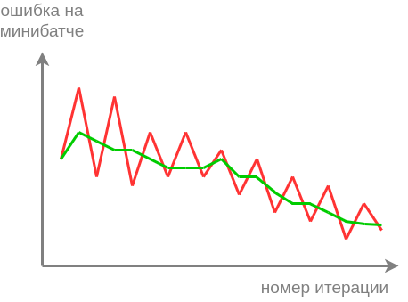

# Мониторинг сходимости

Для анализа сходимости метода [стохастического градиентного спуска](SGD) важно смотреть на динамику потерь на каждой итерации алгоритма. Особенно это важно при долгой и трудоёмкой настройке нейросетей,  чтобы на ранней стадии оптимизации увидеть некорректную настройку определённых параметров. Поскольку в стохастическом градиентном спуске сдвиг весов производится на антиградиент по случайному минибатчу объектов, то и величина этого сдвига будет подвержена случайным колебаниям, как в примере ниже:

Для большей наглядности нам хотелось бы отслеживать сглаженную версию этой динамики, показанную зелёной кривой. Для этого существуют два подхода - скользящее среднее и экспоненциальное сглаживание. Оба метода на вход принимают зашумлённый временной ряд $z_t$ (в нашем случае - потерь на объектах минибатча), а на выходе выдают его сглаженную версию $s_t$, причем сглаживание осуществляется динамически в каждый момент времени.

## Скользящее среднее

Идея **скользящего среднего** заключается в выдаче усреднения по $K$ последним наблюдениям:

$$
s_t=\frac{1}{K}\sum_{i=t-K+1}^t z_i
$$

Это среднее можно эффективно пересчитывать по формуле

$$
s_t:=s_{t-1}+\frac{z_t}{K}-\frac{z_{t-K}}{K}
$$

Вначале, пока $K$ наблюдений еще не накоплены, нужно усреднять по всем располагаемым наблюдениям.

## Экспоненциальное сглаживание

**Экспоненциальное сглаживание** вычисляет сглаженную версию временного ряда по следующей формуле:

$$
\begin{cases}
s_{1}=z_{1} & \\ 
s_{t}=(1-\alpha)z_{t}+\alpha s_{t-1} & 
\end{cases}
$$

Гиперпараметр $\alpha\in [0,1)$ управляет степенью сглаживания.

Как именно $\alpha$ влияет на результат?  

Увеличение $\alpha$ приводит к более слабому учёту новых данных и к более сильному - исторических. Поэтому сглаженный временной ряд $s_t$ будет получаться более гладким. Уменьшение $\alpha$ уменьшает сглаживание. В частности, при $\alpha=0$, сглаженный ряд совпадает с исходным.

Если рекуррентно переписать зависимость $s_t$ только от $z_t,z_{t-1},z_{t-2},...$, то получим, что экспоненциальное сглаживание выдаёт взвешенное усреднение по всем прошлым наблюдениям с экспоненциально убывающими весами:

$$
s_t = (1-\alpha)(z_{t}+\alpha z_{t-1}+\alpha^{2}z_{t-2}+\alpha^{3}z_{t-3}+...)
$$

Более детально об экспоненциальном сглаживании и его связи со скользящим средним можно прочитать в [[1]](https://en.wikipedia.org/wiki/Exponential_smoothing).

## Литература

1. [Wikipedia: exponential smoothing.](https://en.wikipedia.org/wiki/Exponential_smoothing)
