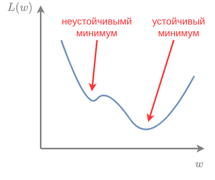

# Стохастический градиентный спуск с инерцией

**Метод стохастического градиентного спуска с инерцией** (stochastic gradient descent with momentum, SGD+momentum [[1]](https://www.mathnet.ru/php/archive.phtml?wshow=paper&jrnid=zvmmf&paperid=7713&option_lang=rus)) - это небольшое усложнение [метода стохастического градиентного спуска](SGD), которое позволяет ускорить сходимость и предотвратить застревание в локальных минимумах с небольшой окрестностью. Также он позволяет быстрее проскакивать точки перегиба и другие области медленных изменений функции потерь.

Напомним метод обычного стохастического градиентного спуска:

> инициализируем $t=0$, а начальные веса $\mathbf{w}_0$ случайно
> 
> пока не выполнено условие остановки:
> 
>             сэмплируем случайные объекты $I=\{n_1,...n_K\}$ из $\{1,2,...N\}$
> 
>             $\Delta \mathbf{w}_{t+1} := \varepsilon_t \frac{1}{K} \sum_{n\in I} \nabla_\mathbf{w} \mathcal{L}(\mathbf{x}_n,y_n|\mathbf{w}_t)$
> 
>             $\mathbf{w}_{t+1}:= \mathbf{w}_t- \Delta \mathbf{w}_{t+1}$
> 
>             $t:=t+1$

Метод стохастического градиентного спуска с инерцией считается аналогично, но в качестве вектора сдвига весов используется не только градиент по объектам минибатча, но и ранее посчитанные градиенты с небольшим весом, задаваемым гиперпараметром $\mu\in (0,1)$:

> инициализируем $t=0$, а начальные веса $\mathbf{w}_0$ случайно
> 
> пока не выполнено условие остановки:
> 
>             сэмплируем случайные объекты $I=\{n_1,...n_K\}$ из $\{1,2,...N\}$
> 
>             $\Delta \mathbf{w}_{t+1} := \textcolor{red}{\mu\Delta \mathbf{w}_t}+\varepsilon_t \frac{1}{K} \sum_{n\in I} \nabla_\mathbf{w} \mathcal{L}(\mathbf{x}_n,y_n|\mathbf{w}_t)$ 
> 
>             $\mathbf{w}_{t+1}:= \mathbf{w}_t- \Delta \mathbf{w}_{t+1}$
> 
>             $t:=t+1$

Компонента $\mu\Delta \mathbf{w}_t$ называется **инерцией** (momentum) и позволяет ускорить сходимость за счёт объединения информации о текущем градиенте с ранее посчитанными градиентами. За счёт этого градиент получается менее зашумлённым случайностью выбора объектов текущего минибатча, что позволяет использовать более высокий шаг обучения и ускорить сходимость. 

> Отметим, однако, что выбор высокого $\mu$ делает метод менее чувствительным к текущему направлению максимального снижения функции, что может, наоборот, замедлить сходимость. На практике чаще всего используют $\mu=0.9$.

Рекурсивно подставляя вместо $\Delta \mathbf{w}_{t},\Delta \mathbf{w}_{t-1},\Delta \mathbf{w}_{t-2},...$ формулу их расчёта, получим, что изменение весов $\Delta \mathbf{w}_{t+1}$ зависит от всех ранее посчитанных градиентов с экспоненциально убывающими весами по номеру итерации (докажите!). 

Учёт инерции позволяет проскакивать локальные минимумы с малой окрестностью, сходясь к более устойчивым минимумам с большей окрестностью, как показано на рисунке:

Детальное обоснование и анализ метода стохастического градиентного спуска представлено в [[2]](https://www.jmlr.org/papers/volume25/22-1189/22-1189.pdf).

## Инерция Нестерова

Метод инерции Нестерова (Nestrov momentum [[3]](https://hengshuaiyao.github.io/papers/nesterov83.pdf)) позволяет ещё немного ускорить сходимость за счёт того, что градиент вычисляется в точке, <u>более близкой к новой оценке весов</u> на следующей итерации:

> инициализируем $t=0$, а начальные веса $\mathbf{w}_0$ случайно
> 
> пока не выполнено условие остановки:
> 
>             сэмплируем случайные объекты $I=\{n_1,...n_K\}$ из $\{1,2,...N\}$
> 
>             $\Delta \mathbf{w}_{t+1} := \mu\Delta \mathbf{w}_t+\varepsilon_t\frac{1}{K} \sum_{n\in I} \nabla_\mathbf{w} \mathcal{L}(\mathbf{x}_n,y_n|\mathbf{w}_t\textcolor{red}{-\mu\Delta \mathbf{w}_t})$
> 
>             $\mathbf{w}_{t+1}:= \mathbf{w}_t-\Delta \mathbf{w}_{t+1}$
> 
>             $t:=t+1$

На шаге $t$ мы уже заранее знаем, что веса сдвинутся на величину инерции, поэтому можем считать градиент уже в сдвинутой точке. Подобное заглядывание вперёд позволяет <u>заранее сместить градиент</u>, если на следующей итерации предвидится изменение рельефа функции потерь.

:::tip Более продвинутые техники

Для оптимизируемых функций со сложным рельефом (особенно в настройке нейросетей) применяются более продвинутые методы, такие как RMSprop и Adam, ключевая идея которых заключается в том, что шаг обучения $\varepsilon_t$ вычисляется независимо для каждой компоненты вектора весов. Это связано с тем, что вдоль одних осей в пространстве весов функция потерь меняется быстро, а вдоль других - медленно, поэтому, для ускорения сходимости, целесообразно адаптировать шаг обучения индивидуально для каждой оси. Эти методы [описаны](../../Neural-networks/Training-neural-networks) во второй части учебника, посвящённой нейросетям.

:::

## Литература

1. [Поляк Б. Т. О некоторых способах ускорения сходимости итерационных методов //Журнал вычислительной математики и математической физики. – 1964. – Т. 4. – №. 5. – С. 791-803.](https://www.mathnet.ru/php/archive.phtml?wshow=paper&jrnid=zvmmf&paperid=7713&option_lang=rus)

2. [Shi B. On the hyperparameters in stochastic gradient descent with momentum //Journal of Machine Learning Research. – 2024. – Т. 25. – №. 236. – С. 1-40.](https://www.jmlr.org/papers/v25/22-1189.html)

3. [Нестеров Ю. Е. Метод минимизации выпуклых функций со скоростью
   сходимости O(1/k2) // Доклады АН СССР. 1983. Т. 269, № 3. С. 543–547.](https://hengshuaiyao.github.io/papers/nesterov83.pdf)
