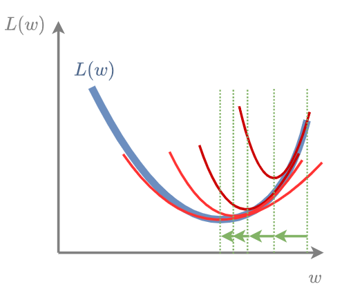

# Метод Ньютона

**Метод оптимизации Ньютона** (Newton's optimization method) позволяет ускорить метод [градиентного спуска](Gradient-descent) за счёт использования информации не только о градиенте, *но и о матрице вторых производных*, называемой **матрицей Гессе** (Hessian):

$$
\nabla^2 L(\mathbf{w})=\begin{pmatrix}
\frac{\partial L(\mathbf{w})}{\partial w_1 \partial w_1} & \cdots & \frac{\partial L(\mathbf{w})}{\partial w_1 \partial w_D} \\
\cdots & \cdots & \cdots \\
\frac{\partial L(\mathbf{w})}{\partial w_D \partial w_1} & \cdots & \frac{\partial L(\mathbf{w})}{\partial w_D \partial w_D}
\end{pmatrix} \in \mathbb{R}^{D \times D}
$$

Использование вторых производный позволяет ускорить сходимость, поскольку содержит <u>информацию о скорости изменения градиента</u>. Там, где градиент меняется медленно, можно увеличить шаг обучения, а там, где быстро, - замедлить.

Метод Ньютона выглядит следующим образом: 

> инициализируем настраиваемые веса $\mathbf{w}$ случайно
> 
> пока не выполнено условие остановки:
> 
>              $\mathbf{w}:=\mathbf{w}-[\nabla_{\mathbf{w}}^2 L(\mathbf{w})]^{-1}\nabla_{\mathbf{w}}L(\mathbf{w})$

Как видим, за счёт использования информации о вторых производных удалось избавиться от явной спецификации шага обучения - он настраивается автоматически по скорости изменения градиента домножением на матрицу Гессе, состоящую из всех вторых производных функции потерь. 

> Обратим внимание, что домножение на матрицу подстраивает скорость изменения *вдоль каждой оси*, используя градиенты *вдоль всех осей*.

Геометрически метод Ньютона в каждой точке строит параболу (в многомерном пространстве - параболоид), после чего смещает оценку весов в точку минимума этой параболы:

## Обоснование метода Ньютона

Рассмотрим минимизацию дважды дифференцируемой функции потерь $L(\mathbf{w})\to\min_{\mathbf{w}}$

Пусть $\mathbf{w}^{*}=\arg\min_{\mathbf{w}}L(\mathbf{w})$

Тогда $\nabla L(\mathbf{w}^{*})=\mathbf{0}$

Разложение Тейлора $\nabla L(\mathbf{w})$ относительно $\mathbf{w}$ в точке $\mathbf{w}^{*}$:

$$
\nabla L(\mathbf{w}^{*})=0=\nabla L(\mathbf{w})+\nabla^{2}L(\mathbf{w})(\mathbf{w}^{*}-\mathbf{w})+o(\left\lVert \mathbf{w}-\mathbf{w}^{*}\right\rVert ),
$$

откуда

$$
\mathbf{w}^{*}-\mathbf{w}=-\left[\nabla^{2}L(\mathbf{w})\right]^{-1}\nabla L(\mathbf{w})+o(\left\lVert \mathbf{w}-\mathbf{w}^{*}\right\rVert )
$$

Получаем итоговое правило обновления весов, чтобы (приближённо!) переместиться в точку минимума: 

$$
\mathbf{w} := \mathbf{w}-\left[\nabla^{2}L(\mathbf{w})\right]^{-1}\nabla L(\mathbf{w})
$$

При минимизации <u>квадратичной функции</u> погрешности $o(\left\lVert \mathbf{w}-\mathbf{w}^{*}\right\rVert )$, её квадратичная аппроксимация будет точной, поэтому метод Ньютона сойдётся за один шаг.

## Достоинства и недостатки метода

Метод Ньютона обладает более высокой скоростью сходимости, чем метод градиентного спуска. В частности, он находит минимум квадратичного функционала всего лишь за одну итерацию. Однако практическому применению этого метода в машинному обучении мешают два аспекта:

- Необходимость хранить в памяти матрицу Гессе, размера $D\times D$, а $D$ обычно велико при большом числе признаков и при использовании таких перепараметризованных моделей, как нейросети.

- Необходимость обращать матрицу Гессе на каждой итерации, что имеет вычислительную сложность $O(D^3)$.

---

Детальнее о проблемах применения метода Ньютона в машинном обучении можно прочитать обсуждении [[1]](https://stats.stackexchange.com/questions/253632/why-is-newtons-method-not-widely-used-in-machine-learning). Из-за перечисленных проблем на практике чаще используют квазиньютоновские методы [[2]](https://en.wikipedia.org/wiki/Quasi-Newton_method), которые используют вычислительно эффективную аппроксимацию метода Ньютона.

Детальнее о методе Ньютона, условиях сходимости и альтернативных методах второго порядка рекомендуется прочитать в учебнике ШАД [[3]](https://education.yandex.ru/handbook/ml/article/metody-vtorogo-poryadka).

## Литература

1. [Stats.stackexchange: Why is Newton's method not widely used in machine learning?](https://stats.stackexchange.com/questions/253632/why-is-newtons-method-not-widely-used-in-machine-learning)

2. [Wikipedia: Quasi-Newton method.](https://en.wikipedia.org/wiki/Quasi-Newton_method)

3. [Учебник ШАД: методы второго порядка.](https://education.yandex.ru/handbook/ml/article/metody-vtorogo-poryadka)
