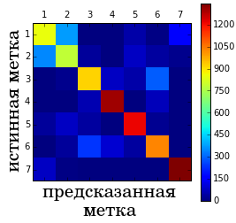

# Базовые меры качества многоклассовой классификации

Ранее мы уже рассматривали [оценку качества регрессионных прогнозов](../Regression-evaluation/Regression-evaluation-metrics), когда целевой отклик - вещественное число $y\in\mathbb{R}$. Теперь рассмотрим оценку качества прогнозов в задаче классификации, в которой целевая величина принимает одно из $C$ дискретных величин: 

$$
y\in\{1,2,...C\}
$$

:::warning Несмещённая оценка

Напомним, что качество классификации необходимо оценивать не на обучающей, а на <u>отдельной валидационной выборке</u>, иначе мы получим смещённую оценку качества! Если же валидационная выборка также использовалась для настройки гиперпараметров, то для оценки качества потребуется третья <u>независимая выборка</u>, которая не использовалась ни для настройки параметров, ни для настройки гиперпараметров.

:::

Далее будут приведены различные стандартные меры оценки качества классификации. При этом важно отслеживать их связь с [конечными мерами качества](../Regression-evaluation/Real-vs-approximate-measures) определяющими эффективность задачи, решаемой классификационными моделями. 

## Точность и частота ошибок

Самой простой и популярной мерой качества является **точность классификации** (accuracy), которая измеряет долю верных предсказаний:

$$
\text{accuracy}=\frac{1}{N}\sum_{n=1}^N \mathbb{I}\{\hat{y}(\mathbf{x}_n)=y_n\}
$$

Максимизация точности эквивалентна минимизации **частоты ошибок** (error rate) классификатора, поскольку они связаны следующим соотношением:

$$
\begin{align*}
   \text{error rate} &=\frac{1}{N}\sum_{n=1}^N \mathbb{I}\{\hat{y}(\mathbf{x}_n)\ne y_n\} \\
                     &=\frac{1}{N}\sum_{n=1}^N (N-\mathbb{I}\{\hat{y}(\mathbf{x}_n)= y_n\}) \\
                     &=1-\text{accuracy}
\end{align*}
$$

## Матрица ошибок классификации

Точность и частота ошибок дают агрегированную картину по всем классам, по которой мы не можем понять, <u>на каких именно классах модель чаще всего ошибалась</u>. 

Для более детального анализа используется матрица ошибок (confusion matrix) $A\in\mathbb{R}^{C\times C}$ , где каждый элемент $a_{ij}$ показывает количество случаев, когда истинный класс был равен $i$, но при этом был предсказан классом $j$. 

> На диагонали будут находиться корректные классификации, а внедиагональные элементы будут показывать число ошибок разных типов.

Ниже приведён пример этой матрицы для 3-х классов:

|       | $\hat{y}=1$ | $\hat{y}=2$ | $\hat{y}=3$ |
| ----- | ----------- | ----------- | ----------- |
| $y=1$ | 10          | 3           | 0           |
| $y=2$ | 0           | 20          | 15          |
| $y=3$ | 2           | 5           | 30          |

По этой матрице видно, что в целом классификатор хорошо справился с  прогнозированием (диагональные элементы относительно большие). А большая часть ошибок классификатора вызвана тем, что объекты 2-го класса он ошибочно классифицирует 3-м классом. Если классов много, то полезно визуализировать матрицу ошибок в виде **тепловой карты** значений (heatmap), как на примере ниже:

  
Как по матрице ошибок вычислить точность классификации (accuracy)?

  Для расчёта точности нужно просуммировать все диагональные элементы (общее число верных классификаций) и разделить его на сумму всех элементов матрицы (равную общему числу объектов выборки).

## Матрица цен

Ошибки классификации различаются тем, какой класс с каким был перепутан. Чаще всего эти ошибки <u>неравноценны между собой</u>. 

> Например, при классификации электронных писем на "важные", "рассылки" и "спам" не так страшно принять спам за важное письмо и его оставить. Гораздо неприятнее принять важное письмо за спам и его удалить. 

Цена ошибки при классификации рассылок меньше, чем при классификации важных писем. Поэтому определяется понятие матрицы ошибок $\Lambda\in\mathbb{R}^{C\times C}$, где каждый элемент $\lambda_{ij}$ показывает штраф за неверную классификацию объекта $i$-го класса $j$-м классом. Диагональные элементы матрицы полагаются равными нулю, поскольку они соответствуют корректным классификациям. Используя матрицу цен, можно вычислять **средний штраф** (average cost) при классификации всей выборки:

$$
\text{average cost} = \frac{1}{N}\sum_{n=1}^N \lambda_{y_n \hat{y}_n} = \frac{1}{N}\sum_{i=1}^C \sum_{j=1}^C a_{ij}\lambda_{ij}
$$

  
При какой матрице цен средний штраф совпадёт с частотой ошибок?

  При штрафе равном нулю для верных классификаций и единице для неверных.

