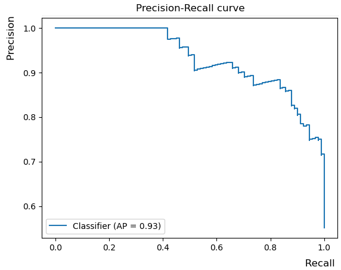

# Специальные меры качества для бинарной классификации

В случае бинарной классификации $y\in\{+1,-1\}$, а соответствующие классы называются положительными и отрицательными. Положительному классу обычно сопоставляют более редкий целевой класс, который мы стремимся обнаружить. 

> Например, при распознавании болезни пациентов по симптомам положительным классом будет наличие заболевания, а отрицательным - отсутствие. 

Матрица ошибок будет размера $2 \times 2$ и каждый элемент этой матрицы имеет своё название:

|        | $\hat{y}=+1$         | $\hat{y}=-1$         |
| ------ | -------------------- | -------------------- |
| $y=+1$ | TP (true positives)  | FN (false negatives) |
| $y=-1$ | FP (false positives) | TN (true negatives)  |

Второе слово в названии обозначает прогноз, а первое - за его корректность. Например, ложно-положительные объекты (FP штук) - это объекты, ошибочно предсказанные как положительные, в то время как истинный класс был отрицательный. А ложно-отрицательные объекты (FN штук) были предсказаны как отрицательные, в то время как на самом деле они принадлежали положительному классу.

  
Как по значениям TP,TN,FP, FN вычислить точность и частоту ошибок классификации?

$$
\text{accuracy}=\frac{TP+TN}{N}=\frac{TP+TN}{TP+TN+FP+FN}
$$

$$
\text{error rate}=\frac{FP+FN}{N}=\frac{FP+FN}{TP+TN+FP+FN}
$$

## Меры качества для несбалансированных классов

### Точность и полнота

В случае **несбалансированных классов** (unbalanced classes), когда положительный класс встречается <u>существенно реже</u>, чем отрицательный, предложенные меры недостаточны для оценки модели! 

> Например, если положительный класс встречается в 1% случаев, а отрицательный - в оставшихся 99%, то константный прогноз, всегда назначающий отрицательный класс, будет показывать точность 99%, а частоту ошибок - всего 1%. Однако это никак не будет свидетельствовать об адекватности модели, поскольку она даже не пыталась выделить положительный класс! 

Поэтому для таких ситуаций используются специальные меры качества - **точность** (precision, не путать с [accuracy](Standard-multiclass-label-quality-estimation#точность-и-частота-ошибок)!) и **полнота** (recall):

$$
\text{precision}=\frac{TP}{\hat{N}_+}=\frac{TP}{TP+FP}
$$

$$
\text{recall}=\frac{TP}{N_+}=\frac{TP}{TP+FN}
$$

где мы использовали обозначения:

- $N_+=TP+FN$ - общее число положительный объектов;

- $\hat{N}_+=TP+FP$ - общее число объектов, <u>предсказанных</u> как положительные. 

Precision показывает долю верно-положительных объектов *среди всех объектов, предсказанных как положительные*. Например, при классификации болезни - это доля действительно больных пациентов среди всех предсказанных как больные. Precision важен, если мы хотим минимизировать число ложных срабатываний классификатора (предсказаний болезни для здоровых пациентов).

Recall показывает долю верно-положительных объектов среди всех объектов, *в действительности принадлежащих положительному классу*. В примере выше recall важен, если мы хотим обнаружить всех больных пациентов, пусть и с некоторой долей ложных срабатываний.

Таким образом, precision и recall измеряют различные аспекты качества модели.

### F-мера

На практике важен и precision, и recall, поэтому считают их среднее гармоническое [[1]](https://ru.wikipedia.org/wiki/%D0%A1%D1%80%D0%B5%D0%B4%D0%BD%D0%B5%D0%B5_%D0%B3%D0%B0%D1%80%D0%BC%D0%BE%D0%BD%D0%B8%D1%87%D0%B5%D1%81%D0%BA%D0%BE%D0%B5), называемое F-мерой (F-measure, $F_1$-score):

$$
F_1\text{-score}=\frac{1}{\frac{1}{2}\frac{1}{\text{Precision}}+\frac{1}{2}\frac{1}{\text{Recall}}}=\frac{2\cdot \text{Precision}\times\text{Recall}}{\text{Precision}+\text{Recall}}
$$

:::tip Почему не используют среднее арифметическое?

Преимущество F-меры по сравнению с обычным усреднением заключается в том, что F-мера будет штрафовать как низкие значения precision, так и низкие значения recall *одновременно*. В частности, она будет равна нулю, если <u>хотя бы один</u> из показателей равен нулю. 

:::

Обычное же усреднение будет давать 0.5 в случае плохо настроенной модели, когда

- Precision $\approx$ 1, Recall = 0 (когда только одного пациента, в болезни которого мы максимально уверены, считаем больным);

- Precision $\approx$ 0, Recall = 1 (когда назначаем больными всех пациентов без разбора).

  
Будет ли этому свойству удовлетворять среднее геометрическое?

  Да, будет, поскольку зависит от произведения этих величин. 

### Взвешенная F-мера

На практике точность и полнота имеют <u>разную важность</u> для конечной задачи. При идентификации болезни по симптомам важнее полнота (хотим отпустить минимальное число больных с диагнозом "здоров"), а в интернет-поиске важнее точность (хотим вернуть в поисковой выдаче только те страницы, которые действительно релевантны поисковому запросу, пусть и не все релевантные, поскольку их слишком много). Поэтому используется **взвешенная F-мера** (weighted F-measure, $F_{\beta}$-score):

$$
F_\beta\text{-score}=\frac{1}{\frac{\beta^2}{1+\beta^2}\frac{1}{\text{Precision}}+\frac{1}{1+\beta^2}\frac{1}{\text{Recall}}}=(1+\beta^2)\frac{\text{Precision}\times\text{Recall}}{\beta^2\text{Precision}+\text{Recall}}
$$

Более высокое значение $\beta$ будет повышать значение Precision и занижать вклад Recall при агрегации.

## Использование мер качества в ранжировании

Классификатор часто используется не для прогнозов меток классов, а для сортировки объектов по степени уверенности модели в том, что они принадлежат положительному классу. 

> Например, компания в первую очередь обзванивает тех клиентов, кому спецпреложение будет максимально интересно. В информационном поиске документы соритруются от более релевантных к менее релевантным.

Поскольку каждый бинарный классификатор [представим в виде](../General-classifiers/Discriminant-functions#бинарный-классификатор-в-общем-виде):

$$
\hat{y}(\mathbf{x})=\text{sign}(g(\mathbf{x})),
$$

то относительная дискриминантная функция $g(\mathbf{x})$ как раз и будет служить оценкой уверенности классификатора в положительном классе для объекта $\mathbf{x}$, по которой можно отранжировать объекты. Рассмотрим для определённости информационный поиск, в котором по запросу пользователя возвращаются релевантные документы. В подобных задачах задают некоторый порог $K$ (предельное число документов, которые пользователь просмотрит в поисковой выдаче), после чего считают меры:

- precision@K - долю релевантных документов среди первых $K$ в выдаче;

- recall@K - долю показанных релевантных документов среди всех релевантных.

Далее можно по ним можно считать взвешенную F-меру. Примеры расчётов precision@K и recall@K можно прочитать в [[2]](https://www.evidentlyai.com/ranking-metrics/precision-recall-at-k).

Недостатком precision@K и recall@K является то, что эти меры <u>никак не зависят</u> от порядка следования корректных классификаций среди $K$ представленных. А нам бы хотелось, чтобы релевантные объекты (положительного класса) шли именно в начале списка. Мерой, поощряющей выдачу релевантных объектов именно в начале отранжированного списка является **average precision**.

### Average Precision

Если варьировать K, то получим **зависимость точности от полноты** (precision-recall curve), пример которой приведён ниже:  

Мы бы хотели получить выше precision при каждом уровне recall, поэтому чем выше этот график, тем качественнее работает классификатор. Агрегированной мерой качества классификации служит площадь под графиком зависимости точности от полноты, которая называется **Average Precision** (AP). Она поощряет ситуацию, когда при ранжировании объектов по степени принадлежности положительному классу <u>в начале списка идут именно представители положительного класса</u>. 

> В случае информационного поиска это будут документы, релевантные поисковому запросу. Поскольку нас интересует качество ранжирующей системы для разных пользователей и поисковых запросов, то величины Average Precision <u>усредняют по пользователям и запросам</u>, получая величину **Mean Average Precision**.

Пример расчёта Average Precision и Mean Average Precision можно посмотреть в [[3]](https://www.evidentlyai.com/ranking-metrics/mean-average-precision-map).

## Литература

1. [Википедия: среднее гармоническое.](https://ru.wikipedia.org/wiki/%D0%A1%D1%80%D0%B5%D0%B4%D0%BD%D0%B5%D0%B5_%D0%B3%D0%B0%D1%80%D0%BC%D0%BE%D0%BD%D0%B8%D1%87%D0%B5%D1%81%D0%BA%D0%BE%D0%B5)

2. [EvidentlyAI: Precision and recall at K in ranking and recommendations.](https://www.evidentlyai.com/ranking-metrics/precision-recall-at-k)

3. [EvidentlyAI: Mean Average Precision (MAP) in ranking and recommendations.](https://www.evidentlyai.com/ranking-metrics/mean-average-precision-map)
