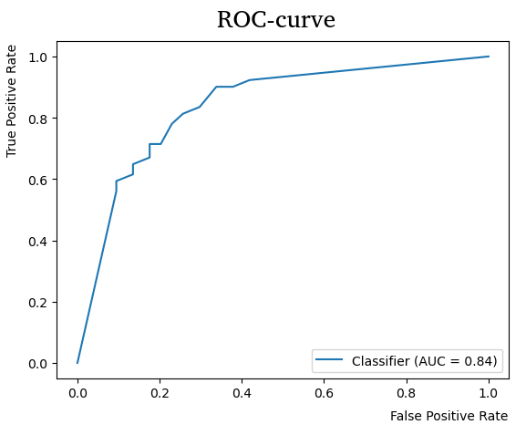
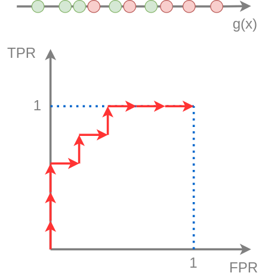

# ROC-кривая

## Управление готовностью назначать положительный класс

Рассмотрим [бинарный классификатор](../General-classifiers/Discriminant-functions#бинарный-классификатор-в-общем-виде):

$$
\hat{y}(\mathbf{x}) = \text{sign}(g(\mathbf{x}))  =
\begin{cases} 
+1, & g(\mathbf{x})\ge 0 \\
-1, & g(\mathbf{x})< 0 \\
\end{cases}
$$

Его относительная дискриминантная функция $g(\mathbf{x})$ характеризует степень уверенности классификатора в том, что объект принадлежит положительному классу.

Решающее правило можно обобщить, введя порог $\alpha$, с которым производится сравнение:

$$
\hat{y}(\mathbf{x}) = \text{sign}(g(\mathbf{x})-\alpha)  =
\begin{cases} 
+1, & g(\mathbf{x})\ge \alpha \\
-1, & g(\mathbf{x})< \alpha \\
\end{cases} \tag{1}
$$

Чем $\alpha$ выше, тем более осторожно классификатор начинает предсказывать положительный класс для тех же самых объектов, и наоборот, для более низких $\alpha$ положительный класс назначается более охотно. Это полезный параметр, чтобы управлять готовностью назначать объектам положительный класс <u>без перенастройки самой модели</u>.

> Рассмотрим задачу кредитного скоринга, в которой для клиентов (объектов $\mathbf{x}$) нужно предсказывать, вернут они кредит $(y=+1)$ или нет $(y=-1)$, на основе чего принимается решение о выдаче им кредита. Для низких $\alpha$ мы более склонны давать кредиты, и это обосновано в периоды экономического подъёма. В периоды же экономического спада разумно выдавать кредиты более осторожно, повысив гиперпараметр $\alpha$, причём саму модель при этом перенастраивать не нужно!

## Меры TPR и FPR

Определим две меры качества бинарной классификации - true positive rate (TPR) и false positive rate (FPR):

$$
TPR=\frac{TP}{N_+},\qquad FPR=\frac{FP}{N_-},
$$

где $N_+,N_-$ - число объектов положительного и отрицательного класса соответственно. 

**Мера TPR** совпадает с [ранее изученной](Special-binary-label-quality-estimation#меры-качества-для-несбалансированных-классов) мерой Recall. Также её называют recognition rate, поскольку по смыслу она характеризует долю верных (положительных) детекций <u>среди объектов положительного класса</u>. 

**Мера FRP** также называется false alarm rate, поскольку она характеризует долю неверных детекций (положительным классом) <u>среди объектов отрицательного класса</u>.

> В примере с кредитным скорингом TPR будет измерять долю клиентов, которые могли бы вернуть кредит, и мы действительно сочли их кредитоспособными. FPR же будет измерять долю клиентов, которые не способны вернуть кредит, но которых мы ошибочно сочли кредитоспособными.

## ROC-кривая

**ROC-кривая** (ROC-curve, receiver operating characteristic) показывает зависимость $TPR$ от $FPR$ при изменении порога $\alpha$. Обе величины изменяются от нуля до единицы по неубывающему закону, как показано на графике: 

При высоком $\alpha$ классификатор будет очень редко назначать положительный класс - только в тех случаях, когда он очень уверен в положительности класса. Тогда: 

- TPR будет близок к нулю (будет мало верно распознанных объектов положительного класса)

- FPR также будет мал (поскольку положительный класс будет назначаться редко).

Если же уменьшать $\alpha$, то частота назначения положительного класса будет увеличиваться, увеличивая и TPR, и FPR, <u>в результате чего мы прочертим ROC-кривую</u>.

:::note ROC-кривая для случайного угадывания

Рассмотрим классификатор, который случайно назначает классы, независимо от вектора признаков $\mathbf{x}$, по формуле

$$
\hat{y}(\mathbf{x})=\text{sign}(\xi-\alpha),
$$

где $\xi$ - равномерно распределённая случайная величина на отрезке $[0,1]$. Докажите, что ROC-кривая, соответствующая этому классификатору, будет диагональю TPR=FPR. Существуют ли классификаторы, для которых ROC-кривая проходит ниже этой прямой? Можем ли мы извлечь пользу из таких классификаторов?

:::

## Построение ROC-кривой по данным

При практическом построении ROC-кривой нам не нужно перебирать все вещественные пороги $\alpha$, поскольку мы работаем с конечной выборкой

$$
(\mathbf{x}_1,y_1),(\mathbf{x}_2,y_2),...(\mathbf{x}_N,y_N)
$$

Мы рассчитываем относительную дискриминантную функцию нашего классификатора $g(\mathbf{x})$ для каждого объекта и отсортируем все объекты по возрастанию этой функции:

$$
g\left(\mathbf{x}_{(1)}\right)\ge g\left(\mathbf{x}_{(2)}\right)\ge...\ge g\left(\mathbf{x}_{(N)}\right)
$$

Далее ROC-кривая строится итеративно, стартуя из точки ($FPR_0,TPR_0$)=(0,0) при движении вдоль значений $g(\mathbf{x})$ от больших значений к меньшим, перебирая в качестве пороговых $\alpha$ только следующие значения:

$$
g\left(\mathbf{x}_{(N)}\right), g\left(\mathbf{x}_{(N-1)}\right),... g\left(\mathbf{x}_{(1)}\right), g\left(\mathbf{x}_{(1)}\right)-1
$$

При сдвиге порога $\alpha$ от $g\left(\mathbf{x}_{(i+1)}\right)$ до $g\left(\mathbf{x}_{(i)}\right)$ прогноз для объект $\mathbf{x}_{(i)}$ по правилу (1) поменяется с отрицательного на положительный класс. В зависимости от реального класса $y_{(i)}$ это будет соответствовать двум разным изменениям на ROC-кривой:

- При $y_{(i)}=+1$ следующая точка ROC-кривой получается сдвигом вверх на $\frac{1}{N_+}$, поскольку при этом на один верно-положительный объект станет больше при том же уровне FPR. 

- При $y_{(i)}=-1$ следующая точка ROC-кривой получается сдвигом вправо на $\frac{1}{N_-}$, поскольку стало на один объект больше среди ложно-положительных срабатываний. FPR увеличится, а TPR останется неизменным.

Пример построения ROC-кривой показан на рисунке:

> Далее ROC-кривая может сглаживаться линейной интерполяцией между точками.

## Площадь под ROC-кривой

Чем выше ROC-кривая, тем <u>лучше</u> классификатор, поскольку нам бы хотелось иметь более высокий TPR при том же уровне FPR.

Агрегированной мерой качества классификации служит **площадь под ROC-кривой**, называемая **AUC** (area under curve). 

> Классификатору, назначающему классы случайно независимо от входа, будет соответствовать диагональная ROC-кривая, площадь под которой равна 0.5 - см. ROC-кривую для случайного угадывания. 

---

Поскольку ROC-кривая описывает не один классификатор, а целое <u>семейство классификаторов</u>, параметризованных гиперпараметром $\alpha$, далее мы рассмотрим [нахождение наилучшего классификатора](ROC-curve-best-point) из этого семейства. 

Мы также изучим эквивалентное [определение величины AUC и способ её численной оптимизации](AUC).
