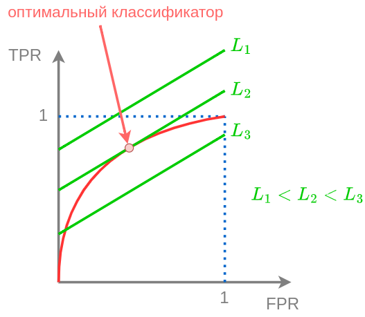

# Лучший классификатор на ROC кривой

[ROC-кривая](ROC-curve-AUC) описывает семейство классификаторов, параметризованных параметром $\alpha\in \mathbb{R}$:

$$
\hat{y}(\mathbf{x}) = \text{sign}(g(\mathbf{x})-\alpha)  =
\begin{cases} 
+1, & g(\mathbf{x})\ge \alpha \\
-1, & g(\mathbf{x})< \alpha \\
\end{cases}
$$

Но как выбрать лучший экземпляр этого семейства?

В бинарной классификации $y\in\{+1,-1\}$, поэтому есть только два типа ошибок: 

- <u>Назначить объекту положительного класса отрицательный класс</u>, что реализуется с вероятностью $p(\widehat{y}=-1|y=+1)=1-TPR$. Обозначим штраф за такую ошибку $\lambda_+$.

- <u>Назначить объекту отрицательного класса положительный класс</u>, что реализуется с вероятностью $p(\widehat{y}=+1|y=-1)=FPR$. Штраф за эту ошибку обозначим $\lambda_-$.

Тогда средние потери классификатора будут

$$
\begin{aligned}
L &= p(\hat{y}=-1,y=+1)\cdot\lambda_+ + p(\hat{y}=+1,y=-1)\cdot\lambda_-  \\
     &= p(y=+1)p(\widehat{y}=-1|y=+1)\cdot\lambda_{+}+p(y=-1)p(\widehat{y}=+1|y=-1)\cdot\lambda_{-}  \\
     &= p(y=+1)(1-TPR)\cdot\lambda_{+}+p(y=-1)FPR\cdot\lambda_{-} 
\end{aligned}     
$$

Отсюда в осях $FPR,TPR$ можно получить **изолинии потерь** (loss isolines), т.е. множество точек (FPR,TPR), приводящих к одинаковому уровню средних потерь $L$: 

$$
TPR=1+\frac{\lambda_{-1}p(y=-1)FPR-L}{\lambda_{+1}p(y=+1)}
$$

Поскольку полученная зависимость TRP(FPR) линейна, то это будет прямая линия с положительным наклоном, а более высоким линиям будут отвечать более низкие ожидаемые потери, как показано на рисунке:

Отсюда следует, что оптимальным классификатором при заданных парамерах

$$
\lambda_-, p(y=-1) \text{ и }\lambda_+,p(y=+1)
$$

будет классификатор, соответствующий <u>точке касания изолинии потерь и ROC-кривой</u>. 

При изменении одного из этих параметров необязательно перенастраивать модель, а достаточно выбрать другую точку на ROC-кривой, т.е. взять классификатор с другим пороговым значением $\alpha$. 

> Например, в задаче кредитного скоринга в кризис вероятность невозврата кредита $p(y=-1)$ существенно вырастает, а для адаптации к этому изменению достаточно лишь изменить порог $\alpha$.
