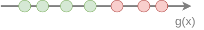

# Эквивалентное определение AUC

Каждой точке на [ROC-кривой](ROC-curve-AUC) будет соответствовать классификатор $\hat{y}(\mathbf{x}) = \text{sign}(g(\mathbf{x})-\alpha)$ со своим выбором $\alpha$. Агрегированной мерой этого семейства классификаторов (при всевозможных значениях $\alpha$) выступает **площадь под ROC-кривой** (area under curve, AUC). 

## Идеальный случай

Максимальное значение величины AUC=1 и, как следует из [алгоритма построения ROC-кривой](ROC-curve-AUC), оно соответствует ROC-кривой, идущей в осях (FPR,TPR) из (0,0) в (0,1), а затем из (0,1) в (1,1). Классификатор в этом случае идеально упорядочит объекты так, что все объекты с низкими $g(\mathbf{x})$ будут принадлежать отрицательному классу, а все объекты с высоким $g(\mathbf{x})$ будут принадлежать положительному классу, как показано на рисунке:

Для безошибочной классификации достаточно лишь выбрать порог $\alpha$, способный безошибочно разделять классы.

## Общий случай

В общем случае $AUC\in [0,1]$ и мера AUC оценивает, насколько сильно ROC-кривая выпукла вверх, что соответствует качеству упорядочивания объектов вдоль оси $g(\mathbf{x})$, когда объектам с более низкими $g(\mathbf{x})$ соответствуют отрицательные классы, а с более высокими $g(\mathbf{x})$ - положительные классы. Сформулируем это утверждение более формально.

## AUC как качество упорядочивания объектов

Предположим для простоты, что каждому объекту соответствует своё <u>уникальное</u> значение относительной дискриминантной функции $g(\mathbf{x})$.

Рассмотрим пару объектов $(\mathbf{x}_{i},y_{i}=-1)$ и $(\mathbf{x}_{j},y_{j}=+1)$ отрицательного и положительного классов. Такую пару будем называть:

- *верно упорядоченной*, если $g(\mathbf{x}_{i})<g(\mathbf{x}_{j})$;

- *неверно упорядоченной*, если $g(\mathbf{x}_{i})>g(\mathbf{x}_{j})$. 

Если $N_+,N_-$ - общее число объектов положительного и отрицательного класса, то общее количество пар объектов отрицательного и положительного классов будет $N_+\cdot N_-$.

Справедливо следующее утверждение:

> Площадь под ROC-кривой (AUC) равна доле верно упорядоченных пар объектов выборки:
> 
> $$
> AUC=\frac{\sum_{(i,j):y_{i}=-1,y_{j}=1}\mathbb{I}\left[g(\mathbf{x}_{j})>g(\mathbf{x}_{i})\right]}{N_-\cdot N_+}
> $$

*Доказательство*:  пусть $\mathbf{x}_{(1)},...\mathbf{x}_{(N)}$ - объекты, упорядоченные по рейтингу:

$$
g\left(\mathbf{x}_{(1)}\right)<g\left(\mathbf{x}_{(2)}\right)<...<g\left(\mathbf{x}_{(N)}\right)
$$

Каждой точке на ROC-кривой будет соответствовать классификатор:

$$
\widehat{y}_{k}(\mathbf{x})=\text{sign}\left(g(\mathbf{x})\ge g(\mathbf{x}_{(k)})\right)
$$

с показателями качества

$$
TPR_{k}=\frac{\sum_{n=k}^{N}\mathbb{I}[y_{(n)}=+1]}{N_{+}},~FPR_{k}=\frac{\sum_{n=k}^{N}\mathbb{I}[y_{(n)}=-1]}{N_{-}}
$$

Обратим внимание, что $TPR_{k},FRP_{k}$ не возрастают по $k$. Случаю $k=N$ будет соответствовать первая точка на ROC-кривой, а случаю $k=1$ - последняя.

Проинтегрируем справа налево площадь под ROC-кривой по [формуле трапеций](http://mathprofi.ru/formula_simpsona_metod_trapecij.html):

$$
AUC=\sum_{k=1}^{N-1}\frac{TPR_{k+1}+TPR_{k}}{2}\left(FPR_{k}-FPR_{k+1}\right)\\=\sum_{k=1}^{N-1}\frac{\sum_{n=k+1}^{N}\mathbb{I}[y_{(n)}=+1]+\sum_{n=k}^{N}\mathbb{I}[y_{(n)}=+1]}{2N_{+}}\times\\\times\frac{1}{N_{-}}\cdot\left(\sum_{n=k}^{N}\mathbb{I}[y_{(n)}=-1]-\sum_{n=k+1}^{N}\mathbb{I}[y_{(n)}=-1]\right)=\\=\sum_{k=1}^{N-1}\frac{\sum_{n=k+1}^{N}\mathbb{I}[y_{(n)}=+1]+\frac{1}{2}\mathbb{I}[y_{(k)}=+1]}{N_{+}}\cdot\frac{\mathit{\mathbb{I}}[y_{(k)}=-1]}{N_{-}}\\=\frac{1}{N_{+}N_{-}}\sum_{k=1}^{N-1}\sum_{n=k+1}^{N}\mathbb{I}[y_{(n)}=+1]\mathbb{I}[y_{(k)}=-1]=\frac{1}{N_{+}N_{-}}\sum_{k<n}\mathbb{I}[y_{(k)}<y_{(n)}]
$$

Мы доказали, что <u>площадь под ROC-кривой равна доле верно упорядоченных пар объектов</u>, в которых первый первый объект принадлежит отрицательному классу, а второй - положительному. Таким образом, мера <u>AUC оценивает качество упорядочивания объектов</u> вдоль значений относительной дискриминантной функции $g(\mathbf{x})$.

> Отсюда, в частности, следует, что величина AUC не будет изменяться при монотонно возрастающих преобразованиях относительной дискриминантной функции:
> 
> $$
> g(x)\to F(g(x)), \text{где } F(\cdot) - \text{любая возрастающая функция.}
> $$

## Оптимизация AUC

Если AUC является конечным критерием качества, то разумно максимизировать именно её, а не другие меры качества. Для этого нужно применять [численную оптимизацию](../Numerical-optimization).

Сложность заключается в том, что поскольку AUC зависит от индикаторных функций: 

$$
AUC=\frac{\sum_{(i,j):y_{i}=-1,y_{j}=1}\mathbb{I}\left[g(\mathbf{x}_{j})>g(\mathbf{x}_{i})\right]}{N_+\cdot N_-}
$$

Поэтому она является является кусочно-постоянной, поэтому её нельзя оптимизировать градиентными методами оптимизации напрямую.

Зато мы можем приблизить каждый индикатор $\mathbb{I}\left[g(\mathbf{x}_{j})>g(\mathbf{x}_{i})\right]$  сигмоидой $\sigma(\beta(g(\mathbf{x}_{j})-g(\mathbf{x}_{i})))$, где $\sigma(u)=\frac{1}{1+e^{-u}}$ - сигмоидная функция (sigmoid), а $\beta>0$ - гиперпараметр, выбираемый пользователем. 

Оценка AUC при этом приближении будет иметь вид

$$
AUC \approx \frac{\sum_{(i,j):y_{i}=-1,y_{j}=1}\sigma(\beta(g(\mathbf{x}_{j})-g(\mathbf{x}_{i})))}{N_+\cdot N_-}
$$

Такая оценка уже будет дифференцируемой функцией, и её можно максимизировать напрямую [градиентными методами](../Numerical-optimization/Gradient-optimization)!

> Чем $\beta$ выше, тем точнее будет аппроксимация ступенчатой функции ценой более резких изменений производной и более нестабильного обучения.
