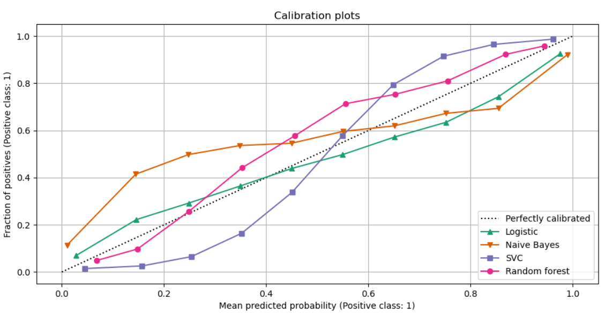
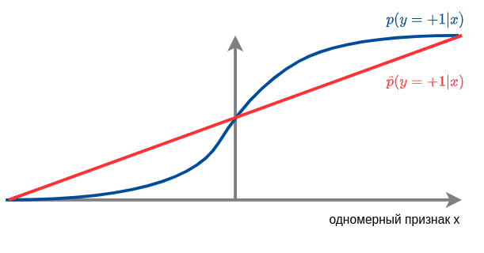

# Контроль качества предсказания вероятностей

## Калибровка вероятностей

Во многих задачах классификации важно не только уметь предсказывать метки классов, <u>но и их вероятности</u>. Например:

- При обнаружении неправомерных злонамеренных действий в сети важно оценивать их вероятность, чтобы балансировать между ложными срабатываниями и пропущенными инцидентами.

- При медицинской диагностике важно оценивать вероятность болезни по снимкам/анализам, чтобы принимать решение о дальнейшей диагностике.

Подбор преобразования $F_{\tau}(g)$ и его параметров $\tau$, переводящего рейтинг класса $g$  в его вероятность, называется **калибровкой вероятностей** (probability calibaration). 

## График калибровки

Для контроля качества калибровки бинарной классификации строят **график калибровки** (calibration-plot), показанный ниже [[1]](https://scikit-learn.org/stable/modules/calibration.html):

По оси X откладывают предсказанную вероятность положительного класса, а по оси Y - фактическую. Чем получаемая зависимость ближе к диагонали Y=X, тем лучше классификатор предсказывает вероятности. 

> Например, на графике выше видно, что метод Naive Bayes недооценивает истинную вероятность, когда предсказывает её малое значение, и, наоборот, переоценивает вероятность, когда предсказывает её большое значение. 

Поскольку в обучающей выборке нам даны только истинные классы, а не их вероятности, то для расчета истинных вероятностей множество предсказанных вероятностей разбивают на отрезки, например:

$$
\hat{p}(y=+1|\mathbf{x})\le 0.1,\quad 0.1<\hat{p}(y=+1|\mathbf{x})\le 0.2,\quad ...\quad 0.9<\hat{p}(y=+1|\mathbf{x})
$$

В рамках каждого отрезка вычисляют фактическую вероятность положительного класса как<u> долю объектов, принадлежащих этому классу</u>.

## Качество прогнозов меток и вероятностей классов

Подчеркнём, что даже если классификатор хорошо предсказывает метки классов, вероятности классов он может предсказывать плохо, как, например, на рисунке ниже:

Классификатор верно настроился на то, что: 

- При $x<0$ вероятность положительного класса меньше 0.5, и надо предсказывать отрицательный класс. 

- При $x>0$  положительный класс более вероятен, и нужно предсказывать его. 

Поэтому точность предсказания меток класса будет высокой, однако вероятности классов предсказываются неверно, поскольку $\hat{p}(y=+1|x)\ne p(y=+1|x)$!

Базовые меры качества классификации, такие как accuracy, error rate, precision, recall и др., оценивают только качество предсказания меток классов. 

Для оценки качества предсказания вероятностей можно использовать среднее значение логарифма правдоподобия или оценку Бриера. Эти меры будут описаны ниже.

:::warning Переобучение

Во избежание переобучения необходимо, как и для других мер качества, проводить оценку на <u>внешней выборке</u>, а не на обучающей (по которой настраивались параметры) и валидационной (по которой настраивались гиперпараметры)!

:::

## Средний логарифм правдоподобия

Наша вероятностная модель $f_\mathbf{w}(\mathbf{x})$ сопоставляет каждому наблюдению $(\mathbf{x},y)$ вероятность пронаблюдать именно такой класс $\hat{p}_\mathbf{w}(y|\mathbf{x})$. При предположении, что объекты выборки распределены независимо, вероятность пронаблюдать ответы на всей выборке $(X,Y)$ факторизуется в произведение вероятностей пронаблюдать ответ на каждом объекте выборки:

$$
\hat{p}_\mathbf{w}(Y|X)=\prod_{n=1}^N \hat{p}_\mathbf{w}(y|\mathbf{x})
$$

Чем выше **правдоподобие** [[2]](https://ru.wikipedia.org/wiki/%D0%A4%D1%83%D0%BD%D0%BA%D1%86%D0%B8%D1%8F_%D0%BF%D1%80%D0%B0%D0%B2%D0%B4%D0%BE%D0%BF%D0%BE%D0%B4%D0%BE%D0%B1%D0%B8%D1%8F), тем больше прогнозы модели согласуются с фактическими наблюдениями, и тем лучше модель прогнозирует вероятности классов. Поскольку произведение большого числа вероятностей будет вырождаться в машинный ноль из-за ограничения точности переменных с плавающей запятой, то на практике анализируют средний **логарифм правдоподобия** (log-likelihood):

$$
\frac{1}{N}\sum_{n=1}^N \log \hat{p}_\mathbf{w}(y|\mathbf{x})
$$

## Оценка Бриера

**Оценка Бриера** представляет собой другой популярный способ оценки качества предсказанных вероятностей с помощью **функции потерь Бриера** (Brier score [[3]](https://en.wikipedia.org/wiki/Brier_score)), равной среднему квадрату отклонений вектора предсказанных вероятностей от вектора истинных вероятностей по L2-норме. 

Пусть $\hat{\mathbf{p}}(y|\mathbf{x})\in\mathbb{R}^C$ - вектор предсказанных моделью вероятностей, а $\mathbf{p}(y|\mathbf{x})\in\mathbb{R}^C$ - вектор истинных вероятностей. 

> Например, если для объекта $\mathbf{x}$ реализуется $i$-й класс, то $\mathbf{p}(y|\mathbf{x})$ будет представлять собой вектор из нулей, в котором на $i$-й позиции стоит единица. 

Тогда оценка Бриера вычисляется по формуле:

$$
\text{Brier Score} = \frac{1}{N}\sum_{n=1}^N \|\hat{\mathbf{p}}(y_n|\mathbf{x}_n)-\mathbf{p}(y_n|\mathbf{x}_n)\|_2^2
$$

:::note Вопрос

Правдоподобие выборки, логарифм правдоподобия и оценка Бриера измеряют степень ошибки (чем больше, тем хуже) или качество прогноза вероятностей (чем больше, тем лучше)?

:::

Для лучшего понимания процесса калибровки вероятностей рекомендуется ознакомиться с демонстрационным кодом [[4]](https://www.kaggle.com/code/kelixirr/probability-calibration-tutorial).

## Литература

1. [Документация sklearn: probability calibration.](https://scikit-learn.org/stable/modules/calibration.html)

2. [Wikipedia: функция_правдоподобия.](https://ru.wikipedia.org/wiki/%D0%A4%D1%83%D0%BD%D0%BA%D1%86%D0%B8%D1%8F_%D0%BF%D1%80%D0%B0%D0%B2%D0%B4%D0%BE%D0%BF%D0%BE%D0%B4%D0%BE%D0%B1%D0%B8%D1%8F)

3. [Wikipedia: Brier score.](https://en.wikipedia.org/wiki/Brier_score) 

4. [Kaggle: probability calibration tutorial.](https://www.kaggle.com/code/kelixirr/probability-calibration-tutorial)
