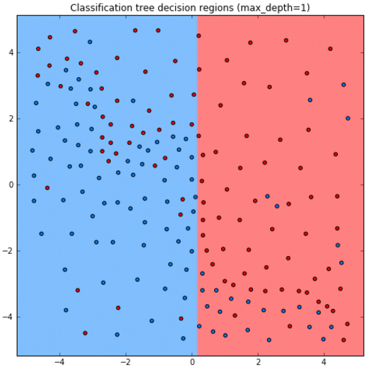
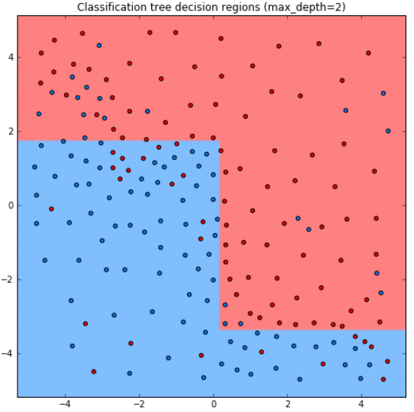
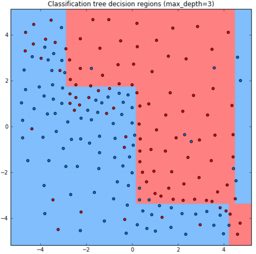
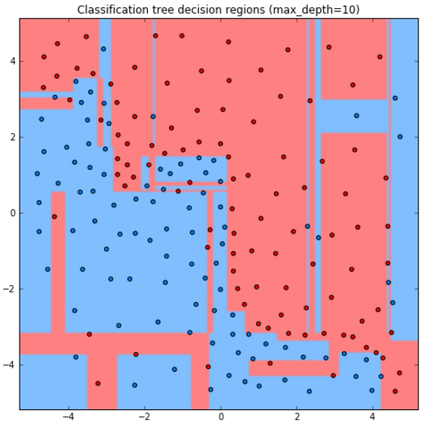
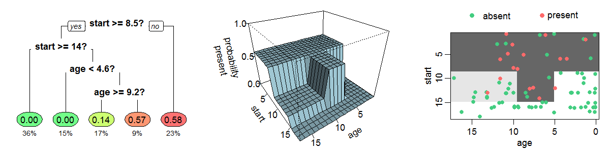
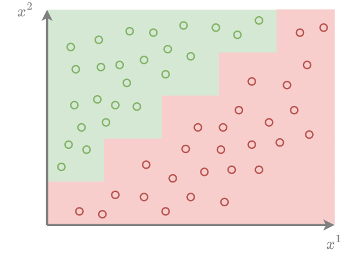
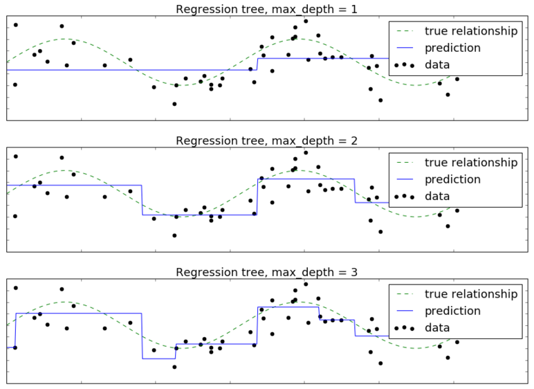
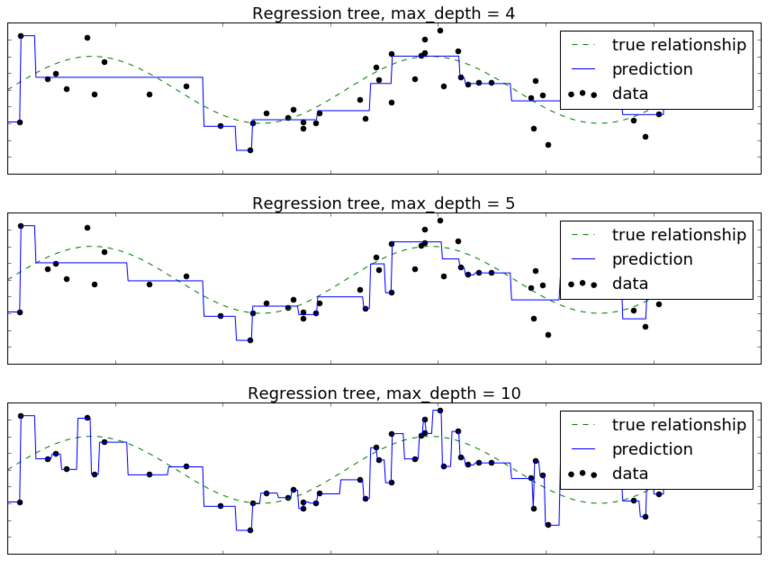

# Особенности прогнозов решающего дерева

В силу [структуры прогнозов решающего дерева CART](Decision-trees) прогнозирующая функция делит всё пространство признаков на непересекающиеся прямоугольники, каждый из которых соответствует своему листу дерева. Поскольку дерево назначает свои прогнозы каждой точке пространства признаков, некоторые прямоугольники будут иметь бесконечно вытянутые стороны в одном из направлений. В каждом прямоугольнике предсказывается некоторое константное значение целевой переменной.

## Прогнозы для классификации

Рассмотрим задачу бинарной классификации на красный и синий класс в пространстве двух признаков.

Ниже приведены прогнозы для решающего дерева глубины 1,2,3,10:









Как видим, дерево получается слишком простым при глубине 1,2, а при глубине 10 уже переобучается на отдельные наблюдения.

Стороны прямоугольников перпендикулярны осям координат, поскольку сами прямоугольники получаются пересечением условий вида [признак $\le$ порог] и [признак>порога]. Прогнозная функция $\hat{y}(\mathbf{x})$ имеет ступенчатый кусочно-постоянный вид, показанной на графике ниже в центре [[1]](https://en.wikipedia.org/wiki/Decision_tree_learning):



В результате решающее дерево хорошо аппроксимирует целевую величину, только если изменение происходит резко вдоль одного из признаков. Если же изменения отклика происходят постепенно или под углом к осям признаков, то решающему дереву <u>потребуется переобучаться под данные и сделать много разбиений</u>, чтобы их приблизить.

Ниже показан пример наклонной границы между классами, которую дереву будет сложно аппроксимировать:



## Прогнозы для регрессии

Пусть целевая регрессионная зависимость имеет вид

$$
y=\sin(x)+\varepsilon
$$

где $x$ - одномерный признак, а $\varepsilon$ - небольшой Гауссов шум. Построим решающее дерево глубины 1,2,3,4,5,10. Целевую зависимость $\sin(x)$ обозначим пунктирной линией, обучающие объекты - черными точками, а прогнозную функцию дерева - синей кривой. Тогда получим следующую визуализацию прогнозов дерева разной глубины:





Видим, что при глубине 1,2 дерево недообучено, а при глубине 10 уже сильно переобучено под отдельные наблюдения. Прогнозная функция, как и в случае классификации, имеет кусочно-постоянный вид.

В многомерном случае предиктивная функция также будет иметь кусочно-постоянный вид с резкими перепадами значений вдоль осей. В результате дереву потребуется много разбиений для аппроксимации изменений отклика, происходящих под углом к осям признаков.

:::tip Композиция алгоритмов

Решающему дереву сложно моделировать линейные зависимости между признаками и откликом, но это легко делать линейным моделям. Зато решающие деревья легко настраиваются на зависимости, в которых признаки оказывают совместное влияние на отклик (например, способны обработать совместный случай, когда число просрочек по кредиту>0 и объем задолженности $<$ 10.000 в [задаче кредитного скоринга](Decision-trees)). Линейные же модели учитывают вклад каждого признака независимо от значений остальных признаков. За счёт этого модели <u>хорошо компенсируют ошибки друг друга</u>, если действуют в композиции друг с другом. Построение прогнозов набором моделей будет изучено в [отдельном разделе](../Model-ensembles) учебника. 

:::

:::note Вариант комбинации линейных моделей и решающих деревьев

Также для комбинации линейных моделей и решающих деревьев в своё время был предложен алгоритм RuleFit [[2]](https://projecteuclid.org/journals/annals-of-applied-statistics/volume-2/issue-3/Predictive-learning-via-rule-ensembles/10.1214/07-AOAS148.full), который:

1. настраивает решающие деревья; 

2. по ним извлекает набор бинарных признаков соответствующих  индикаторам попадания объекта в каждый из узлов образовавшихся деревьев; 

3. строит линейную модель по исходным <u>и извлечённым бинарным признакам</u>.

:::

## Пример запуска в Python

<div class="code_start">Решающее дерево CART для классификации:</div>

```py
from sklearn.tree import DecisionTreeClassifier
from sklearn.metrics import accuracy_score
from sklearn.metrics import brier_score_loss

X_train, X_test, Y_train, Y_test = get_demo_classification_data()  

# инициализация дерева (criterion - функция неопределённости):
model = DecisionTreeClassifier(criterion='gini')  
model.fit(X_train, Y_train)    # обучение модели   
Y_hat = model.predict(X_test)  # построение прогнозов
print(f'Точность прогнозов: {100*accuracy_score(Y_test, Y_hat):.1f}%')

P_hat = model.predict_proba(X_test)  # можно предсказывать вероятности классов
loss = brier_score_loss(Y_test, P_hat[:,1])  # мера Бриера на вер-ти положительного класса
print(f'Мера Бриера ошибки прогноза вероятностей: {loss:.2f}')
```

<div class="code_end"></div>

[Больше информации](https://scikit-learn.org/stable/modules/tree.html#classification). [Полный код](https://github.com/victorkitov/ML/blob/main/%D0%9F%D1%80%D0%B8%D0%BC%D0%B5%D1%80%D1%8B%20%D0%B7%D0%B0%D0%BF%D1%83%D1%81%D0%BA%D0%B0%20%D0%BE%D1%81%D0%BD%D0%BE%D0%B2%D0%BD%D1%8B%D1%85%20%D0%BC%D0%B5%D1%82%D0%BE%D0%B4%D0%BE%D0%B2%20%D0%B2%20sklearn.ipynb). 

<div class="code_start">Решающее дерево CART для регрессии:</div>

```py
from sklearn.tree import DecisionTreeRegressor
from sklearn.metrics import mean_absolute_error

X_train, X_test, Y_train, Y_test = get_demo_regression_data()  

# инициализация дерева (criterion - функция неопределённости):
model = DecisionTreeRegressor(criterion='absolute_error')  
model.fit(X_train, Y_train)    # обучение модели   
Y_hat = model.predict(X_test)  # построение прогнозов
print(f'Средний модуль ошибки (MAE): \
        {mean_absolute_error(Y_test, Y_hat):.2f}')  
```

<div class="code_end"></div>

[Больше информации](https://scikit-learn.org/stable/modules/tree.html#regression). [Полный код](https://github.com/victorkitov/ML/blob/main/%D0%9F%D1%80%D0%B8%D0%BC%D0%B5%D1%80%D1%8B%20%D0%B7%D0%B0%D0%BF%D1%83%D1%81%D0%BA%D0%B0%20%D0%BE%D1%81%D0%BD%D0%BE%D0%B2%D0%BD%D1%8B%D1%85%20%D0%BC%D0%B5%D1%82%D0%BE%D0%B4%D0%BE%D0%B2%20%D0%B2%20sklearn.ipynb). 


## Литература

1. [Wikipedia: decision tree learning.](https://en.wikipedia.org/wiki/Decision_tree_learning)
2. [Friedman J. H., Popescu B. E. Predictive learning via rule ensembles //The Annals of Applied Statistics. – 2008. – Т. 2. – №. 3. – С. 916-954.](https://projecteuclid.org/journals/annals-of-applied-statistics/volume-2/issue-3/Predictive-learning-via-rule-ensembles/10.1214/07-AOAS148.full)
