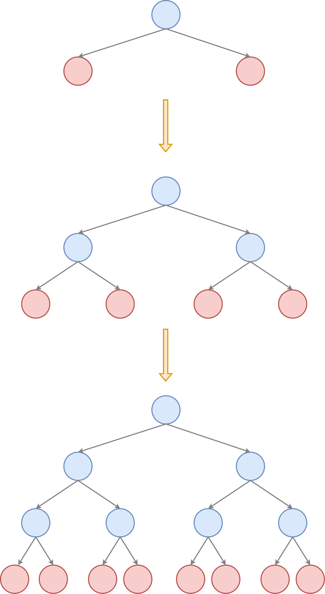
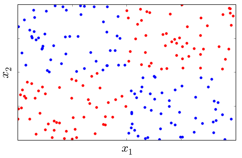

# Настройка решающего дерева

Решающее дерево строится сверху вниз, начиная от корневой вершины, содержащей все объекты обучающей выборки. Сначала настраивается правило для корня, разделяющее эти объекты на две группы, первая из которых уходит левому потомку, а вторая - правому. Затем процесс расщепления вершин производится рекурсивно для каждой из образовавшихся вершин, как показано на рисунке:

Синим показаны внутренние узлы (inner nodes), в которых подбираются правила вида 

$$
\text{признак}\le\text{порог}
$$

а красным - листовые вершины (terminal nodes, leaves), в которых строится итоговый прогноз.

:::tip

Обратим внимание, что указанные правила в узлах <u>одинаково хорошо работают и для вещественных, и для бинарных признаков</u>. В последнем случае как раз образуются две ветки в зависимости от значения бинарного признака. Категориальные признаки можно закодировать через [one-hot кодирование](../Data-preprocessing/Categorical-preprocessing#one-hot-кодирование), тогда спуск по дереву будет осуществляться вправо, если категориальный признак равен определённой категории, и влево иначе. Если категорий много, то потребуется много сравнений, и всё равно не все значения категорий окажутся перепробованными. 

Поэтому для решающих деревьев рекомендуется [кодирование средним](../Data-preprocessing/Categorical-preprocessing#кодирование-средним). Тогда при использовании образовавшегося признака объекты с высоким средним значением отклика пойдут вправо, а с низким - влево, что резко упростит прогнозирование для последующих этапов. 

:::

## Выбор решающего правила во внутренних узлах дерева

Чтобы задать решающее правило в каждом внутреннем узле дерева $t$, необходимо специфицировать, <u>какой именно признак с каким порогом сравнивать</u>. Для этого вводится **функция неопределённости** (impurity fuction) $\phi(t)$, характеризующая степень неопределённости откликов для объектов, попавших в соответствующий узел $t$. Примеры основных таких функций будут даны в [следующей главе](Impurity-functions), а пока достаточно знать, что  

- эта функция равна нулю, когда все объекты, попавшие в лист, имеют одинаковый отклик (соответствуют одному значению в регрессии или одному классу в классификации);

- функция тем выше, чем сильнее неопределённость в откликах (выше дисперсия для вещественных откликов, а в случае классификации - когда распределение классов ближе к равномерному).

Для $i$-го признака и порога $h$ решающее правило $x^i\le h$ разобьёт узел $t$ на два дочерних узла: левый $t_L$ и правый $t_R$. Если изначально в узле $t$ было $n$ объектов, то они распределятся между левым и правым потомков в количествах $n_L$ и $n_R$.

Тогда применение правила изменит неопределённость откликов с $\phi(t)$ в родительском узле на $\frac{n_L}{n}\phi(t_L)+\frac{n_R}{n}\phi(t_R)$ в дочерних, в результате чего получим общее изменение неопределённости:

$$
\Delta\phi(t)=\phi(t)-\frac{n_L}{n}\phi(t_L)-\frac{n_R}{n}\phi(t_R)
$$

Подбор признака и порога осуществляется перебором всевозможных признаков $i=1,2,...D$ и значений порога $h$ (среди уникальных значений $i$-го признака для объектов, попавших в узел $t$) и выбором такой пары $(i^*,h^*)$, для которых достигается <u>минимальная неопределённость в дочерних узлах</u> или (что то же самое) достигается <u>максимальное изменение неопределённости</u> при переходе от родительского узла к дочерним:

$$
(i^*,h^*)=\arg\max_{i,h}\Delta\phi(t)
$$

:::tip Неравнозначность признаков

Стоит отметить, что в алгоритме вещественные признаки будут выбираться чаще, чем бинарные, поскольку для них больше уникальных значений порога, что даёт оптимизации <u>больше гибкости подогнаться по порогу именно по вещественному признаку</u>.

:::

Сложность расчета $\phi(t)$, как будет видно из [следующей главы](Impurity-functions), имеет порядок $O(n)$, поэтому сложность подбора решающего правила равна $O(Dn^2)$, поскольку для каждого признака в качестве порога нужно перебрать его всевозможные уникальные значения, число которых не превосходит $n$.

:::tip Более эффективный расчёт

Эту сложность можно снизить двумя способами:

1. Перебирать не все возможные пороги, а только основные. В качестве таковых можно взять 10%,20%,...90% [персентиль](../Data-preprocessing/Feature-normalization#p-процентная-перцентиль) в распределении признака. Тогда сложность подбора правила снизится до $O(9Dn)$, поскольку мы будем перебирать всего 9 значений порога. Правда, для расчёта персентилей потребуется предварительно отсортировать значения каждого признака, что имеет порядок $O(D n\log n)$. Разумеется, можно брать и более детализированную сетку значений. Перебор по более грубой сетке значений повысит влияние бинарных признаков, т.к. они станут более конкурентоспособными в сравнении с вещественными. Также это повысит ожидаемую глубину дерева, необходимую для точного приближения данных.

2. Предварительно отсортировать каждый признак. Это наложит дополнительные вычислительные расходы на сортировку, зато позволит более эффективно пересчитывать значения функций неопределённости за $O(1)$, поскольку мы будем знать, какой объект переходит из правой дочерней вершины в левую при каждом изменении порога без сканирования всех $n$ объектов, и сможем пересчитывать $\phi(t)$ за $O(1)$, используя кумулятивные статистики. Итоговая сложность подбора правила по всем порогам тогда будет $O(D(n\log n+2n))=O(Dn\log n)$.

:::

Используя второй метод эффективного подбора правила, совокупная сложность построения всех правил на уровне $h$ будет иметь сложность $O(DN\log N)$ (поскольку все $N$ объектов выборки проходят через один из узлов на каждом уровне), а общая сложность построения дерева глубины $H$ будет иметь порядок $O(HDN\log N)$.

## Остановка при наращивании дерева

При построении дерева сверху вниз необходимо решить, когда оканчивать дробление узлов и превращать текущие узлы в листовые. Конечно, нет смысла продолжать разбиение, если все объекты текущего узла дают одинаковый отклик. В частности, это достигается, когда в листе остался всего один объект. Но также используются и досрочная остановка по одному из следующих критериев:

1. достигнута целевая глубина $H$;

2. число объектов в узле меньше $K$;

3. число объектов в одном из дочерних узлов после оптимального разбиения оказалась меньше $K$;

4. неопределённость отклика в узле меньше порога $\phi(t)\le \varepsilon$;

5. максимальное изменение неопределённости при разбиении узла меньше порога: $\Delta\phi(t)\le \varepsilon$.

### Сравнение критериев

Досрочная остановка целесообразна, чтобы контролировать сложность получаемого дерева, когда мы стремимся выровнять сложность модели и сложность реальных данных. Иначе дерево, обученное до самого низа, станет переобученным и будет иметь плохую [обобщающую способность](../Base-concepts/Generalization-ability) на новых наблюдениях.

Критерии 2 и 3 близки по смыслу, однако критерий 3 предпочтительнее тем, что он, в отличие от критерия 2, гарантирует, что <u>в каждом листовом узле будет достаточное количество объектов</u> ($\ge K$), чтобы делать статистически значимые выводы о прогнозе в листе.

Критерий 1 приводит в общем случае к построению сбалансированного дерева (расстояние от корня до каждого листа одно и то же), однако может оказаться <u>неоптимальным с точки зрения числа объектов в листе</u>: какие-то листы окажутся переполненными объектами, а какие-то - недозаполненными. Поэтому среди критериев 1,2,3 следует пользоваться третьим критерием.

Критерий 5 кажется максимально релевантным оптимизации, в котором мы стремимся минимизировать $\phi(t)$ и досрочно прерываем процесс настройки, если видим, что не удаётся достичь существенного изменения в неопределённости. Однако тут стоит помнить, что остановка по этому критерию <u>субоптимальна</u>, поскольку в начале построения дерева мы можем видеть малое изменение неопределённости, которое может стать большим при более поздних разбиениях, как показано на рисунке для случая бинарной классификации, используя два признака:

Изначальное распределение классов 50/50%, и какое бы разбиение вдоль какой бы оси мы ни выбрали, оно примерно таким и останется, поэтому изменение неопределённости $\Delta\phi(t)\approx 0$. Однако, если бы мы не останавливались, а стали бы производить последующие разбиения, то мы могли бы прийти к 100% точности прогнозов!

Из-за этого, для достижения максимальной точности прогнозов, рекомендуется строить дерево <u>до самого низа</u> (пока объекты в каждом узле не станут иметь одинаковый отклик), а потом производить обрезку лишних ветвей (tree pruning), описанную [далее](Tree-pruning). Что, впрочем, не отменяет досрочную остановку по критерию 3, чтобы <u>обеспечить в каждом листе минимальное количество объектов</u> для построения статистически достоверных прогнозов.

## Назначение прогноза в листах

Как только принято решение об остановке процесса построения дерева, текущий узел дерева превращается в листовую вершину, которой нужно назначить прогноз. Для этого используют простые правила:

- в задаче регрессии назначают среднее или медиану откликов для объектов, попавших в узел.

- в задаче классификации:
  
  - в качестве прогноза метки класса выдают самый распространённый класс узла;
  
  - если нужно выдать вероятности классов, то возвращают частотное распределение классов для объектов, попавших в узел.

:::tip Настройка на определённую функцию потерь

Для минимизации пользовательской функции потерь $\mathcal{L}(\hat{y},y)$ эффективнее назначать такой прогноз в листьях дерева, который будет её минимизировать напрямую, о чем будет рассказано [далее](Custom-loss-function#листовые-прогнозы-для-пользовательской-функции-потерь).

:::
