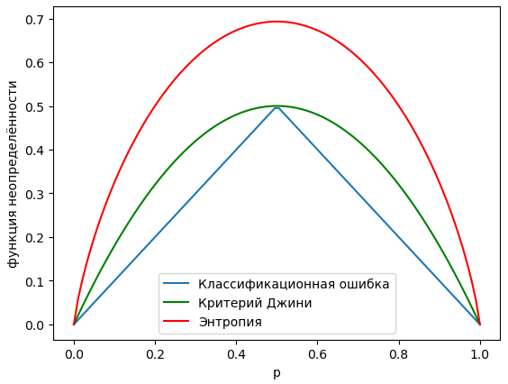
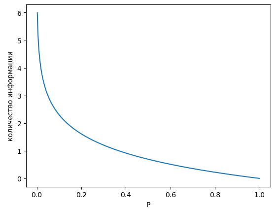

# Функции неопределённости решающих деревьев

## Задача регрессии

При предсказании вещественного отклика $y\in\mathbb{R}$ в качестве функции неопределённости (impurity function) используется **дисперсия откликов**:

$$
\phi(t)=\frac{1}{\left|I_{t}\right|}\sum_{i\in I_{t}}\left(y_{i}-\text{mean}_{i\in I_{t}}(y_{i})\right)^{2}
$$

где

- $I_{t}=\{i_{1},...i_{K}\}$ - множество индексов объектов, попадающих в узел $t$,

- $K=|I_t|$ - количество таких объектов,

- $\text{mean}_{i\in I_{t}}(y_{i})$ - выборочное среднее по откликам объектов, попадающих в узел $t$.

Также используется **среднее абсолютное отклонение** (mean absolute deviation):

$$
\phi(t)=\frac{1}{\left|I_{t}\right|}\sum_{i\in I_{t}}|y_{i}-\text{median}_{i\in I_{t}}(y_{i})|,
$$

где $\text{median}_{i\in I_{t}}(y_{i})$ - выборочная [медиана](../Data-preprocessing/Feature-normalization#медиана) откликов объектов узла $t$.

> Для более неопределённых данных с изменяющимся откликом обе меры неопределённости будут давать высокие значения. А в случае одинаковых откликов они будут равны нулю.

## Задача классификации

Для классификации функции неопределённости $\phi(t)$ будут зависеть <u>от вероятностей классов</u> для объектов, попавших в узел $t$. Ниже представлены популярные варианты этих функций:

| название                 | на английском        | формула                         |
| ------------------------ | -------------------- | ------------------------------- |
| классификационная ошибка | classification error | $1-\max\{p_1,p_2,...p_C\}$      |
| критерий Джини           | Gini                 | $\sum_{i=1}^{C}p_{i}(1-p_{i})$  |
| энтропийный критерий     | entropy              | $-\sum_{i=1}^{C}p_{i}\ln p_{i}$ |

### Обоснование функций неопределённости

Рассмотрим бинарную классификацию и некоторый узел дерева $t$.

Пусть вероятность положительного класса  $p(y=+1|t)=p$, а отрицательного  $p(y=-1|t)=1-p$.

Зависимости функций неопределённости от $p$ приведены ниже:

> Как видим, максимальная неопределённость функций достигается в наиболее неопределённом случае, когда $p=0.5$ и оба класса равновероятны. А минимум неопределённости достигается, когда $p=0$ либо $p=1$. В этих случаях все объекты узла принадлежат одному из классов, и неопределённость классификации отсутствует. 

Для многоклассового случая представленные функции также измеряют степень неопределённости классов, достигая максимума при равномерном распределении классов, когда $p_1=p_2=...=p_C=\frac{1}{C}$, а минимума, когда все объекты принадлежат одному из классов:

$$
p_1=0,\, ...\, p_{i-1}=0,\, p_i=1,\, p_{i+1}=0,\, ...\, p_C=0
$$

Интуитивно это можно понять следующим образом:

**Классификационная ошибка** измеряет ожидаемое число ошибок при классификации всех объектов <u>максимально вероятным классом</u>, у которого вероятность появления $p_{max}=\max \{p_1,p_2,...p_C\}$. Очевидно, что вероятность ошибки при такой классификации будет $1-p_{max}$. Классификация будет безошибочной, когда в узле присутствуют объекты только одного класса, а максимум ошибок будет достигаться, когда все классы будут равновероятны.

**Критерий Джини** (Gini criterion) измеряет вероятность ошибки <u>при случайном угадывании класса</u> по правилу:

$$
\hat{y}=
\begin{cases}
1,& \text{ с вероятностью }p_1, \\
2,& \text{ с вероятностью }p_2,  \\
\cdots & \cdots \\
C, & \text{ с вероятностью }p_C.  \\
\end{cases}
$$

Тогда, расписывая вероятность ошибки по формуле полной вероятности [[1]](https://ru.wikipedia.org/wiki/%D0%A4%D0%BE%D1%80%D0%BC%D1%83%D0%BB%D0%B0_%D0%BF%D0%BE%D0%BB%D0%BD%D0%BE%D0%B9_%D0%B2%D0%B5%D1%80%D0%BE%D1%8F%D1%82%D0%BD%D0%BE%D1%81%D1%82%D0%B8), как раз и получим критерий Джини:

$$
p(\hat{y}\ne y)= \sum_{c=1}^C p(\hat{y}\ne y|y=1)p(y=1)= \sum_{c=1}^C (1-p_c)p_c
$$

Эта ошибка будет максимальной, когда все классы равновероятны, и равняться нулю, когда все объекты принадлежат одному из классов.

**Энтропийный критерий** (entropy criterion) вычисляет энтропию случайной величины $y$:

$$
y=
\begin{cases}
1,& \text{ с вероятностью }p_1,   \\
2,& \text{ с вероятностью }p_2,   \\
\cdots & \cdots \\
C, & \text{ с вероятностью }p_C.  \\
\end{cases}
$$

которая служит <u>мерой её неопределённости</u>. Покажем это. 

Определим количество информации, которую мы получаем при случайном событии, реализующимся с вероятностью $p$, по формуле

$$
\text{Info(событие с вероятностью p)}=-\ln p
$$

График этой зависимости показан ниже:

Именно так определить получаемую информацию разумно, поскольку такая функция:  

- будет выдавать нулевую информацию при реализации события, у которого вероятность наступления равна 1 (происходит всегда);

- стремится к бесконечности при $p\to 0$ (событие происходит редко); 

- для двух независимых событий $A$ и $B$ будет выполнено свойство аддитивности:

$$
\text{Info}(A,B)=\text{Info}(A)+\text{Info}(B)
$$

Тогда энтропия случайной величины $y$ будет равна <u>ожидаемому количеству информации</u>, которую мы получим, узнав реализацию этой случайной величины:

$$
\text{entropy(y)}=\mathbb{E}\{\text{Info(y)}\} = -\sum_{c=1}^C p_c \ln p_c
$$

Максимум информации мы будем получать для случая, когда все классы равновероятны, а минимум - когда реализуется всегда только один из классов. 

:::note Задача

Докажите формально, что энтропия максимизируется, когда все классы равновероятны. Для этого нужно её промаксимизировать при ограничении, что вероятности суммируются в единицу. Технически для этого используется метод множителей Лагранжа [[2]](https://ru.wikipedia.org/wiki/%D0%9C%D0%B5%D1%82%D0%BE%D0%B4_%D0%BC%D0%BD%D0%BE%D0%B6%D0%B8%D1%82%D0%B5%D0%BB%D0%B5%D0%B9_%D0%9B%D0%B0%D0%B3%D1%80%D0%B0%D0%BD%D0%B6%D0%B0).

:::

## Литература

1. [Wikipedia: формула полной вероятности.](https://ru.wikipedia.org/wiki/%D0%A4%D0%BE%D1%80%D0%BC%D1%83%D0%BB%D0%B0_%D0%BF%D0%BE%D0%BB%D0%BD%D0%BE%D0%B9_%D0%B2%D0%B5%D1%80%D0%BE%D1%8F%D1%82%D0%BD%D0%BE%D1%81%D1%82%D0%B8)

2. [Wikipedia: метод множителей Лагранжа.](https://ru.wikipedia.org/wiki/%D0%9C%D0%B5%D1%82%D0%BE%D0%B4_%D0%BC%D0%BD%D0%BE%D0%B6%D0%B8%D1%82%D0%B5%D0%BB%D0%B5%D0%B9_%D0%9B%D0%B0%D0%B3%D1%80%D0%B0%D0%BD%D0%B6%D0%B0)
