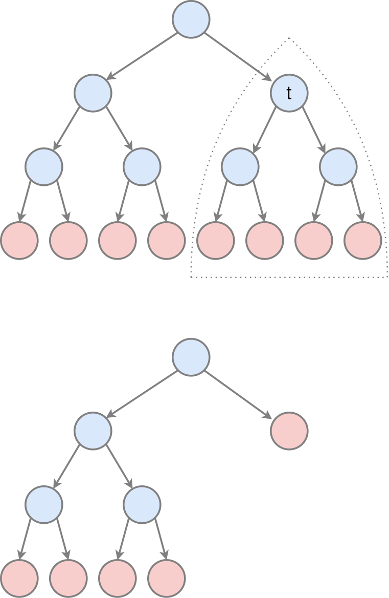

# Обрезка решающих деревьев

## Идея метода

В итеративном построении решающих деревьев сверху вниз мы анализировали [различные правила остановки](Tree-fitting#остановка-при-наращивании-дерева), и был приведён пример, когда ранняя остановка может приводить к неоптимальным решениям, поскольку начальные правила разбиения не приводят к снижению неопределённости, а последующие - приводят. 

Это ситуация весьма распространена на практике, поэтому для повышения точности прогнозов: 

1. деревья строят до самого низа (пока в узлах не останется по одному объекту или все объекты листа не будут иметь один и тот же отклик); 

2. потом обрезают лишние ветви дерева, что называется **обрезкой дерева** (tree pruning).

## Простые подходы

В обрезке дерева его поддеревья заменяются их корнями, которые назначаются листовыми вершинами (с константным прогнозом). Делать это можно полным перебором, сравнивая качество прогнозов полного решающего дерева с обрезанным на [валидационной выборке](../Base-concepts/Quality-estimation), однако придётся перебирать слишком много вариантов.

Поэтому в качестве кандидатов на обрезку можно перебирать только предпоследние вершины, потом предпредпоследние и так далее снизу вверх по дереву, однако это также требует большого числа вычислений.

Чтобы сделать поиск кандидатов на обрезку более направленным и эффективным используется алгоритм **обрезки по минимальной цене**.

## Алгоритм обрезки по минимальной цене

В алгоритме **обрезки по минимальной цене** (minimal cost complexity pruning), являющегося составной частью алгоритма CART [[1]](https://www.taylorfrancis.com/books/mono/10.1201/9781315139470/classification-regression-trees-leo-breiman-jerome-friedman-olshen-charles-stone) дерево строится до самого низа (хотя также можно применять досрочный останов, например, по минимальному числу объектов в листьях), после чего для каждой внутренней вершины полного дерева оценивается целесообразность разрастания вершины до поддерева, сравнивая 2 ситуации:  

1. когда эта вершина имеет под собой исходное поддерево;

2. когда эта вершина является терминальной (без поддерева под ним).

Эти ситуации проиллюстрированы ниже для вершины $t$:

Обозначим через $A_t$ поддерево с корнем во внутренней вершине $t$. Зададим штраф $R(A_t)$, вычисляющий неточность прогнозов поддерева $A_t$ как среднюю функцию неопределённости в листовых вершинах поддерева $A_t$. Например, для регрессии это может быть дисперсия откликов, а для классификации - частота ошибок. Усреднение необходимо производить <u>пропорционально числу объектов</u>, попадающих в каждый лист дерева.

Дополнительно определим регуляризованный штраф $R_\alpha(A_t)=R(A_t)+\alpha M(A_t)$, который, помимо штрафа за неточность прогнозов, штрафует поддерево за сложность, вычисляемую как количество листьев $M(A_t)$ в этом поддереве. Гиперпараметр $\alpha>0$ обозначает штраф за каждый дополнительный лист поддерева.

Найдём равновесное значение $\alpha^*$, при котором регуляризованный штраф за поддерево $A_t$ совпадёт с регуляризованным штрафом, когда поддерево $A_t$ заменяется на его корень $t$  (в котором сразу будет строиться прогноз, как на рисунке выше):

$$
R_{\alpha^*}(A_t)=R_{\alpha^*}(t)
$$

Это можно переписать в виде

$$
R(A_t)+\alpha^* M(A_t)=R(t)+\alpha^*,
$$

поскольку поддерево $t$ состоит всего из одного листа.

Отсюда равновесное $\alpha^*$ будет равно:

$$
\alpha^*=\frac{R(t)-R(A_t)}{M(A_t)-1}
$$

Равновесное $\alpha^*$ задаёт <u>целесообразность разрастания</u> внутренней вершины $t$ в поддерево $A_t$. 

> Если оно равно нулю, то разрастание полностью нецелесообразно, поскольку одиночная вершина $t$ и образованное из неё поддерево $A_t$ даёт одинаковый уровень ошибок. Но чем выше $\alpha^*$, тем построение поддерева $A_t$ целесообразнее, поскольку, чтобы компенсировать более высокую точность поддерева по сравнению с корнем, приходится сильнее штрафовать увеличение числа листов.

В алгоритме обрезки по минимальной цене вычисляются целесообразности $\alpha^*$ для каждого поддерева $A_t$ полного дерева, после чего <u>удаляется поддерево с минимальной целесообразностью</u>. Далее $\alpha^*$ пересчитываются для всех оставшихся вершин (достаточно пересчитывать не для всех, а только для поддеревьев, затронутых удалением с предыдущего шага), и процесс повторяется до тех пор, пока не останется одна корневая вершина исходного дерева. Таким образом, алгоритм выдаст систему вложенных друг в друга поддеревьев:

$$
T_1\supset T_2 \supset ... \supset T_K=\text{корень первоначального дерева},
$$

среди которых выбирается поддерево, дающее максимальную точность на [валидационной выборке](../Base-concepts/Quality-estimation).

---

Дополнительно об алгоритмах обрезки решающих деревьях вы можете прочитать в [[2]](https://en.wikipedia.org/wiki/Decision_tree_pruning). В [[3]](https://onlinelibrary.wiley.com/doi/book/10.1002/9781119952954) подробно разобран пример расчёт алгоритма обрезки по минимальной цене и приведены вариации алгоритма. В [[4]](https://scikit-learn.org/stable/auto_examples/tree/plot_cost_complexity_pruning.html) описано применение алгоритма в библиотеке sklearn.

## Литература

1. [Breiman, L., Friedman, J., Olshen, R.A., & Stone, C.J. (1984). Classification and Regression Trees (1st ed.). Chapman and Hall/CRC.](https://www.taylorfrancis.com/books/mono/10.1201/9781315139470/classification-regression-trees-leo-breiman-jerome-friedman-olshen-charles-stone)

2. [Wikipedia: decision tree pruning.](https://en.wikipedia.org/wiki/Decision_tree_pruning)

3. [Webb A. R., Copsey K.D. Statistical pattern recognition. – John Wiley & Sons, 2011.](https://onlinelibrary.wiley.com/doi/book/10.1002/9781119952954)

4. [Документация sklearn: post pruning decision trees with cost complexity pruning.](https://scikit-learn.org/stable/auto_examples/tree/plot_cost_complexity_pruning.html)
