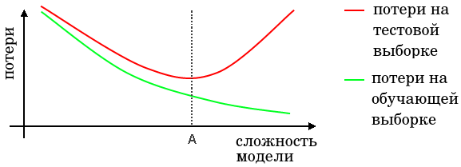

# Сложность прогнозирующих моделей

Зафиксируем прогностическую модель и начнём варьировать её сложность (гибкость), то есть способность подстраиваться под объекты обучающей выборки. В случае линейных моделей это будет множитель при регуляризаторе; в случае метода $K$ ближайших соседей - параметр $K$; в случае решающего дерева это может быть максимальная глубина дерева или минимальное число объектов в листьях.

Общий вид зависимости средних потерь от сложности модели машинного обучения выглядит следующим образом:

Средние потери на тестовой выборке в общем случае выше, чем на обучающей выборке, поскольку параметры модели настраиваются именно под обучающую выборку. 

При увеличении сложности модели растёт её способность подстраиваться под обучающие данные, поэтому <u>средние потери на обучении снижаются</u>. А вот средние потери на тестовой выборке: 

- <u>Сначала снижаются</u>, когда модельная зависимость всё ещё слишком проста и не может в полной мере приближать реальную зависимость в данных. Такие модели называют **недообученными** (underfitted models).

- <u>Потом начинают повышаться</u>, когда выразительная сложность модели становится выше сложности реальной зависимости в данных. Избыточную гибкость модель тратит на поточечную подстройку под специфику обучающей выборки, которая была сформирована случайно. То есть модель начинает выявлять ложные зависимости, которых нет в тестовой выборке. Такие модели называют **переобученными** (overfitted models). 

Поэтому в каждом алгоритме важно настроить гиперпараметр, отвечающий за его сложность, чтобы сложность модели соответствовала сложности реальной зависимости в данных. На графике выше оптимальная сложность модели показана точкой A.

А ниже приведён пример данных для регрессионной задачи с примерно квадратичной зависимостью между признаком и откликом. Слева показан пример недообученной модели, а справа - переобученной:

В [следующей главе](Bias-variance-decomposition) мы изучим понятие переобучения и недообучения модели более формально, используя **разложение на смещение и разброс** (bias-variance decomposition).

