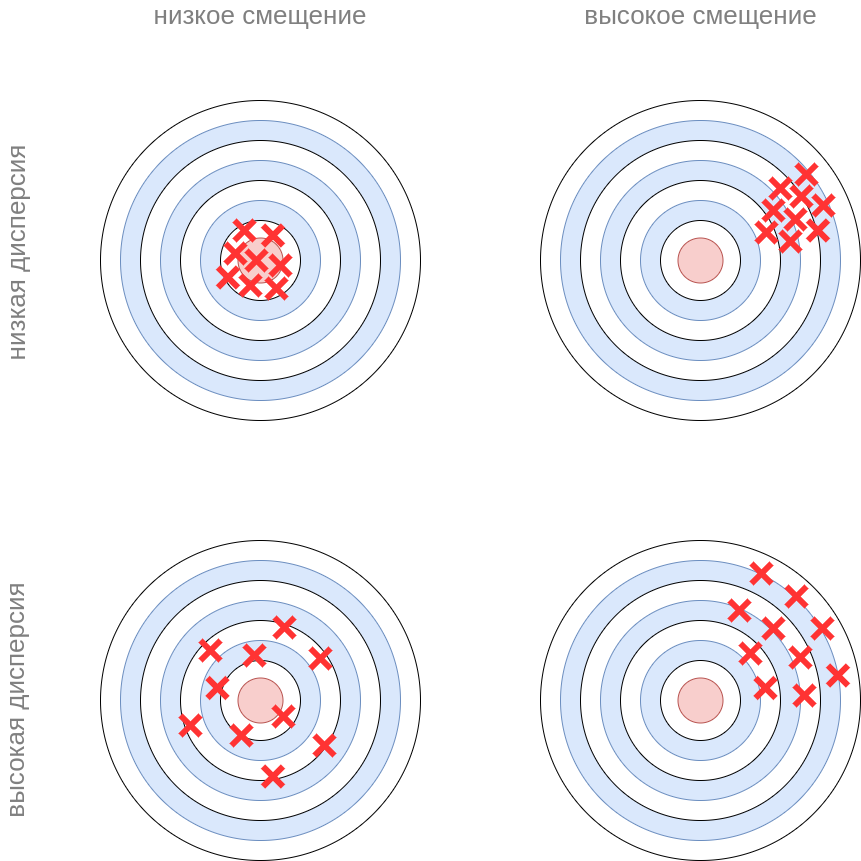

# Разложение на смещение и разброс

**Разложение на смещение и разброс** (bias-variance decomposition [[1]](https://en.wikipedia.org/wiki/Bias%E2%80%93variance_tradeoff), впервые предложено в [[2]](http://doursat.free.fr/docs/Geman_Bienenstock_Doursat_1992_bv_NeurComp.pdf)) позволяет более формально описать **недообучение** (underfitting) и **переобучение** (overfitting)  моделей машинного обучения.

Рассмотрим некоторую реальную задачу зависимость

$$
y=f(\mathbf{x})+\varepsilon
$$

где $y\in\mathbb{R}$, $f(\mathbf{x})$ - некоторая функция, а $\varepsilon$ - случайный шум, не зависящий от объектов $\mathbf{x}$ и имеющий нулевой среднее.

Эту зависимость мы будем приближать модельной зависимостью $\widehat{f}(\mathbf{x})$ по имеющейся обучающей выборке 

$$
(X,Y)=\{(\mathbf{x}_{n},y_{n}),\,n=1,2...N\}
$$

Зафиксируем объект $\mathbf{x}$, для которого мы строим прогноз, и оценим ожидаемый квадрат ошибки $(\widehat{f}(\mathbf{x})-y(\mathbf{x}))^2$, усредняя по реализациям случайного шума $\varepsilon$ и обучающей выборки $(X,Y)$. Последнее представляет интерес, поскольку на практике в обучающую выборку попадают <u>случайные объекты</u> из генеральной совокупности. 

> Например, при классификации новостей мы выгружаем из интернета случайные $N$ новостей и их размечаем вручную. Но мы могли бы разметить и другие $N$ новостей, получив при этом другую обучающую выборку, по которой модель настроилась бы немного по-другому!

Лучшее, что мы можем сделать, это приблизить $\hat{f}(\mathbf{x})\approx f(\mathbf{x})$, поскольку шум $\varepsilon$ не зависит от объектов и его мы прогнозировать не можем.

**Разложение на смещение и разброс** (bias-variance decomposition) декомпозирует ошибку прогноза на различные причины этой ошибки.

:::info Разложение на смещение и разброс

$$
\begin{aligned}\mathbb{E}_{X,Y,\varepsilon}\{[\widehat{f}(\mathbf{x})-y(\mathbf{x})]^{2}\}=&\left(\mathbb{E}_{X,Y}\{\widehat{f}(\mathbf{x})\}-f(\mathbf{x})\right)^{2}\\&+\mathbb{E}_{X,Y}\left\{ [\widehat{f}(\mathbf{x})-\mathbb{E}_{X,Y}\widehat{f}(\mathbf{x})]^{2}\right\} +\mathbb{E}\varepsilon^{2}\end{aligned}
$$

:::

- Выражение в первой компоненте, возводимое в квадрат, называется **смещением модели** (bias) и показывает, насколько сильно <u>модель будет систематически отклоняться от целевой зависимости</u> $f(\mathbf{x})$, если мы будем использовать различные обучающие выборки.

- Вторая компонента разложения называется **дисперсией модели** (variance) и показывает, насколько сильно <u>прогнозы модели будут различаться, если её настраивать на различных обучающих выборках</u>.

- Третья компонента называется **неснижаемой ошибкой** (irreducible error) и определяется шумом в данных, который мы предсказать не можем.

Это можно проиллюстрировать игрой в дартс, где мы стремимся попасть дротиком в центр цели. Ошибка попадания в цель может объясняться большим смещением (например, ветер систематически сдувает дротик в сторону) или большой дисперсией (неточные броски). Смещение и дисперсия могут присутствовать и совместно.

 

 

Рассмотрим задачу прогнозирования для квадратичной зависимости $y=x^2+\varepsilon$. 

- У **недообученных моделей** (например, линейной регрессии от $y=w_0+w_1x$) ошибка будет вызвана <u>высоким смещением</u>, поскольку прямая будет систематически отклоняться от целевой квадратичной зависимости. При этом дисперсия модели будет невелика, поскольку в ней присутствуют всего два параметра $w_0,w_1$ и они будут примерно похожими для различных обучающих выборок.

- У **переобученных моделей** (например, при прогнозировании квадратичной зависимости полиномом высокой степени или решающим деревом, которое мы строим до самого низа), напротив, смещение будет близким к нулю, поскольку они будут почти безошибочно подгоняться под обучающие данные, а ошибка прогнозирования будет вызвана <u>высокой дисперсией</u>, связанной с переобучением модели под конкретную реализацию обучающей выборки (модель её запоминает).

В [следующей главе](Bias-variance-decomposition-proof) мы докажем разложение на смещение и разброс.

## Литература

1. [Wikipedia: bias–variance tradeoff.](https://en.wikipedia.org/wiki/Bias%E2%80%93variance_tradeoff)
2. [Geman S., Bienenstock E., Doursat R. Neural networks and the bias/variance dilemma //Neural computation. – 1992. – Т. 4. – №. 1. – С. 1-58.](http://doursat.free.fr/docs/Geman_Bienenstock_Doursat_1992_bv_NeurComp.pdf)
