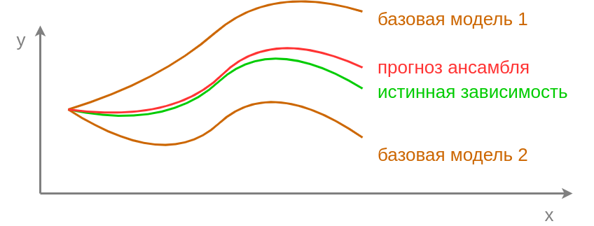
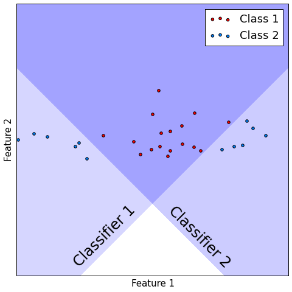

# Ансамбли моделей

## Идея

**Ансамбли моделей** (model ensembles), называемые также **композициями алгоритмов**, строят прогноз, используя не одну модель $f(\mathbf{x})$, а совокупность **базовых моделей** (base learners) $f_1(\mathbf{x}),...f_M(\mathbf{x})$ и **агрегирующую мета-модель** (meta-model) $G(\cdot)$, которая агрегирует прогнозы базовых моделей:

$$
\widehat{y}(\mathbf{x})=G(f_{1}(\mathbf{x}),...f_{M}(\mathbf{x}))
$$

Далее рассмотрим проблемы, которые могут успешно решаться с помощью ансамблей моделей.

## Борьба с переобучением

Ансамбли позволяют бороться с  [переобучением](../Bias-variance/Model-complexity) (overfitting) базовых моделей под обучающую выборку. 

> Используя ансамбль, мы надеемся, что одни модели будут недооценивать целевую переменную, другие - переоценивать, в результате чего ошибки разных моделей взаимно скомпенсируются, и мы получим более точный итоговый прогноз.

Агрегирующей моделью $G(\cdot)$ в этом случае выступает простая функция, такая как усреднение прогнозов базовых моделей.

 

## Борьба с недообучением

Также ансамбли позволяют бороться с [недообучением](../Bias-variance/Model-complexity) (undefitting) базовых моделей, поскольку использование сложной агрегирующей модели $G(\cdot)$ позволяет внести дополнительную гибкость в процесс построения прогнозов. 

Рассмотрим пример классификации, представленный на рисунке ниже. Как видим, данные линейно неразделимы, поэтому первый линейный классификатор размечает лишь часть объектов корректно, аналогично и второй классификатор. Если же объединить прогнозы двух классификаторов по правилу логического AND, то есть назначать красный класс лишь в случаях, когда оба классификатора предсказывают красный класс, то получим безошибочную классификацию, выделенную тёмно-синим на рисунке:

## Повышение устойчивости

Также ансамбли позволяют уменьшить риски, связанные с той или иной стратегией моделирования. У каждой модели есть свои предположения о данных, которые в реальности будут лишь ограниченно выполняться и приводить к систематическому смещению. Использование не одной, а сразу нескольких моделей, использующих разные предположения о распределении данных, позволяет уменьшить несоответствие итоговой модели реальному распределению. *Поэтому рекомендуется использовать в ансамбле модели разных классов* - решающие деревья, линейные модели и метрические методы.

:::tip Аналогия с инвестициями

Один из основных принципов инвестирования заключается в диверсификации рисков ("не складывать все яйца в одну корзину"), состоящий в том, что инвестиционный портфель должен состоять из разнородных активов. Даже если один из активов упадёт в цене, совокупный портфель подешевеет не сильно, поскольку будет включать в себя различные активы.

:::

Разные типы данных

Необходимость использования ансамблей может вытекать из свойств самой задачи. Например, при многоклассовой классификации, когда используется [набор бинарных классификаторов](../Multiclass-with-binary-classifiers). Или когда уже построены отдельные базовые модели (например, идентификаторы человека по голосу, по лицу, по отпечатку пальцев), и мы хотим уточнить итоговый прогноз, учитывая мнения всех моделей.
