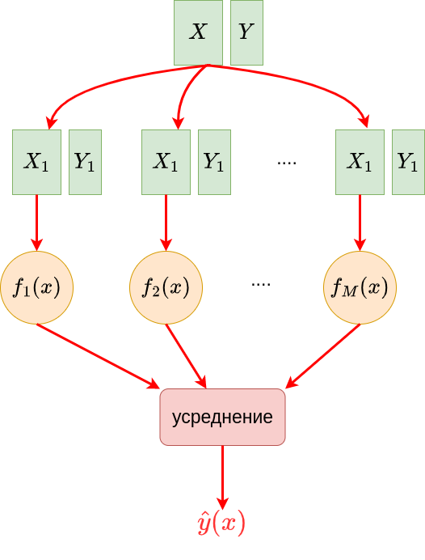
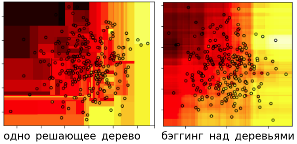
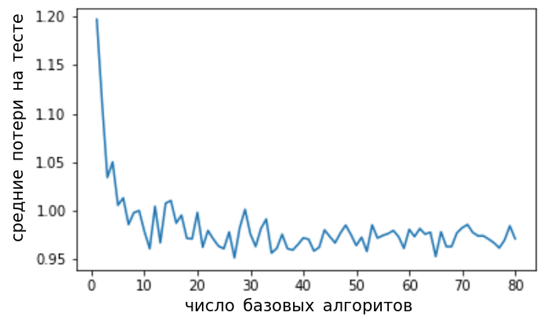

# Настройка на разных фрагментах обучающей выборки

## Идеи методов

Пусть исходная обучающая выборка состоит из $N$ объектов. Для генерации разнообразных моделей из одного семейства чаще всего используется настройка моделей <u>на разных фрагментах обучающей выборки</u> $(X,Y)$. 

Чтобы настроить $M$ моделей, необходимо по единообразной схеме сгенерировать M фрагментов выборки $(X_1,Y_1),(X_2,Y_2),...(X_M,Y_M)$, называемых **псевдовыборками**. На каждой псевдовыборке настраивается модель одного класса (как правило, решающее дерево). Но настроенные модели будут получаться разными, поскольку они настраиваются на разных наборах объектов!

:::tip Агрегация базовых моделей

Поскольку все псевдовыборки строятся по единообразной схеме, а базовые модели берутся из одного семейства, полученные базовые алгоритмы будут однородны и равнозначны между собой. Поэтому в качестве агрегирующей функции используется <u>равномерное усреднение</u>:

$$
\hat{y}(\mathbf{x})=\frac{1}{M}\sum_{m=1}^M f_m(\mathbf{x})
$$

:::

Процесс построения ансамбля по разным псевдовыборкам показан на схеме ниже:



Для генерации псевдовыборок используются следующие подходы:

- **Кросс-валидация** (cross-validation): вся выборка разбивается по объектам на $M$ случайных блоков одного размера. $m$-я псевдовыборка включает все блоки, кроме блока $m$, $m=1,2,...M$. Это аналогично [кросс-валидации](../Base-concepts/Quality-estimation#кросс-валидация) при оценке качества прогнозов. В результате каждая модель будет настраиваться, используя примерно $N\frac{M-1}{M}$ объектов. 

- **Бэггинг** (bagging): псевдовыборка генерируется такого же размера, что и исходная выборка, с помощью <u>сэмплирования объектов с возвращением</u> (with replacement). В результате некоторые объекты могут появиться в псевдовыборке несколько раз, а некоторые - ни разу. Если быть точнее, то вероятность не выбрать определённый объект равна $\frac{N-1}{N}$, а вероятность не выбрать его $N$ раз равна $\left(\frac{N-1}{N}\right)^N$. При $N\to\infty$ она будет стремиться к $1/e \approx 0.37$ (докажите!), в результате чего псевдовыборка будет содержать примерно 2/3 исходных объектов, но её размер будет по-прежнему $N$ за счёт того, что некоторые объекты используются несколько раз. Псевдовыборка, полученная таким образом, называется **бустраповской псевдовыборкой** (bootstrap sample [[1]](https://en.wikipedia.org/wiki/Bootstrapping_(statistics)), предложена в [[2]](https://www.jstor.org/stable/2958830)) и широко используется в статистике для получения эмпирических распределений тестовых статистик.

- **Пэйстинг** (pasting): псевдовыборка генерируется из исходной с помощью <u>сэмплирования объектов без возвращения</u> (without replacement). Чтобы псевдовыборка получалась отличной от исходной, необходимо, чтобы размер псевдовыборки был строго меньше $N$. Пэйстинг удобен для больших данных, где бэггинг слишком ресурсоёмок.

- **Метод случайных подпространств** (random subspaces): в этом методе берутся все объекты исходной выборки, а <u>сэмплируются признаки без возвращения</u>. Модель, обученная на такой выборке, будет использовать лишь часть от всех располагаемых признаков.

- **Метод случайных фрагментов** (random patches [[3]](https://www.researchgate.net/publication/262212941_Ensembles_on_Random_Patches)): комбинируется сэмплирование объектов и признаков без возвращения. Это практично, когда приходится работать как с большим объёмом объектов, так и признаков. Вариация метода - сэмплировать объекты с возвращением, как в бэггинге.

Ниже показано сравнение регрессионных прогнозов для одного решающего дерева и для бэггинга над решающими деревьями:



Видно, что одно решающее дерево даёт кусочно-постоянное решение с более резкими перепадами прогнозов по сравнению с ансамблем над многими деревьями.

Во всех представленных методах можно варьировать число псевдовыборок $M$. Поскольку на каждой псевдовыборке настраивается модель одного типа, то все базовые алгоритмы равнозначны, поэтому их прогнозы в итоге <u>усредняются с равными весами</u>. 

При увеличении числа базовых алгоритмов качество может только увеличиваться. Вначале оно резко падает (поскольку малое число псевдовыборок охватывает далеко не все данные), а потом выходит на стабильную асимптоту, как показано на рисунке ниже:



> Поэтому по гиперпараметру $M$ нельзя переобучиться: качество может только вырасти или остаться прежним, если $M$ взять слишком большим. 

Однако сложность настройки ансамбля и построения прогнозов <u>линейно растёт с ростом числа базовых моделей</u>. Поэтому на практике подбирают оптимальные значения других гиперпараметров (например, функцию неопределённости, минимальное число объектов в листах при настройке ансамбля над решающими деревьями) при невысоком $M$, а в финальной версии модели увеличивают $M$ при <u>уже настроенных гиперпараметрах</u>.

:::tip Неопределённость прогноза

Поскольку все базовые модели равнозначны между собой, можно рассчитывать не только среднее от их прогнозов $f_1(\mathbf{x}),...f_M(\mathbf{x})$, но и стандартное отклонение, которое будет показывать неопределённость прогноза. Это повышает прозрачность использования модели, поскольку даёт возможность дифференцировать ситуации, когда ансамбль уверен в своём прогнозе, а когда - нет. В последнем случае можно передать объект на обработку другому более продвинутому методу.

:::

С представленными методами генерации ансамблей можно также ознакомиться в [[4]](https://medium.com/geekculture/ensemble-techniques-part-1-bagging-pasting-b8cc7fd69edf).

## Оценка Out-of-Bag

Честная оценка качества модели требует выделения отдельной валидационной выборки или процедуры кросс-валидации, что сокращает объём данных для обучения модели. **Метод оценивания out-of-bag** (OOB estimate) позволяет использовать <u>ту же обучающую выборку для оценивания качества ансамбля, что использовалась для его настройки</u>, и применим к методам, в которых базовые модели обучаются на подмножествах объектов: кросс-валидация, бэггинг, пэйстинг и метод случайных фрагментов. 

Поскольку каждая базовая модель использует не все, а лишь подмножество объектов обучающей выборки, то для каждого объекта $(\mathbf{x}_n,y_n)$ можно составить множество $I(n)$ тех псевдовыборок (и соответствующих базовых моделей), куда этот объект не попал. Далее мы можем получить честный прогноз для $\mathbf{x}_n$, усредняя не по всем базовым моделям, а только по <u>подмножеству моделей, обучающие псевдовыборки которых не содержали выбранный объект</u>: 

$$
\hat{y}(\mathbf{x})=\frac{1}{|I(\mathbf{x}_n)|}\sum_{i\in I(n)}f_i(\mathbf{x}_n)
$$

Для моделей, проиндексированных $I(n)$, объект $\mathbf{x}_n$ будет новым, и в результате мы построим честный вневыборочный прогноз, *не прибегая к отдельной валидационной выборке*. Out-of-Bag-оценка (OOB-estimate [[5]](https://en.wikipedia.org/wiki/Out-of-bag_error)) строится указанным способом, усредняя out-of-bag прогнозы по всем объектам обучающей выборки.

<details>
  <summary>Как в среднем связана OOB-оценка со средними потерями на тестовой выборке?</summary>

OOB-оценка несмещённо оценивает качество ансамбля, использующего не все, а лишь <u>подмножество базовых моделей</u>. Итоговая же модель использует все базовые модели. Чем количество базовых моделей больше, тем прогноз получается точнее в общем случае, поэтому реальное качество на тестовой выборке будет в среднем даже немного выше, чем оценка out-of-bag.

</details>

## Пример запуска на Python

<div class="code_start">Бэггинг для классификации:</div>

```py
from sklearn.ensemble import BaggingClassifier
from sklearn.tree import DecisionTreeClassifier
from sklearn.metrics import accuracy_score
from sklearn.metrics import brier_score_loss

X_train, X_test, Y_train, Y_test = get_demo_classification_data()  

# инициализация модели:
model = BaggingClassifier(DecisionTreeClassifier(),  # базовая модель
                          max_samples=0.8,           # доля случайных объектов для обучения
                          max_features=1.0,          # доля случайных признаков для обучения
                          n_jobs=-1)                 # использовать все ядра процессора
model.fit(X_train, Y_train)    # обучение модели   
Y_hat = model.predict(X_test)  # построение прогнозов
print(f'Точность прогнозов: {100*accuracy_score(Y_test, Y_hat):.1f}%')

P_hat = model.predict_proba(X_test)  # можно предсказывать вероятности классов
loss = brier_score_loss(Y_test, P_hat[:,1])  # мера Бриера на вероятности положительного класса
print(f'Мера Бриера ошибки прогноза вероятностей: {loss:.2f}')
```

<div class="code_end"></div>

<br/>

<div class="code_start">Бэггинг для регрессии:</div>

```py
from sklearn.ensemble import BaggingRegressor
from sklearn.tree import DecisionTreeRegressor
from sklearn.metrics import mean_absolute_error

X_train, X_test, Y_train, Y_test = get_demo_classification_data()  

# инициализация модели:
model = BaggingRegressor(DecisionTreeRegressor(),  # базовая модель
                         max_samples=0.8,          # доля случайных объектов для обучения
                         max_features=1.0,         # доля случайных признаков для обучения
                         n_jobs=-1)                # использовать все ядра процессора
model.fit(X_train, Y_train)    # обучение модели   
Y_hat = model.predict(X_test)  # построение прогнозов
print(f'Средний модуль ошибки (MAE): {mean_absolute_error(Y_test, Y_hat):.2f}')    
```

<div class="code_end"></div>

[Больше информации](https://scikit-learn.org/stable/modules/ensemble.html#bagging-meta-estimator). [Полный код](https://github.com/victorkitov/ML/blob/main/%D0%9F%D1%80%D0%B8%D0%BC%D0%B5%D1%80%D1%8B%20%D0%B7%D0%B0%D0%BF%D1%83%D1%81%D0%BA%D0%B0%20%D0%BE%D1%81%D0%BD%D0%BE%D0%B2%D0%BD%D1%8B%D1%85%20%D0%BC%D0%B5%D1%82%D0%BE%D0%B4%D0%BE%D0%B2%20%D0%B2%20sklearn.ipynb). 


## Литература

1. [Wikipedia: Bootstrapping.](https://en.wikipedia.org/wiki/Bootstrapping_(statistics))

2. [Efron B. Bootstrap methods: another look at the jackknife //The Annals of Statistics. 1979. – С. 1–26.](https://www.jstor.org/stable/2958830)

3. [Louppe G., Geurts P. Ensembles on random patches //Machine Learning and Knowledge Discovery in Databases: European Conference, ECML PKDD 2012, Bristol, UK, September 24-28, 2012. Proceedings, Part I 23. – Springer Berlin Heidelberg, 2012. – С. 346-361.](https://www.researchgate.net/publication/262212941_Ensembles_on_Random_Patches)

4. [Medium: ensemble techniques part 1-bagging & pasting.](https://medium.com/geekculture/ensemble-techniques-part-1-bagging-pasting-b8cc7fd69edf)

5. [Wikipedia: out-of-bag error.](https://en.wikipedia.org/wiki/Out-of-bag_error)
