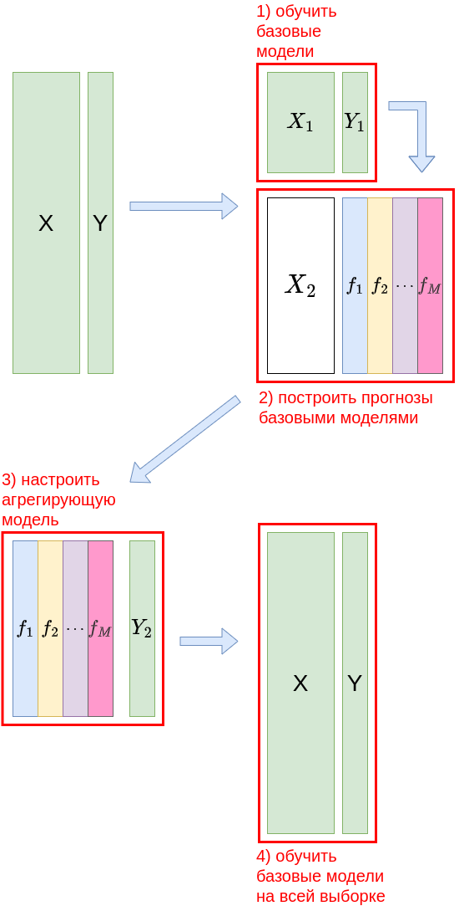

# Стэкинг

**Алгоритм стэкинга** (stacking [[1]](https://www.researchgate.net/publication/222467943_Stacked_Generalization)) решает задачу настройки ансамбля моделей

$$
\hat{y}(\mathbf{x}) = G(f_1(\mathbf{x}),f_2(\mathbf{x}),...f_M(\mathbf{x}))
$$

для общей ситуации, когда агрегирующая функция $G(\cdot)$ имеет <u>свои собственные настраиваемые параметры</u>. 

:::tip Использование исходного вектора признаков

Агрегирующей функции, помимо прогнозов базовых моделей, можно передавать и исходный вектор признаков $\mathbf{x}$. В результате получим следующую функцию предсказания:

$$
\hat{y}(\mathbf{x}) = G(\mathbf{x},f_1(\mathbf{x}),f_2(\mathbf{x}),...f_M(\mathbf{x}))
$$

В этом случае агрегирующая модель получит возможность по-разному использовать прогнозы базовых моделей <u>в разных частях признакового пространства</u>.

:::

> Базовые модели в стэкинге можно настраивать неточно, поскольку агрегирующая функция будет подправлять итоговый прогноз, учитывая ответы других моделей.

## Линейный стэкинг

Простейшим примером $G(\cdot)$ выступает линейная комбинация базовых моделей с настраиваемыми весами $w_0,w_1,...w_M$.

$$
\hat{y}(\mathbf{x}) = w_0+w_1 f_1(\mathbf{x})+ w_2 f_2(\mathbf{x}) + ... + w_M f_M(\mathbf{x})
$$

> Смещение $w_0$ включают, если агрегируются недообученные модели с систематическими смещениями. Если в базовых алгоритмах присутствуют переобученные модели, то они будут давать несмещенные прогнозы, и смещение $w_0$ можно не включать.

Настройка весов производится методом [линейной регрессии](../Linear-regression-extensions), в которой признаками выступают не исходные признаковые описания объектов, а <u>прогнозы базовых моделей</u>.

:::warning Переобучение

При настройке базовых моделей $f_1(\mathbf{x}),...f_M(\mathbf{x})$ и агрегирующей $G(\cdot)$ <u>нельзя использовать одну и ту же обучающую выборку</u>, иначе будет происходить переобучение! 

> Рассмотрим пример. Пусть среди базовых моделей присутствует алгоритм одного ближайшего соседа. Очевидно, на обучающей выборке он будет обеспечивать 100% точность, поскольку ближайшим соседом для прогнозируемых объектов обучающей выборки будут выступать они сами. Тогда, при обучении параметров базовой модели на той же обучающей выборке, всё внимание агрегирующей модели будет направлено на самую переобученную модель! 

Правильная настройка стэкинга будет рассмотрена ниже.

:::

### Специальные виды регуляризации

Веса $w_1,...w_M$ будут находиться неустойчиво из-за сильной корреляции признаков, которыми выступают прогнозы одной и той же целевой величины $y$ разными базовыми моделями. Чтобы повысить устойчивость оценки весов и качество всего ансамбля, необходимо использовать регуляризацию на веса. Это может быть стандартная L1- или L2-регуляризация, но в контексте решаемой задачи целесообразно использование специального регуляризатора:

$$
R(\mathbf{w}) = \sum_{m=1}^M\left(w_m-\frac{1}{M}\right)^2,
$$

который будет прижимать веса не к нулевым значениям, а к равномерному усреднению базовых моделей, что представляет естественный вид [равномерного усреднения](Averaging-ensembles).

Дополнительно можно настраивать веса при условии их неотрицательности: 

$$
w_1\ge 0, w_2 \ge 0, ... w_M \ge 0,
$$

поскольку прогнозы базовых моделей должны получаться положительно скоррелированными с целевой величиной $y$.

## Стэкинг общего вида

В качестве агрегирующей модели $G(\cdot)$ может выступать не только линейная регрессия, но вообще любая модель: логистическая регрессия, решающее дерево или даже другой ансамбль, например, решающий лес. Теоретически можно рассмотреть даже стэкинг над стэкингом, хотя это редко используется в связи со сложной процедурой настройки.

## Настройка стэкинга

Если настраивать базовые модели и агрегирующую на одной и той же обучающей выборке, то будет происходить переобучение, вызванное тем, что базовые модели настраиваются на известные отклики, а агрегирующая повторно использует те же самые отклики. Чтобы так не происходило, можно использовать две стратегии: блендинг и стэкинг с кросс-валидацией.

### Блендинг

В блендинге настройка базовых моделей и агрегирующей производится на двух разных выборках объектов, как показано на схеме:



Формально последовательность действий записывается следующим образом:

1. Разбить обучающую выборку $(X,Y)$ на две случайные подвыборки $(X_1,Y_1)$ и $(X_2,Y_2)$ размера $N_1$ и $N_2$.

2. Обучить базовые модели на $(X_1,Y_1)$.

3. Предсказать объекты выборки $X_2$ каждой базовой моделью, в результате чего получить матрицу прогнозов базовыми моделями $F(X_2)\in \mathbb{R}^{N_2\times M}$.

4. На обучающей выборке $(F(X_2),Y_2)$ обучить агрегирующую модель $G(\cdot)$.

5. Донастроить базовые модели на всей обучающей выборке $(X,Y)$.

Последний шаг не приводит к переобучению и опционален. Без него агрегирующая модель максимально согласуется с базовыми, поскольку именно на них она настраивалась. Если же использовать последний шаг, то базовые модели получаются лучше настроенными (используя все наблюдения, а не часть), но будут хуже сочетаться с агрегирующей функцией, которая использовала их настройку на подвыборке $(X_2,Y_2)$, а не на всей выборке.

:::tip Пропорции разбиения на подвыборки

Обучающая выборка разбивается на первую и вторую выборку в пропорции примерно 80/20%, поскольку в стэкинге основная тяжесть прогнозирования ложится на базовые модели, а агрегирующей модели остаётся лишь оптимальным образом скомбинировать уже имеющиеся прогнозы.

:::

### Стэкинг с кросс-валидацией

Недостаток блэндинга заключается в том, что при настройке агрегирующей модели используются не все объекты, а лишь их подмножество, оказавшееся во второй выборке, что приводит к недостаточно точной настройке $G(\cdot)$.

Повысить точность позволяет стэкинг с кросс-валидацией - это и есть алгоритм стэкинга по умолчанию. 

Последовательность действий при настройке с кросс-валидацией будет следующей:

1. Разбить обучающую выборку $(X,Y)$ на $K$ случайных подвыборок $(X_1,Y_1),(X_2,Y_2),...(X_K,Y_K)$ одинакового размера (состоящие из $N'=N/K$ объектов).

2. Для $k=1,2,...K$:
   
   1. настроить базовые модели на всех подвыборках кроме $k$-ой, получив их настроенные версии $f^k_1(\mathbf{x}),...f^k_M(\mathbf{x})$;
   
   2. спрогнозировать с помощью $f^k_1(\mathbf{x}),...f^k_M(\mathbf{x})$ объекты исключённой $k$-й выборки, получив матрицу прогнозов $F(X_k)\in\mathbb{R}^{N'\times M}$.

3. Объединить все подвыборки прогнозов $F(X_1),F(X_2),...F(X_K)$ в одну $F(X)\in\mathbb{R}^{N\times M}$.

4. Добавить к $F(X)$ небольшой случайный шум.

5. На выборке $(F(X),Y)$ настроить агрегирующую модель $G(\cdot)$.

6. Обучить базовые модели $f_1(\mathbf{x}),...f_M(\mathbf{x})$ на всей выборке $(X,Y)$.

Последний шаг нужен для замены $K$ версий каждой базовой модели одной финальной. 

Настройка агрегирующей модели корректна, поскольку основывается на честных вневыборочных прогнозах базовыми моделями на тех объектах, которые они не использовали при обучении. Настройка производится весьма точно, поскольку задействуются все $N$ объектов исходной выборки.

Поскольку на втором шаге для каждой подвыборки настраивается своя версия каждой базовой модели, объединять напрямую их прогнозы не совсем правильно - это будут прогнозы, сделанные немного отличающимися моделями. Для их выравнивания используется шаг 4, на котором к прогнозам базовых моделей  добавляется случайный шум с небольшой дисперсией (гиперпараметр метода).

:::tip Вариант стэкинга

Вместо шага 6, на котором происходит перенастройка базовых моделей на всей обучающей выборке, для нового объекта $\mathbf{x}$ можно строить прогноз каждой версией всех базовых моделей, полученных на шаге 2. То есть построить $K\cdot M$ прогнозов моделями $f^k_m(\mathbf{x})$ для $k=1,2,...K,$ $m=1,2,...M$. Затем нужно для каждой версии базовых моделей провести агрегирование их прогнозов и усреднить по версиям:

$$
\hat{y}(\mathbf{x})=\frac{1}{K}\sum_{k=1}^K G(f^k_1(\mathbf{x}),f^k_2(\mathbf{x}),...f^k_M(\mathbf{x}))
$$

Это в $K$ раз замедляет построение прогноза, но может обеспечивать более высокую точность на некоторых типах данных.

:::

## Пример запуска в Python

<div class="code_start">Стэкинг для классификации:</div>

```py
from sklearn.neighbors import KNeighborsClassifier
from sklearn.tree import DecisionTreeClassifier
from sklearn.linear_model import LogisticRegression
from sklearn.ensemble import StackingClassifier
from sklearn.metrics import accuracy_score
from sklearn.metrics import brier_score_loss

X_train, X_test, Y_train, Y_test = get_demo_classification_data()

# Инициализируем базовые модели и проверим их качество
knn = KNeighborsClassifier(n_neighbors=100)    # инициализация модели
knn.fit(X_train, Y_train)     # обучение модели   
Y_hat = knn.predict(X_test)   # построение прогнозов
print(f'Точность прогнозов: {100*accuracy_score(Y_test, Y_hat):.1f}%')  

tree_model = DecisionTreeClassifier()  # инициализация дерева
tree_model.fit(X_train, Y_train)       # обучение модели   
Y_hat = tree_model.predict(X_test)     # построение прогнозов
print(f'Точность прогнозов: {100*accuracy_score(Y_test, Y_hat):.1f}%')  

# Инициализируем стэкинг
ensemble = StackingClassifier(estimators=[('K nearest neighbors', knn),   # базовые модели
                                          ('decision tree', tree_model)], 
                              final_estimator=LogisticRegression(),  # агрегирующая модель
                              cv=3,        # количество блоков кросс-валидации при настройке стэкинга
                              n_jobs=-1)   # используем все ядра процессора для настройки
ensemble.fit(X_train, Y_train)     # обучение базовых моделей` ансамбля
Y_hat = ensemble.predict(X_test)   # построение прогнозов
print(f'Точность прогнозов: {100*accuracy_score(Y_test, Y_hat):.1f}%')  

P_hat = ensemble.predict_proba(X_test)  # можно предсказывать вероятности классов
loss = brier_score_loss(Y_test, P_hat[:,1])  # мера Бриера на вероятности положительного класса
print(f'Мера Бриера ошибки прогноза вероятностей: {loss:.2f}')
```

<div class="code_end"></div>

[Больше информации](https://scikit-learn.org/stable/modules/ensemble.html#stacked-generalization). [Полный код](https://github.com/victorkitov/ML/blob/main/%D0%9F%D1%80%D0%B8%D0%BC%D0%B5%D1%80%D1%8B%20%D0%B7%D0%B0%D0%BF%D1%83%D1%81%D0%BA%D0%B0%20%D0%BE%D1%81%D0%BD%D0%BE%D0%B2%D0%BD%D1%8B%D1%85%20%D0%BC%D0%B5%D1%82%D0%BE%D0%B4%D0%BE%D0%B2%20%D0%B2%20sklearn.ipynb). 

<div class="code_start">Стэкинг для регрессии:</div>

```py
from sklearn.neighbors import KNeighborsRegressor
from sklearn.tree import DecisionTreeRegressor
from sklearn.linear_model import Ridge
from sklearn.ensemble import StackingRegressor
from sklearn.metrics import accuracy_score
from sklearn.metrics import brier_score_loss

X_train, X_test, Y_train, Y_test = get_demo_classification_data()

# Инициализируем базовые модели и проверим их качество
knn = KNeighborsRegressor(n_neighbors=100)  # инициализация модели
knn.fit(X_train, Y_train)                   # обучение модели   
Y_hat = log_model.predict(X_test)           # построение прогнозов
print(f'Средний модуль ошибки (MAE): {mean_absolute_error(Y_test, Y_hat):.2f}')   

tree_model = DecisionTreeRegressor()  # инициализация дерева
tree_model.fit(X_train, Y_train)      # обучение модели   
Y_hat = tree_model.predict(X_test)    # построение прогнозов
print(f'Средний модуль ошибки (MAE): {mean_absolute_error(Y_test, Y_hat):.2f}')   

# Инициализируем стэкинг
ensemble = StackingRegressor(estimators=[('K nearest neighbors', knn),   # базовые модели
                                         ('decision tree', tree_model)], 
                              final_estimator=Ridge(),  # агрегирующая модель
                              cv=3,        # количество блоков кросс-валидации при настройке стэкинга
                              n_jobs=-1)   # используем все ядра процессора для настройки
ensemble.fit(X_train, Y_train)     # обучение базовых моделей ансамбля
Y_hat = ensemble.predict(X_test)   # построение прогнозов
print(f'Средний модуль ошибки (MAE): {mean_absolute_error(Y_test, Y_hat):.2f}')      
```

<div class="code_end"></div>

[Больше информации](https://scikit-learn.org/stable/modules/ensemble.html#stacked-generalization). [Полный код](https://github.com/victorkitov/ML/blob/main/%D0%9F%D1%80%D0%B8%D0%BC%D0%B5%D1%80%D1%8B%20%D0%B7%D0%B0%D0%BF%D1%83%D1%81%D0%BA%D0%B0%20%D0%BE%D1%81%D0%BD%D0%BE%D0%B2%D0%BD%D1%8B%D1%85%20%D0%BC%D0%B5%D1%82%D0%BE%D0%B4%D0%BE%D0%B2%20%D0%B2%20sklearn.ipynb). 


## Литература

1. [Wolpert D. H. Stacked generalization //Neural networks. – 1992. – Т. 5. – №. 2. – С. 241-259.](https://www.researchgate.net/publication/222467943_Stacked_Generalization)
