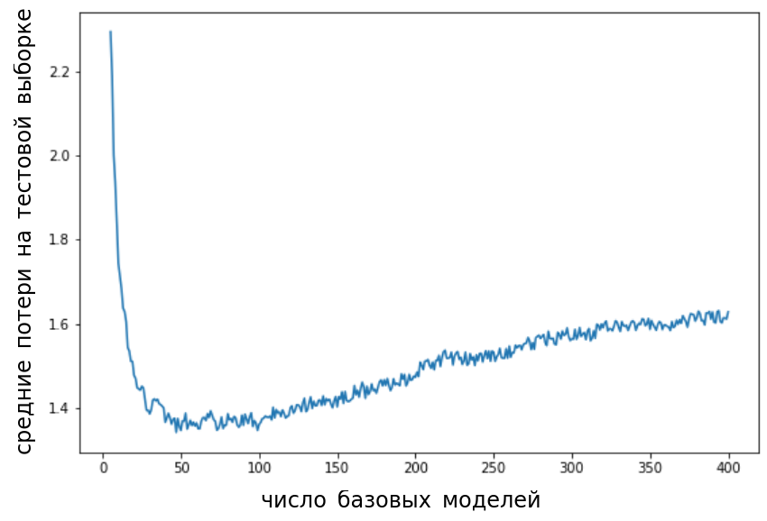

# Сравнение бустинга с другими ансамблями моделей

## Бустинг и бэггинг

Ранее изученные [алгоритмы построения ансамбля](../Model-ensembles/Base-models-building), такие как [бэггинг, метод случайных подпространств](../Model-ensembles/Sample-based-base-models) и [случайный лес](../Model-ensembles/RF-ERT), настраивают модели независимо друг от друга, что  снижает [переобученность](../Bias-variance/Model-complexity) базовых моделей (снижает дисперсию их ошибок в [разложении на смещение и разброс](../Bias-variance/Bias-variance-decomposition)). Это позволяет эффективно распределить настройку каждой модели по разным вычислительным устройствам. Также нельзя переобучиться по числу базовых моделей - при увеличении их числа среднее качество ансамбля будет только расти. Однако независимость построения каждой базовой модели <u>не позволяет моделям исправлять систематические ошибки ансамбля</u>.

В бустинге же модели <u>настраиваются последовательно, исправляя ошибки уже настроенного ансамбля</u>. В результате этого происходит борьба с недообученностью базовых моделей (снижение систематического смещения базовых моделей в [разложении на смещение и разброс](../Bias-variance/Bias-variance-decomposition)). Поэтому алгоритм бустинга, как правило, работает точнее бэггинга, но требует более тщательной настройки по числу базовых моделей, поскольку может переобучаться, если их выбрать слишком много, как показано на графике:

Для подбора оптимального количества базовых моделей нужно <u>отслеживать качество ансамбля на отдельной валидационной выборке</u>.

Также итеративная процедура настройки базовых моделей в бустинге <u>не допускает параллелизацию</u> в их обучении: настроить следующую модель возможно, лишь когда настроены все предыдущие!

## Бустинг и стэкинг

Итеративная процедура настройки модели и коэффициента при ней в бустинге позволяет быстро строить линейную агрегирующую модель (как в [линейном стэкинге](../Model-ensembles/Stacking#линейный-стэкинг)), однако коэффициент при текущей модели <u>учитывают ошибки только предшествующих моделей</u>, но не будущих. Также базовые модели в стэкинге настраиваются предсказывать конечную целевую переменную, а в бустинге - <u>ошибку прогнозирования текущим ансамблем</u>.
